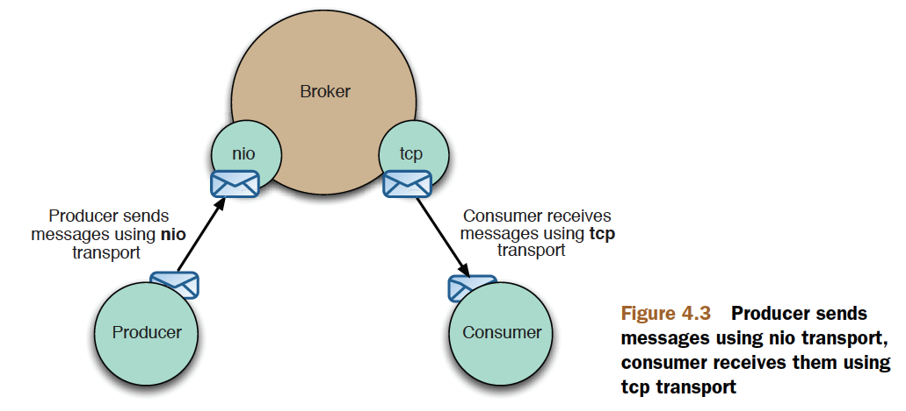
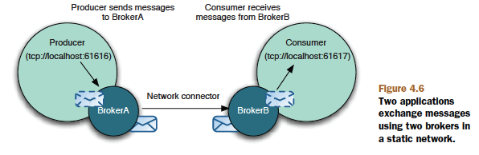

# Chapter 4

## Connecting to ActiveMQ

This chapter covers

- A description and demonstration of ActiveMQ connector URIs
- How to connect your clients to ActiveMQ using transport connectors
- How to create a cluster of ActiveMQ message brokers using network connectors

## index

- 01 [connecting-to-activemq](#connecting-to-activemq)
- 02 [understanding-connector-uris](#understanding-connector-uris)
- 03 [transport-connectors](#transport-connectors)
- 04 [configuring-transport-connectors](#configuring-transport-connectors)
- 05 [transmission-control-protocol-tcp](#transmission-control-protocol-tcp)
- 06 [new-i/o-api-protocol-nio](#new-i/o-api-protocol-nio)
- 07 [user-datagram-protocol-udp](#user-datagram-protocol-udp)
- 08 [comparing-the-tcp-and-udp-transports](#comparing-the-tcp-and-udp-transports)
- 09 [secure-sockets-layer-protocol-ssl](#secure-sockets-layer-protocol-ssl)
- 10 [enabling-and-disabling-ssl-ciphers](#enabling-and-disabling-ssl-ciphers)
- 11 [hypertext-transfer-protocol-http/https](#hypertext-transfer-protocol-http/https)
- 12 [connecting-to-activemq-inside-the-virtual-machine-vm-connector](#connecting-to-activemq-inside-the-virtual-machine-vm-connector)
- 13 [network-connectors](#network-connectors)
- 14 [static-networks](#static-networks)
- 15 [dynamic-networks](#dynamic-networks)
- 16 [failover-protocol](#failover-protocol)
- 17 [summary-of-network-protocols-used-for-client-broker-communication](#summary-of-network-protocols-used-for-client-broker-communication)

## Understanding connector URIs

- Uniform resource identifiers (URIs)

`<scheme>:<scheme-specific-part>`

- URL (Uniform Resource Locator)

`tcp://localhost:61616`

This is a typical hierarchical URI used in ActiveMQ, which translates to `create a TCP connection to the localhost on port 61616.`

## Transport connectors

The requirements of ActiveMQ users in terms of connectivity are diverse(多种多样).
Some users focus on performance, others on security, and so on. ActiveMQ tries to
cover all these aspects and provide a connector for every use case

### Configuring transport connectors

```xml
<transportConnectors>
    <transportConnector name="openwire" uri="tcp://localhost:61616" discoveryUri="multicast://default"/>
    <transportConnector name="ssl" uri="ssl://localhost:61617"/>
    <transportConnector name="stomp" uri="stomp://localhost:61613"/>
    <transportConnector name="xmpp" uri="xmpp://localhost:61222"/>
</transportConnectors>
```

The preceding snippet defines four transport connectors. Upon starting up
ActiveMQ using such a configuration file,

```java
ActiveMQConnectionFactory factory =
new ActiveMQConnectionFactory("tcp://localhost:61616");
Connection connection = factory.createConnection();
connection.start();
Session session =
connection.createSession(false, Session.AUTO_ACKNOWLEDGE);
```

### Transmission Control Protocol (TCP)

Before exchanging messages over the network, we need to serialize them to a suitable
form. Messages must be serialized in and out of a byte sequence to be sent over
the wire using what’s known as a _wire protocol_. The default wire protocol used in
ActiveMQ is called OpenWire. The protocol specification can be found on the
ActiveMQ website (http://mng.bz/u2eT). The OpenWire protocol isn’t specific to
the TCP network transport and can be used with other network protocols. Its main
purpose is to be efficient and allow fast exchange of messages over the network. Furthermore,
a standardized and open protocol such as OpenWire allows native
ActiveMQ clients to be developed for various programming environments.

```xml
<transportConnectors>
<transportConnector name="tcp"
uri="tcp://localhost:61616?trace=true"/>
</transportConnectors>
```

Some of the benefits of the TCP transport connector include the following:

- Efficiency—Since this connector uses the OpenWire protocol to convert messages
  to a stream of bytes (and back), it’s very efficient in terms of network
  usage and performance.
- Availability—TCP is one of the most widespread network protocols and has been
  supported in Java from the early days, so it’s almost certainly supported on your
  platform of choice.
- Reliability—The TCP protocol ensures that

### New IO API protocol (NIO)

This makes the NIO transport connector more suitable
in situations where

- `You have a large number of clients you want to connect to the broker—Generally`, the
  number of clients that can connect to the broker is limited by the number of
  threads supported by the operating system. Since the NIO connector
  implementation starts fewer threads per client than the TCP connector, you
  should consider using NIO in case TCP doesn’t meet your needs.
- `You have a heavy network traffic to the broker—Again`, the NIO connector generally
  offers better performance than the TCP connector (in terms of using less
  resources on the broker side), so you can consider using it when you find that
  the TCP connector doesn’t meet your needs.

```xml
<transportConnectors>
<transportConnector
name="tcp"
uri="tcp://localhost:61616?trace=true" />
<transportConnector
name="nio"
uri="nio:localhost:61618?trace=true" />
</transportConnectors>
```



### User Datagram Protocol (UDP)

User Datagram Protocol (UDP) along with TCP make up the core of internet protocols.
The purpose of these two protocols is identical—to send and receive data packets
(datagrams) over the network. But there are two main differences between them:

- `TCP is a stream-oriented protocol`, which means that the order of data packets is
  guaranteed. There’s no chance for data packets to be duplicated or arrive out
  of order. UDP, on the other hand, doesn’t guarantee packet ordering, so a
  receiver can expect data packets to be duplicated or arrive out of order.
- `TCP also guarantees reliability of packet delivery`, meaning that packets won’t be lost
  during the transport. This is ensured by maintaining an active connection
  between the sender and receiver. On the contrary, UDP is a connectionless protocol,
  so it can’t make such guarantees.

## Comparing the TCP and UDP transports

When considering the TCP and the UDP transports, questions arise that compare
these two protocols. When should you use the UDP transport instead of the TCP
transport? There are basically two such situations where the UDP transport offers an
advantage:

- The broker is located behind a firewall that you don’t control and you can
  access it only over UDP ports.
- You’re using time-sensitive messages and you want to eliminate network transport
  delay as much as possible.
  But there are also a couple of pitfalls regarding the UDP connector:
- Since UDP is unreliable, you can end up losing some of the messages, so your
  application should know how to deal with this situation.
- Network packets transmitted between clients and brokers aren’t just messages,
  but can also contain so-called control commands. If some of these
  control commands are lost due to UDP unreliability, the JMS connection
  could be endangered.

```xml
<transportConnectors>
<transportConnector
name="tcp"
uri="tcp://localhost:61616?trace=true"/>
<transportConnector
name="udp"
uri="udp://localhost:61618?trace=true" />
</transportConnectors>
```

### Secure Sockets Layer Protocol (SSL)

```xml
<transportConnectors>
<transportConnector name="ssl" uri="ssl://localhost:61617?trace=true" />
</transportConnectors>
```

This is accomplished using the following system properties:

- javax.net.ssl.keyStore—Defines which keystore the client should use
- javax.net.ssl.keyStorePassword—Defines an appropriate password for the keystore
- javax.net.ssl.trustStore—Defines an appropriate truststore the client should use

### ENABLING AND DISABLING SSL CIPHERS

```xml
<transportConnectors>
<transportConnector
name="ssl"
uri="ssl://localhost:61617?transport.enabledCipherSuites=SSL_RSA_WITH_RC4_128_SHA" />
</transportConnectors>
```

### Hypertext Transfer Protocol (HTTPHTTPS)

> config

```xml
<transportConnectors>
<transportConnector name="tcp" uri="tcp://localhost:61616?trace=true"/>
<transportConnector name="http" uri="http://localhost:8080?trace=true" />
</transportConnectors>
```

> pom

```xml
<dependency>
<groupId>org.apache.activemq</groupId>
<artifactId>activemq-optional</artifactId>
<version>5.4.1</version>
</dependency>
```

### Connecting to ActiveMQ inside the virtual machine (VM connector)

`vm://brokerName?key=value`

## Network connectors

Summary of protocols used to network brokers

| Protocol  | Description                                                                                 |
| --------- | ------------------------------------------------------------------------------------------- |
| Static    | Used for defining networks of brokers with known addresses                                  |
| Failover  | Used to provide reconnection logic for clients to the network of brokers or a single broker |
| Multicast | Used for defining dynamic networks of brokers (broker addresses are not statically defined) |
| Discovery | Used by clients to connect to dynamic network of brokers                                    |
| Peer      | Used to easily connect multiple embedded brokers                                            |
| Fanout    | Used to produce messages to multiple unconnected brokers                                    |

We should explain known as discovery. In general, discovery is a process of detecting
remote broker services. Clients usually want to discover all available brokers. Brokers,
on the other hand, usually want to find other available brokers so they can establish a
network of brokers.

### Static networks



```xml
<networkConnectors>
<networkConnector name="local network"
uri="static://(tcp://remotehost1:61616,tcp://remotehost2:61616)"/>
</networkConnectors>
```

Configuring broker networks can be difficult depending on the situation. Use of the
static protocol allows for an explicit notation that a network should exist.

Consider a situation where clients in remote offices are connecting to a broker in the home
office. Depending on the number of clients in each remote office, you may wind up
with far too many wide area network connections into the home office. This can cause
an unnecessary burden(负担) on the network. To minimize connections, you may want to
place a broker in each remote office and allow a static network connection between
the remote office broker and the home office broker. Not only will this minimize the
number of network connections between the remote offices and the home office, but
it’ll allow the client applications in the remote offices to operate more efficiently. The
removal of the `long haul connection`(长连接) over the wide area network means less latency（低延迟）
and therefore less waiting for the client application.

### Dynamic networks

> MULTICAST CONNECTOR

- IP multicast

```xml
<networkConnectors>
<networkConnector name="default-nc" uri="multicast://default"/>
</networkConnectors>
```

`IP multicast` is a network technique used for easy transmission of data from one source
to a group of interested receivers (one-to-many communications) over an IP network.
One of the fundamental concepts of IP multicast is the so-called group address. The
group address is an IP address in the range of `224.0.0.0` to `239.255.255.255` used by
both sources and receivers. Sources use this address as a destination for their data,
whereas receivers use it to express their interest in data from that group.

```config
multicast://ipadaddress:port?key=value
```

```xml
<broker xmlns="http://activemq.apache.org/schema/core" brokerName="multicast"
        dataDirectory="${activemq.base}/data">
    <networkConnectors>
        <networkConnector name="default-nc" uri="multicast://default"/>
        </networkConnectors>
    <transportConnectors>
        <transportConnector name="openwire" uri="tcp://localhost:61616" discoveryUri="multicast://default"/>
    </transportConnectors>
</broker>
```

One disadvantage to using the multicast protocol is that discovery is automatic. If
there are brokers that you don’t want to be automatically added to a given group, you
must be careful in setting up the initial configuration of the broker network. Careful
segmentation of broker networks is important, as you don’t want messages to wind up
in a broker network where they don’t belong. Another disadvantage of the multicast
protocol is that it can be excessively chatty on the network. For this reason, many network
administrators won’t allow its use. Please check with your network administrator
before taking the time to configure a network using the multicast protocol.

- FAILOVER PROTOCOL
- DISCOVERY PROTOCOL
- PEER PROTOCOL
- FANOUT CONNECTOR

## FAILOVER PROTOCOL

```config
failover:(uri1,...,uriN)?key=value

failover:uri1,...,uriN
```

A default configuration also
implements `reconnection delay logic`, _meaning that the transport will start with a 10ms
delay for the first reconnection attempt and double this time for any subsequent
attempt up to 30000ms._ Also, the reconnection logic will try to reconnect indefinitely.
Of course, all reconnection parameters can be reconfigured according to your needs
using the appropriate transport options.

```config
    failover:(tcp://localhost:61616)
```

_The advantage of this is that clients don’t need to be manually restarted in the case of
a broker failure (or maintenance, and so forth)_. As soon as the broker becomes
available again the client will automatically reconnect. This means far more robustness
for your applications by simply utilizing a feature of ActiveMQ.

## Summary of network protocols used for client-broker communication

| Protocol | Description                                                                                                                                                                   |
| -------- | ----------------------------------------------------------------------------------------------------------------------------------------------------------------------------- |
| TCP      | Default network protocol for most use cases.                                                                                                                                  |
| NIO      | Consider NIO protocol if you need to provide better scalability for connections from producers and consumers to the broker.                                                   |
| UDP      | Consider UDP protocol when you need to deal with the firewall between clients and the broker.                                                                                 |
| SSL      | Consider SSL when you want to secure communication between clients and the broker.                                                                                            |
| HTTP(S)  | Consider HTTP(S) when you need to deal with the firewall between clients and the broker.                                                                                      |
| VM       | Although not a network protocol per se, consider VM protocol when your broker and clients scommunicate with a broker that is embedded in the same Java Virtual Machine (JVM). |
