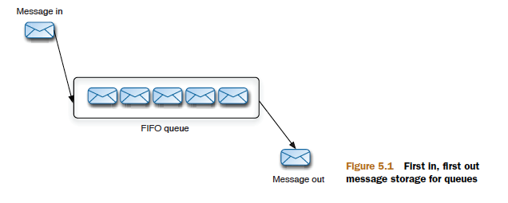
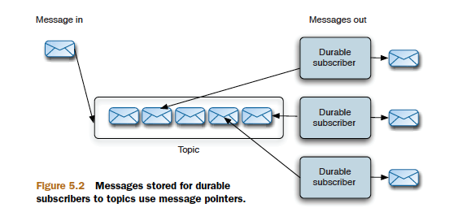

# Chapter 05

ActiveMQ message storage

This chapter covers

- How messages are stored in ActiveMQ for both queues and topics
- The four styles of message stores provided with ActiveMQ
- How ActiveMQ caches messages for consumers
- How to control message caching using subscription recovery policies

## How are messages stored by ActiveMQ

Messages sent to queues and topics are stored differently, because there are some storage
optimizations that can be made with topics that don’t make sense with queues, as we’ll explain.

Storage for queues is straightforward—messages are basically stored in first in, first out order (FIFO). One message is dispatched to a
single consumer at a time. Only when that message has been consumed and acknowledged
can it be deleted from the broker’s message store.

| queue                                        | topic                                        |
| -------------------------------------------- | -------------------------------------------- |
|  |  |

## The KahaDB message store

The recommended message store for general-purpose messages since ActiveMQ version
5.3 is KahaDB. This is a file-based message store that combines a transactional journal(交易日记),
for reliable message storage and recovery, with good performance and scalability.

> config

```xml
<broker brokerName="broker" persistent="true" useShutdownHook="false">
...
<persistenceAdapter>
<kahaDB directory="activemq-data" journalMaxFileLength="16mb"/>
</persistenceAdapter>
...
</broker>
```

## The AMQ message store internals
