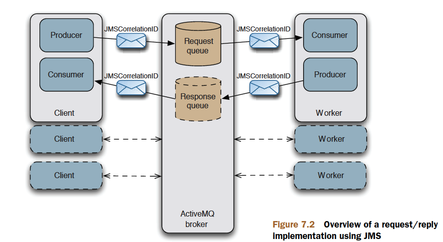

# Chapter 07

Creating Java applications with ActiveMQ

This chapter covers

- Embedding ActiveMQ in Java applications
- Embedding ActiveMQ using Spring
- Creating request/reply applications
- Writing JMS clients using Spring

## Embedding ActiveMQ using the BrokerService

`org.apache.activemq.broker.BrokerService`

> config

```xml
<?xml version="1.0" encoding="utf-8"?>

<broker xmlns="http://activemq.apache.org/schema/core" brokerName="myBroker" dataDirectory="${activemq.base}/data">
  <transportConnectors>
    <transportConnector name="openwire" uri="tcp://localhost:61616"/>
  </transportConnectors>
  <plugins>
    <simpleAuthenticationPlugin>
      <users>
        <authenticationUser username="admin" password="password" groups="admins,publishers,consumers"/>
        <authenticationUser username="publisher" password="password" groups="publishers,consumers"/>
        <authenticationUser username="consumer" password="password" groups="consumers"/>
        <authenticationUser username="guest" password="password" groups="guests"/>
      </users>
    </simpleAuthenticationPlugin>
  </plugins>
</broker>

```

```java
public static void main(String[] args) throws Exception {
    BrokerService broker = new BrokerService();
    broker.setBrokerName("myBroker");
    broker.setDataDirectory("data/");
    SimpleAuthenticationPlugin authentication =
    new SimpleAuthenticationPlugin();
    List<AuthenticationUser> users =
    new ArrayList<AuthenticationUser>();
    users.add(new AuthenticationUser("admin","password","admins,publshers,consumers"));
    users.add(new AuthenticationUser("publisher","password","publishers,consumers"));
    users.add(new AuthenticationUser("consumer","password","consumers"));
    users.add(new AuthenticationUser("guest", "password","guests"));
    authentication.setUsers(users);
    broker.setPlugins(new BrokerPlugin[]{authentication});
    broker.addConnector("tcp://localhost:61616");
    broker.start();
    System.out.println();
    System.out.println("Press any key to stop the broker");
    System.out.println();
    System.in.read();
}
```

## Embedding ActiveMQ using the BrokerFactory

In many applications, you’ll want to be able to
initialize the broker using the same configuration files used to configure standalone
instances of the ActiveMQ broker. For that purpose ActiveMQ provides the utility
`org.apache.activemq.broker.BrokerFactory` class

```java
public class Factory {
    public static void main(String[] args) throws Exception {
        System.setProperty("activemq.base", System.getProperty("user.dir"));
        String configUri ="xbean:target/classes/org/apache/activemq/book/ch6/activemq-simple.xml";
        URI brokerUri = new URI(configUri);
        BrokerService broker = BrokerFactory.createBroker(brokerUri);
        broker.start();
        System.out.println();
        System.out.println("Press any key to stop the broker");
        System.out.println();
        System.in.read();
    }
}
```

```config
broker:(tcp://localhost:61616,network:static:tcp://remotehost:61616)?persistent=false&useJmx=true
```

## Embedding ActiveMQ using Spring

> config

```xml
<beans>
  <bean id="admins" class="org.apache.activemq.security.AuthenticationUser">
    <constructor-arg index="0" value="admin" />
    <constructor-arg index="1" value="password" />
    <constructor-arg index="2" value="admins,publisher,consumers" />
  </bean>
  <bean id="publishers"
  class="org.apache.activemq.security.AuthenticationUser">
    <constructor-arg index="0" value="publisher" />
    <constructor-arg index="1" value="password" />
    <constructor-arg index="2" value="publisher,consumers" />
  </bean>
  <bean id="consumers"
  class="org.apache.activemq.security.AuthenticationUser">
    <constructor-arg index="0" value="consumer" />
    <constructor-arg index="1" value="password" />
    <constructor-arg index="2" value="consumers" />
  </bean>
  <bean id="guests" class="org.apache.activemq.security.AuthenticationUser">
    <constructor-arg index="0" value="guest" />
    <constructor-arg index="1" value="password" />
    <constructor-arg index="2" value="guests" />
  </bean>
<bean id="simpleAuthPlugin"
class="org.apache.activemq.security.SimpleAuthenticationPlugin">
  <property name="users">
    <util:list>
      <ref bean="admins" />
      <ref bean="publishers" />
      <ref bean="consumers" />
      <ref bean="guests" />
    </util:list>
  </property>
</bean>
<bean id="broker" class="org.apache.activemq.broker.BrokerService" init-method="start" destroy-method="stop">
  <property name="brokerName" value="myBroker" />
  <property name="persistent" value="false" />
  <property name="transportConnectorURIs">
    <list>
      <value>tcp://localhost:61616</value>
      </list>
  </property>
  <property name="plugins">
      <list>
      <ref bean="simpleAuthPlugin"/>
    </list>
  </property>
</bean>
</beans>
```

## Using the BrokerFactoryBean

`org.apache.activemq.xbean.BrokerFactoryBean`

```xml
<beans>
  <bean id="broker" class="org.apache.activemq.xbean.BrokerFactoryBean">
    <property name="config" value="org/apache/activemq/book/ch6/activemq-simple.xml"/>
    <property name="start" value="true" />
  </bean>
</beans>
```

## Using Apache XBean with Spring

## Using a custom XML namespace with Spring

## Implementing request/reply with JMS

Some of the most [scalable](https://translate.google.cn/#view=home&op=translate&sl=en&tl=zh-CN&text=scalable) systems in the world are implemented
using asynchronous processing like that being demonstrated in this example.



Now comes the interesting part—to demonstrate how this architecture can be
highly scalable. Imagine that a single worker isn’t enough to handle the load of
incoming requests. No problem: just add additional workers to handle the load.
Those workers can even be distributed across multiple hosts—this is the most important
aspect of scaling this design. Because the workers aren’t contending for the same
resources on the same host, the only limit is the maximum throughput of messages
through the broker, which is much higher than you can achieve with any classic clientserver
setup. Furthermore, `ActiveMQ can be scaled both vertically and horizontally`, as
discussed in part 4. Let’s now take a look at a simple implementation of request/reply.

- Implementing the server and the worker
- Implementing the client
- Running the request/reply example

The JMS API can be tedious, as it requires you to write a lot of code for initializing
all the necessary JMS objects such as connections, sessions, producers, consumers, and
so forth. This is where the `Spring Framework` provides a lot of benefit. It helps you to
remove such boilerplate code by supplying a more cogent API and by simplifying the
overall configuration.

## Writing JMS clients using Spring

ActiveMQ and Spring make
an excellent JMS development platform, making many common tasks extremely easy
to accomplish. Some of the tasks to be covered in this section include

- Configuring JMS connections

ActiveMQ provides classes that can be used to
configure URLs and other parameters of connections to brokers. The connection
factory could later be used by your application to get the appropriate connection.

- Configuring JMS destinations

ActiveMQ destination objects can be configured simply as beans representing JMS destinations used by your producers and consumers.

- Defining JMS consumers

Spring provides helper classes that allow you to easily configure a message listener container and hook message listeners to it.

- Implementing JMS producers

Spring also provides helper bean classes for creating new producers.

> Configuring JMS connections

```xml
<bean id="jmsConnectionFactory" class="org.apache.activemq.ActiveMQConnectionFactory">
  <property name="brokerURL" value="tcp://localhost:61616" />
  <property name="userName" value="admin" />
  <property name="password" value="password" />
</bean>
```

Spring XML configuration for the `PooledConnectionFactory`:

```xml
<bean id="pooledJmsConnectionFactory" class="org.apache.activemq.pool.PooledConnectionFactory" destroy-method="stop">
  <property name="connectionFactory" ref="jmsConnectionFactory" />
</bean>
```

pom dependency

```xml
<dependency>
  <groupId>commons-pool</groupId>
  <artifactId>commons-pool</artifactId>
  <version>1.4</version>
</dependency>
```

## Configuring JMS destinations

```xml
<bean id="cscoDest" class="org.apache.activemq.command.ActiveMQTopic">
  <constructor-arg value="STOCKS.CSCO" />
</bean>
<bean id="orclDest" class="org.apache.activemq.command.ActiveMQTopic">
  <constructor-arg value="STOCKS.ORCL" />
</bean>
```

## Creating JMS consumers

Defining two Spring message listener containers and a message listener

```xml
<!-- The message listener -->
<bean id="portfolioListener" class="org.apache.activemq.book.ch3.portfolio.Listener"></bean>

<!-- Spring DMLC -->
<bean id="cscoConsumer" class="org.springframework.jms.listener.DefaultMessageListenerContainer">
  <property name="connectionFactory" ref="jmsConnectionFactory" />
  <property name="destination" ref="cscoDest" />
  <property name="messageListener" ref="portfolioListener" />
</bean>

<!-- Spring DMLC -->
<bean id="orclConsumer" class="org.springframework.jms.listener.DefaultMessageListenerContainer">
  <property name="connectionFactory" ref="jmsConnectionFactory" />
  <property name="destination" ref="orclDest" />
  <property name="messageListener" ref="portfolioListener" />
</bean>
```

So all you have to do is to implement a message listener bean and
leave everything else to the Spring MLC. Note that in this example we’ve used the
plain (not pooled) connection factory. This is because no connection pooling is
needed for this simple example. This example uses the Spring DefaultMessage-
ListenerContainer (DMLC), which is the most commonly used MLC. Although
numerous other properties on the DMLC can be configured, this example is using
only the basics. When these two DMLC instances start up, they’ll be ready to receive
messages and hand them off to the message listener.

## Creating JMS producers

`JmsTemplate` & `MessageCreator`

> MessageCreator

```java
public class StockMessageCreator implements MessageCreator {
  private int MAX_DELTA_PERCENT = 1;
  private Map<Destination, Double> LAST_PRICES = new Hashtable<Destination, Double>();
  Destination stock;
  public StockMessageCreator(Destination stock) {
    this.stock = stock;
  }
  public Message createMessage(Session session) throws JMSException {
     value = LAST_PRICES.get(stock);
     if (value == null) {
      value = new Double(Math.random() * 100);
     }
    // lets mutate the value by some percentage
    double oldPrice = value.doubleValue();
    value = new Double(mutatePrice(oldPrice));
    LAST_PRICES.put(stock, value);
    double price = value.doubleValue();
    double offer = price * 1.001;
    boolean up = (price > oldPrice);
    MapMessage message = session.createMapMessage();
    message.setString("stock", stock.toString());
    message.setDouble("price", price);
    message.setDouble("offer", offer);
    message.setBoolean("up", up);s
    System.out.println(
    "Sending: " + ((ActiveMQMapMessage)message).getContentMap()
    + " on destination: " + stock
    );
    return message;
  }
  protected double mutatePrice(double price) {
    double percentChange = (2 * Math.random() * MAX_DELTA_PERCENT) - MAX_DELTA_PERCENT;
    return price * (100 + percentChange) / 100;
  }
}
```

> JMS publisher implementation in Spring

```java
  public class SpringPublisher {
  private JmsTemplate template;
  private int count = 10;
  private int total;
  private Destination[] destinations;
  Listing 7.24 JMS publisher implementation in Spring
  private HashMap<Destination,StockMessageCreator> creators = new HashMap<Destination,StockMessageCreator>();
  public void start() {
    while (total < 1000) {
    for (int i = 0; i < count; i++) {
      sendMessage();
    }
    total += count;
    System.out.println("Published '" + count + "' of '"
    + total + "' price messages");
    try {
        Thread.sleep(1000);
      } catch (InterruptedException x) {
      }
    }
  }
  protected void sendMessage() {
    int idx = 0;
    while (true) {
      idx = (int)Math.round(destinations.length * Math.random());
      if (idx < destinations.length) {
        break;
      }
    }
    Destination destination = destinations[idx];
    // send
    template.send(destination, getStockMessageCreator(destination));
  }
  private StockMessageCreator getStockMessageCreator(Destination dest) {
    if (creators.containsKey(dest)) {
      return creators.get(dest);
    } else {
      StockMessageCreator creator = new StockMessageCreator(dest);
      creators.put(dest, creator);
      return creator;
    }
  }
  // getters and setters goes here
}
```

config

```xml
<!-- Spring JMS Template -->
<bean id="jmsTemplate" class="org.springframework.jms.core.JmsTemplate">
<property name="connectionFactory" ref="pooledJmsConnectionFactory" />
</bean>
<bean id="stockPublisher"
class="org.apache.activemq.book.ch7.spring.SpringPublisher">
<property name="template" ref="jmsTemplate" />
<property name="destinations">
<list>
<ref local="cscoDest" />
<ref local="orclDest" />
</list>
</property>
</bean>
```

> NOTE

The pooled connection factory is used with the JmsTemplate. This is
important because the JmsTemplate is designed for use with Java EE containers
in mind, which typically provide connection pooling capabilities as
required by the Java EE specifications. Every call to the JmsTemplate.send()
method creates and destroys all the JMS resources (connections, consumers,
and producers). So if you’re not using a Java EE container, make sure to use a
pooled connection factory for sending messages with the JmsTemplate.
