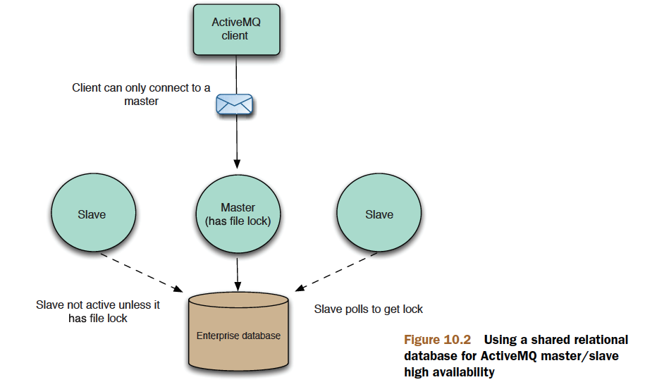
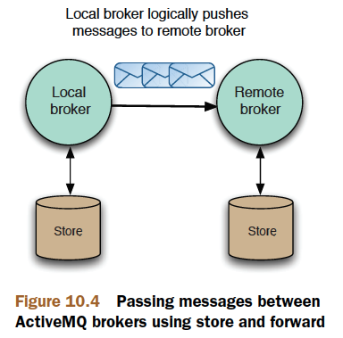

# Chapter 10

Deploying ActiveMQ in the enterprise

This chapter covers

- Configuring ActiveMQ for high availability
- Understanding networks of brokers
- Scaling the ActiveMQ via configuration

This chapter will focus on the enterprise deployment of ActiveMQ message brokers,
the type of deployments that are used in production environments where
applications need to be available without message loss at a 24/7 service level. This
chapter will demonstrate how to configure ActiveMQ for high availability so that an
ActiveMQ deployment can survive machine or network loss.

## Configuring ActiveMQ for high availability

Typically you need to run multiple ActiveMQ brokers on different machines, so that if one machine or one ActiveMQ broker
fails, a secondary one can take over. Using ActiveMQ terminology, such deployments
are known as `master/slave`, where one broker takes the role of the primary or
master and there are one or more slave brokers that wait for the master to fail, at
which point one will take over to become the new master. The ActiveMQ Java and C++
clients provide a built-in `failover` transfer, so that they’ll automatically switch over from
the failed master to the new master without message loss.

ActiveMQ currently supports `two different` types of `master/slave` configurations:
`shared nothing`, where each ActiveMQ broker has its own unique message storage, and
`shared storage`, where multiple ActiveMQ brokers can connect to the shared message
store (a relational database or a shared file system) but only one broker will be active
at a time. We’ll discuss these deployment scenarios in this section.

## Shared nothing master/slave


A shared nothing master/slave configuration does impose some extra overhead on
message processing, but this overhead is small considering the benefit that it provides.
When a message producer sends a persistent message to the master, it’ll wait for a
receipt from the master until it can send the next message. The master won’t send the
receipt until it has replicated the message to the slave, and in turn wait for the slave to
finish its processing of the message (which will typically involve the slave persisting it
to storage). The master will then process the message (persist it to storage and dispatch
it to any interested consumers) before sending back a receipt to the message
producer that it has successfully processed the message.

When a master broker fails, the slave has two choices:

- Shut itself down—Hence, it’s only acting to preserve the state of the master. In this
  scenario, an administrator will typically have to manually configure the slave to
  be the master, and configure a new message broker to take the role of the slave.

- Start up its transports and initiate any network connections—Hence, the slave automatically
  becomes the new master.

`failover://(tcp://masterhost:61616,tcp://slavehost:61616)?randomize=false`

> limitations

A master will only replicate its active state from the time the slave connects to it. So if a client is
using the master before the slave is attached, any messages or acknowledgements that
have been processed by the master before the slave has attached itself can potentially
be lost if the master then fails. You can avoid this by setting the waitForSlave property
on the master configuration. This property forces the master to not accept any client
connections until a slave broker has attached to it.

Other limitations are that a master is allowed to have `only one slave`, and that a slave itself can’t have another slave.

> Summary

The shared nothing broker configuration should only be used when you want to ensure that you don’t lose
messages for your application, but you can afford to have some down time to attach a
new slave after the master has failed and the old slave has become the master.

> WHEN TO USE SHARED NOTHING MASTER/SLAVE

You should use a shared nothing master/slave configuration in production environments
`when some down time on failure is acceptable`. Manual intervention by an
administrator will be necessary after a master fails, as it would be advisable to set up
and configure a new slave for the new master after the old master has failed.

> CONFIGURING SHARED NOTHING MASTER/SLAVE

```xml
<services>
    <masterConnector remoteURI="tcp://remotehost:62001" userName="Rob" password="Davies"/>
</services>
```

## Shared storage master/slave

Whereas the shared nothing master/slave offers the ability for brokers to remain independent
of one another, the shared storage master/slave allows many brokers to share the
storage mechanism, but only one broker can be live at any given time. Using a shared
resource storage will ensure that in the event of a master broker failure, no manual
intervention will be required to maintain the integrity of your application in the event
of an additional failure. Another benefit is that there’s no limitation on the number of
slave brokers that can be active at one time with shared storage master/slave.
The ActiveMQ shared storage master/slave configuration comes in two flavors: a
relational database or a file system–based storage.

> SHARED DATABASE MASTER/SLAVE



> WHEN TO USE SHARED DATABASE MASTER/SLAVE

Shared database master/slave is an ideal configuration if you’re already using an
enterprise relational database. Although generally slower than a shared nothing configuration,
it requires no additional configuration, and there are no limitations on the
number of slave brokers that can be run or when they can be run.

If access to an enterprise database isn’t an option, or performance is a consideration,
you can use a shared file system instead, where conceptually ActiveMQ brokers
can be set up in the same way as the shared database.

> SHARED FILE SYSTEM MASTER/SLAVE


WHEN TO USE SHARED FILE SYSTEM MASTER/SLAVE

## How ActiveMQ passes messages across a network of brokers



## Network configuration
