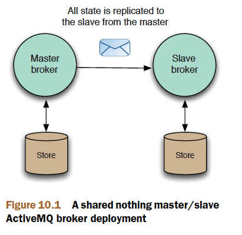

# Chapter 10

Deploying ActiveMQ in the enterprise

This chapter covers

- Configuring ActiveMQ for high availability
- Understanding networks of brokers
- Scaling the ActiveMQ via configuration

This chapter will focus on the enterprise deployment of ActiveMQ message brokers,
the type of deployments that are used in production environments where
applications need to be available without message loss at a 24/7 service level. This
chapter will demonstrate how to configure ActiveMQ for high availability so that an
ActiveMQ deployment can survive machine or network loss.

## Configuring ActiveMQ for high availability

Typically you need to run multiple ActiveMQ brokers on different machines, so that if one machine or one ActiveMQ broker
fails, a secondary one can take over. Using ActiveMQ terminology, such deployments
are known as `master/slave`, where one broker takes the role of the primary or
master and there are one or more slave brokers that wait for the master to fail, at
which point one will take over to become the new master. The ActiveMQ Java and C++
clients provide a built-in `failover` transfer, so that they’ll automatically switch over from
the failed master to the new master without message loss.

ActiveMQ currently supports `two different` types of `master/slave` configurations:
`shared nothing`, where each ActiveMQ broker has its own unique message storage, and
`shared storage`, where multiple ActiveMQ brokers can connect to the shared message
store (a relational database or a shared file system) but only one broker will be active
at a time. We’ll discuss these deployment scenarios in this section.

## Shared nothing master/slave

