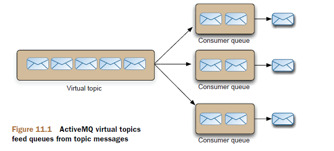

# Chapter 11

ActiveMQ broker features in action

This chapter covers

- Using wildcards and composite destinations
- Utilizing advisory messages
- Understanding virtual topics and retroactive consumers
- Using ActiveMQ plug-ins
- An introduction to Apache Camel

## Apache Camel

## Consume from multiple destinations using wildcards

Three special characters are reserved for destination names:

- `.` A dot, used to separate elements in the destination name
- `*` Used to match one element
- `>` Matches one or all trailing elements

So to subscribe to the latest scores that all Leeds teams are playing in, you can subscribe
to the topic named `*.*.Leeds`, as shown:

```java
String brokerURI = ActiveMQConnectionFactory.DEFAULT_BROKER_URL;
ConnectionFactory connectionFactory =
new ActiveMQConnectionFactory(brokerURI);
Connection connection = connectionFactory.createConnection();
connection.start();
Session session = connection.createSession(false, Session.AUTO_ACKNOWLEDGE);
Topic allLeeds = session.createTopic("*.*.Leeds");
MessageConsumer consumer = session.createConsumer(allLeeds);
Message result = consumer.receive();
```

## Sending a message to multiple destinations

It can be useful to send the same message to different destinations at once

ActiveMQ supports a feature called composite destinations
that allows you to send the same message to multiple destinations at once.

```conf
    store.order.backoffice,store.order.warehouse
```

```java
String brokerURI = ActiveMQConnectionFactory.DEFAULT_BROKER_URL;
ConnectionFactory connectionFactory = new ActiveMQConnectionFactory(brokerURI);
Connection connection = connectionFactory.createConnection();
connection.start();
Session session = connection.createSession(false, Session.AUTO_ACKNOWLEDGE);
Queue ordersDestination = session.createQueue("store.orders, topic://
store.orders");
MessageProducer producer = session.createProducer(ordersDestination);
Message order = session.createObjectMessage();
producer.send(order);
```

## Advisory messages

Advisory messages are notification messages generated by the ActiveMQ broker as a
result of changes to the broker.

> demo

```java
    String brokerURI = ActiveMQConnectionFactory.DEFAULT_BROKER_URL;
    ConnectionFactory connectionFactory =
    new ActiveMQConnectionFactory(brokerURI);
    Connection connection = connectionFactory.createConnection();
    connection.start();
    Session session =
    connection.createSession(false, Session.AUTO_ACKNOWLEDGE);
    Topic connectionAdvisory = AdvisorySupport.CONNECTION_ADVISORY_TOPIC;
    MessageConsumer consumer = session.createConsumer(connectionAdvisory);
    ActiveMQMessage message = (ActiveMQMessage) consumer.receive();
    DataStructure data = (DataStructure) message.getDataStructure();
    if (data.getDataStructureType() == ConnectionInfo.DATA_STRUCTURE_TYPE) {
        ConnectionInfo connectionInfo = (ConnectionInfo) data;
        System.out.println("Connection started: " + connectionInfo);
    } else if (data.getDataStructureType() == RemoveInfo.DATA_STRUCTURE_TYPE) {
        RemoveInfo removeInfo = (RemoveInfo) data;
        System.out.println("Connection stopped: " + removeInfo.getObjectId());
    } else {
        System.err.println("Unknown message " + data);
    }
```

Many different advisories are generated by the ActiveMQ broker to provide information
about the running system. A dozen of the more useful advisory topics appear
in the numbered list below.

- 1 ActiveMQ.Advisory.Connection
- 2 ActiveMQ.Advisory.Producer.Queue
- 3 ActiveMQ.Advisory.Consumer.Queue
- 4 ActiveMQ.Advisory.Queue
- 5 ActiveMQ.Advisory.Expired.Queue
- 6 ActiveMQ.Advisory.SlowConsumer.Queue
- 7 ActiveMQ.Advisory.FastProducer.Queue
- 8 ActiveMQ.Advisory.MessageDelivered.Queue
- 9 ActiveMQ.Advisory.MessageConsumed.Queue
- 10 ActiveMQ.Advisory.FULL
- 11 ActiveMQ.Advisory.MasterBroker
- 12 ActiveMQ.Advisory.MessageDLQd.Queue

Properties from the list of 12 ActiveMQ advisory topics

|     | Description                                                | Properties | Data structure | Generated by default | Policy entry property |
| --- | ---------------------------------------------------------- | ---------- | -------------- | -------------------- | --------------------- |
| 1   | Generated when a connection start/stops                    |            |                |                      |                       |
| 2   | Producer start/stop messages on a queue                    |            |                |                      |                       |
| 3   | Consumer start/stop messages on a Queue                    |            |                |                      |                       |
| 4   | Queue created/destroyed                                    |            |                |                      |                       |
| 5   | Expired messages on a queue                                |            |                |                      |                       |
| 6   | Slow queue consumer                                        |            |                |                      |                       |
| 7   | Fast queue producer                                        |            |                |                      |                       |
| 8   | Message delivered  to the broker                           |            |                |                      |                       |
| 9   | Message consumed  by a client                              |            |                |                      |                       |
| 10  | A usage resource is at its limit                           |            |                |                      |                       |
| 11  | A broker is now the master in a master/slave configuration |            |                |                      |                       |
| 12  | Message sent to a dead letter queue                        |            |                |                      |                       |

## Supercharge JMS topics by going virtual

If you want to broadcast a message to multiple consumers, then you use a `JMS topic`. If
you want a pool of consumers to receive messages from a destination, then you use a
`JMS queue`. But there’s no satisfactory way to send a message to a topic and then have
multiple consumers receiving messages on that topic the way you can with queues.

```conf
VirtualTopic.<topic name>.
Consumer.<consumer name>.VirtualTopic.<virtual topic name>.
```

The JMS spec requires that a durable subscriber to a topic use a unique JMS client ID
and subscriber name. Also, only one thread (a single consumer) can be active at any
time with that unique JMS client ID and subscriber name. This means that if that subscriber
dies for some reason, there will be no failover to another consumer and there’s
no ability to load balance messages across competing consumers. But using JMS queue
semantics allows the ability to fail over consumers, to load balance messages among
competing consumers, and to use ActiveMQ message groups (see chapter 12), which
allows sticky load balancing of messages to maintain message order. Furthermore, JMS
queue depths can be monitored via JMX (see chapter 14). Using virtual topics works
around these disadvantages while still retaining the benefits of JMS topics.
Virtual topics allow a publisher to send messages to a normal JMS topic



`Virtual topics` allow a publisher to send messages to a normal JMS topic while consumers
receive messages from a normal JMS queue. So consumers subscribe to a
queue to receive messages that were published to a topic.

## Retroactive consumers

There’s a downside to consuming `nonpersistent` messages, in that you’ll only be
able to consume messages from the point when your message consumer starts. You
can miss messages if your message consumer starts behind the message producer, or
there’s a network glitch and your message consumer needs to reconnect to the broker
(or another one in a network).

> config consumer

```java
String brokerURI = ActiveMQConnectionFactory.DEFAULT_BROKER_URL;
ConnectionFactory connectionFactory =
new ActiveMQConnectionFactory(brokerURI);
Connection connection = connectionFactory.createConnection();
connection.start();
Session session =
connection.createSession(false, Session.AUTO_ACKNOWLEDGE);
Topic topic =
session.createTopic("soccer.division1.leeds?consumer.retroactive=true");
MessageConsumer consumer = session.createConsumer(topic);
Message result = consumer.receive();
```

> config broker

```xml
<destinationPolicy>
    <policyMap>
        <policyEntries>
            <policyEntry topic=">">
            <subscriptionRecoveryPolicy>
                <fixedSizedSubscriptionRecoveryPolicy maximumSize="8mb"/>
            </subscriptionRecoveryPolicy>
            </policyEntry>
        </policyEntries>
    </policyMap>
</destinationPolicy>
```

## Message redelivery and dead-letter queues

When messages expire on the ActiveMQ broker (they exceed their time-to-live, if set)
or can’t be redelivered, they’re moved to a `dead-letter queue`, so they can be consumed
or browsed by an administrator at a later point.

Messages are normally redelivered to a client in the following scenarios:

- A client is using transactions and calls rollback() on the session.
- A client is using transactions and closes before calling commit.
- A client is using CLIENT_ACKNOWLEDGE on a session and calls recover() on that session.

> AcitveMQ.DLQ

```xml
<destinationPolicy>
    <policyMap>
        <policyEntries>
            <policyEntry queue=">">
                <deadLetterStrategy>
                <individualDeadLetterStrategy
                queuePrefix="DLQ."
                useQueueForQueueMessages="true"
                processExpired="false"
                processNonPersistent="false"/>
                </deadLetterStrategy>
            </policyEntry>
        </policyEntries>
    </policyMap>
</destinationPolicy>
```

When a message is sent to a dead-letter queue, an advisory message is generated
for it. You can listen for dead-letter queue advisory messages on the topic
`ActiveMQ.Advisory.MessageDLQd.*`.

## Extending functionality with interceptor plug-ins

### Visualization

- connectionDotFilePlugin
- destinationDotFilePlugin

### Enhanced logging

- loggingInterceptor

## Central timestamp messages with the timestamp interceptor plug-in

- timestampingBrokerPlugin

## Statistics

- statisticsBrokerPlugin
- ActiveMQ.Statistics.Broker
- ActiveMQ.Statistics.Destination

## Configuring plugins for the broker

```xml
<broker useJmx="false" persistent="false">
    <plugins>
    <loggingBrokerPlugin logAll="true" logConnectionEvents="false"/>
    <timeStampingBrokerPlugin zeroExpirationOverride="1000" ttlCeiling="60000" futureOnly="true"/>
    <statisticsBrokerPlugin/>
    </plugins>
</broker>
```

## Routing engine with Apache Camel framework

At the core of the `Camel framework` is a routing engine builder

It allows you to
define your own routing rules, the sources from which to accept messages, and how to
process and send them to other destinations. Camel defines an integration language
that allows you to define routing rules, akin to business processes

```xml
<beans>
<broker brokerName="testBroker">
<transportConnectors>
<transportConnector uri="tcp://localhost:61616"/>
</transportConnectors>
</broker>
<import resource="camel.xml"/>
</beans>

<bean id="activemq"
class="org.apache.activemq.camel.component.ActiveMQComponent">
<property name="connectionFactory">
<bean class="org.apache.activemq.ActiveMQConnectionFactory">
<property name="brokerURL"
value="vm://testBroker?create=false&amp;waitForStart=1000"/>
<property name="userName" value="DEFAULT_VALUE"/>
<property name="password" value="DEFAULT_VALUE"/>
</bean>
</property
```


```xml
<route>
<from uri="activemq:topic:Test.Topic"/>
<to uri="activemq:queue:Test.Queue"/>
</route>
```

This route will consume messages on the topic `Test.Topic` and route them to the
queue `Test.Queue`. Simple, but useful stuff.


Let’s demonstrate something more complex. The statistics broker plug-in
(statisticsBrokerPlugin) will only publish a statistic message when requested. So it’d be
useful to broadcast a message with statistical information periodically, and we can use
Apache Camel to do that.
First, we need to ensure that the statisticsBrokerPlugin is enabled, as in the following
example configuration:

```xml
<beans>
    <broker useJmx="false" persistent="false">
        <plugins>
            <statisticsBrokerPlugin/>
        </plugins>
    </broker>
<import resource="camel.xml"/>
</beans>
```

Then, with Apache Camel, we’ll do the following:

- Use the timer component to initiate the name of the route to poll.
- Communicate with the statistics plug-in using a request/reply pattern. In Apache Camel, a request/reply exchange is called InOut—we’ll poll the queue named `Test.Queue`.
- Broadcast the result on a topic called `Statistics.Topic`.

The complete Apache Camel route is only three lines of code, as shown:

```xml
<route>
<from uri="timer://foo?fixedRate=true&amp;period=1000"/>
<inOut uri="activemq:queue:ActiveMQ.Statistics.DestinationTest.Queue"/>
<to uri="activemq:topic:Statistics.Topic"/>
</route>
```