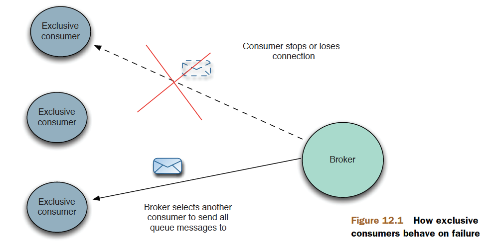
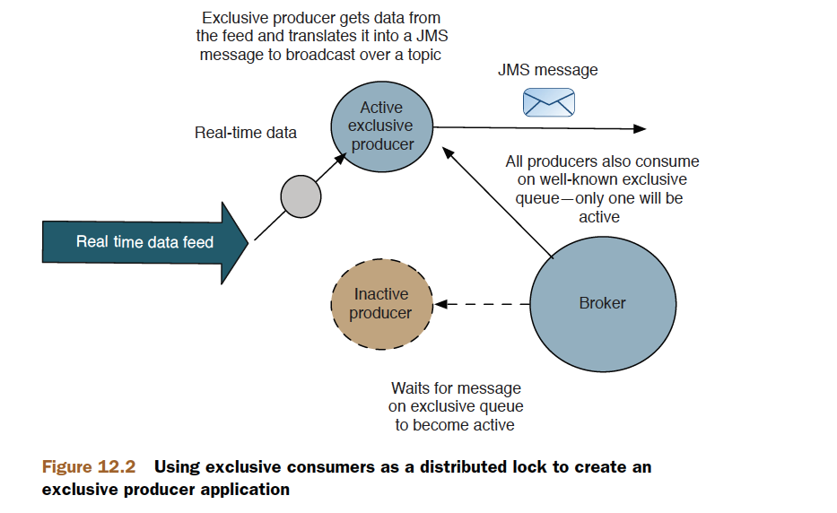

# Chapter 12

Advanced client options

This chapter covers

- How to use exclusive consumers
- The power of message groups
- Understanding support for streams and blobs
- The failover transport
- Scheduling message delivery

In the last chapter we covered advanced ActiveMQ broker features. In this chapter
we’re going to look at some advanced features on the client side of ActiveMQ. We’ll
look at how to ensure that one message consumer will receive messages from a
queue, regardless of how many message consumers have subscribed to it. This feature
is called exclusive consumer, and can be used for ensuring that messages are
always consumed in order, or as a distributed locking mechanism—for which we
have an example. We’ll look at message groups, where messages can be grouped
together to be consumed by the same message consumer. ActiveMQ supports two
different ways to send large payloads through ActiveMQ—using ActiveMQ streams
and blob messages—and we’ll look at both methods. As the client-side failover
transport protocol is important for applications to survive network outages and
broker failure, we’ll look at its nuances in more detail. And, finally, we’ll look at
sending messages with a delay, and delay using scheduled messages.

- exclusive consumer
- consumed in order
- message groups

## Exclusive consumers



> create an exclusive consumer

```java
queue = new ActiveMQQueue("TEST.QUEUE?consumer.exclusive=true");
consumer = session.createConsumer(queue);
```

## Using exclusive consumers to provide a distributed lock



```java
public void start() throws JMSException {
    this.connection = this.factory.createConnection();
    this.connection.start();
    this.session =
    this.connection.createSession(false, Session.CLIENT_ACKNOWLEDGE);
    Destination destination = this.session.createQueue(this.queueName + "?consumer.exclusive=true");
    Message message = this.session.createMessage();
    MessageProducer producer = this.session.createProducer(destination);
    producer.send(message);
    MessageConsumer consumer = this.session.createConsumer(destination);
    consumer.setMessageListener(this);
}
```

## Message groups


```java
Session session =
connection.createSession(false, Session.AUTO_ACKNOWLEDGE);
Queue queue = session.createQueue("group.queue");
MessageProducer producer = session.createProducer(queue);
Message message = session.createTextMessage("<foo>test</foo>");
message.setStringProperty("JMSXGroupID", "TEST_GROUP_A");
producer.send(message);
```

```xml
<destinationPolicy>
<policyMap>
<policyEntries>
<policyEntry queue=">"
consumersBeforeDispatchStarts="2"
timeBeforeDispatchStarts="5000"/>
</policyEntries>
</policyMap>
</destinationPolicy>
```

## ActiveMQ streams
