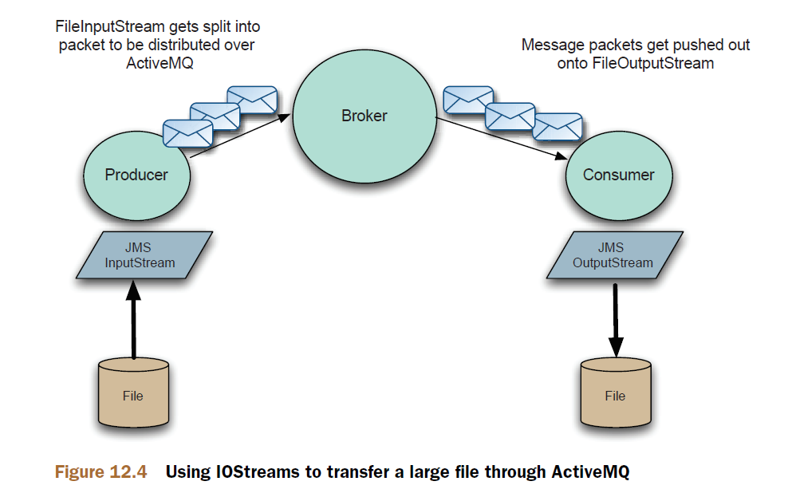

# Chapter 12

Advanced client options

This chapter covers

- How to use exclusive consumers
- The power of message groups
- Understanding support for streams and blobs
- The failover transport
- Scheduling message delivery

In the last chapter we covered advanced ActiveMQ broker features. In this chapter
we’re going to look at some advanced features on the client side of ActiveMQ. We’ll
look at how to ensure that one message consumer will receive messages from a
queue, regardless of how many message consumers have subscribed to it. This feature
is called exclusive consumer, and can be used for ensuring that messages are
always consumed in order, or as a distributed locking mechanism—for which we
have an example. We’ll look at message groups, where messages can be grouped
together to be consumed by the same message consumer. ActiveMQ supports two
different ways to send large payloads through ActiveMQ—using ActiveMQ streams
and blob messages—and we’ll look at both methods. As the client-side failover
transport protocol is important for applications to survive network outages and
broker failure, we’ll look at its nuances in more detail. And, finally, we’ll look at
sending messages with a delay, and delay using scheduled messages.

- exclusive consumer
- consumed in order
- message groups

## Exclusive consumers


> create an exclusive consumer

```java
queue = new ActiveMQQueue("TEST.QUEUE?consumer.exclusive=true");
consumer = session.createConsumer(queue);
```

## Using exclusive consumers to provide a distributed lock


```java
public void start() throws JMSException {
    this.connection = this.factory.createConnection();
    this.connection.start();
    this.session =
    this.connection.createSession(false, Session.CLIENT_ACKNOWLEDGE);
    Destination destination = this.session.createQueue(this.queueName + "?consumer.exclusive=true");
    Message message = this.session.createMessage();
    MessageProducer producer = this.session.createProducer(destination);
    producer.send(message);
    MessageConsumer consumer = this.session.createConsumer(destination);
    consumer.setMessageListener(this);
}
```

## Message groups


```java
Session session =
connection.createSession(false, Session.AUTO_ACKNOWLEDGE);
Queue queue = session.createQueue("group.queue");
MessageProducer producer = session.createProducer(queue);
Message message = session.createTextMessage("<foo>test</foo>");
message.setStringProperty("JMSXGroupID", "TEST_GROUP_A");
producer.send(message);
```

```xml
<destinationPolicy>
    <policyMap>
        <policyEntries>
            <policyEntry queue=">"
            consumersBeforeDispatchStarts="2"
            timeBeforeDispatchStarts="5000"/>
        </policyEntries>
    </policyMap>
</destinationPolicy>
```

## ActiveMQ streams



> OutputStream

```java
//source of our large data
FileInputStream in = new FileInputStream("largetextfile.txt");
String brokerURI = ActiveMQConnectionFactory.DEFAULT_BROKER_URL;
ConnectionFactory connectionFactory = new ActiveMQConnectionFactory(brokerURI);
Connection connection = (ActiveMQConnection)
connectionFactory.createConnection();
connection.start();
Session session = connection.createSession(false, Session.AUTO_ACKNOWLEDGE);
Queue destination = session.createQueue(QUEUE_NAME);
OutputStream out = connection.createOutputStream(destination);
//now write the file on to ActiveMQ
byte[] buffer = new byte[1024];
while(true){
    int bytesRead = in.read(buffer);
    if (bytesRead==-1){
    break;
}
out.write(buffer,0,bytesRead);
}
//close the stream so the receiving side knows the steam is finished
out.close();
```

> InputStream

```java
//destination of our large data
FileOutputStream out = new FileOutputStream("copied.txt");
String brokerURI = ActiveMQConnectionFactory.DEFAULT_BROKER_URL;
ConnectionFactory connectionFactory =
new ActiveMQConnectionFactory(brokerURI);
Connection connection = (ActiveMQConnection)
connectionFactory.createConnection();
connection.start();
Session session =
connection.createSession(false, Session.AUTO_ACKNOWLEDGE);
//we want to be an exclusive consumer
String exclusiveQueueName= QUEUE_NAME + "?consumer.exclusive=true";
Queue destination = session.createQueue(exclusiveQueueName);
InputStream in = connection.createInputStream(destination);
//now write the file from ActiveMQ
byte[] buffer = new byte[1024];
while(true){
int bytesRead = in.read(buffer);
if (bytesRead==-1){
break;
}
out.write(buffer,0,bytesRead);
}
out.close();
```

## Blob messages

```java
import org.apache.activemq.BlobMessage;
String brokerURI = ActiveMQConnectionFactory.DEFAULT_BROKER_URL;
ConnectionFactory connectionFactory =
new ActiveMQConnectionFactory(brokerURI);
Connection connection = connectionFactory.createConnection();
connection.start();
ActiveMQSession session = (ActiveMQSession)
connection.createSession(false, Session.AUTO_ACKNOWLEDGE);
Queue destination = session.createQueue(QUEUE_NAME);
MessageProducer producer = session.createProducer(destination);
BlobMessage message =
session.createBlobMessage(new URL("http://example.com/bigfile.dat"));
producer.send(message);
```

```java
import org.apache.activemq.BlobMessage;
// destination of our Blob data
FileOutputStream out = new FileOutputStream("blob.dat");
String brokerURI = ActiveMQConnectionFactory.DEFAULT_BROKER_URL;
ConnectionFactory connectionFactory =
new ActiveMQConnectionFactory(brokerURI);
Connection connection = (ActiveMQConnection)
connectionFactory.createConnection();
connection.start();
Session session =
connection.createSession(false, Session.AUTO_ACKNOWLEDGE);
Queue destination = session.createQueue(QUEUE_NAME);
MessageConsumer consumer = session.createConsumer(destination);
BlobMessage blobMessage = (BlobMessage) consumer.receive();
InputStream in = blobMessage.getInputStream();
// now write the file from ActiveMQ
byte[] buffer = new byte[1024];
while (true) {
    int bytesRead = in.read(buffer);
    if (bytesRead == -1) {
    break;
}
out.write(buffer, 0, bytesRead);
}
out.close();
```

## Surviving network or broker failure with the failover protocol

```config
failover:(tcp://host1:61616,tcp://host2:61616,ssl://host2:61616)

failover:(tcp://master:61616,tcp://slave:61616)?randomize=false

failover:(tcp://master:61616,tcp://slave:61616)?\
backOffMultiplier=1.5,initialReconnectDelay=1000

failover:(tcp://host1:61616?wireFormat.maxInactivityDuration=1000,\
tcp://host2:61616?wireFormat.maxInactivityDuration=1000)

failover:(tcp://host1:61616,tcp://host2:61616)?\
trackMessages=true,maxCacheSize=256000

failover:(tcp://host1:61616,tcp://host2:61616,\
tcp://host3:61616)?backup=true,backupPoolSize=2
```

> TransportConnector properties for updating clients of cluster changes

| Property                     | Default value | Description                                                                                                                                                                              |
| ---------------------------- | ------------- | ---------------------------------------------------------------------------------------------------------------------------------------------------------------------------------------- |
| updateClusterClients         | false         | If true, pass information to connected clientsabout changes in the topology of the broker cluster.                                                                                       |
| rebalanceClusterClients      | false         | If true, connected clients will be asked to rebalance across a cluster of brokers when a new broker joins the network of brokers.                                                        |
| updateClusterClientsOnRemove | false         | If true, will update clients when a cluster is removed from the network. Having this as separate option enables clients to be updated when new brokers join, but not when brokers leave. |
| updateClusterFilter          | null          | Comma-separated list of regular expression filters used to match broker names of brokers to designate as being part of the failover cluster for the clients.                             |

```xml
<broker>
    <transportConnectors>
        <transportConnector name="clustered" uri="tcp://0.0.0.0:61616" updateClusterClients="true" updateClusterFilter="*newyork*,*london*" />
    </<transportConnectors>
</broker>
```

This configuration will update any clients that are using the failover transport protocol
with the locations of any brokers joining that have newyork or london in their broker
names. With `updateClusterClients` enabled, you only need to configure the failover
protocol with one broker in the cluster, for example:
`failover:(tcp://tokyo:61616)`
As the client will be updated automatically as new brokers join and leave the cluster, if
the machine `tokyo` should fail, the client would automatically fail over to either `newyork`
or `london`.

## Scheduling messages to be delivered by ActiveMQ in the future

```cron
.---------------- minute (0 - 59)
| .------------- hour (0 - 23)
| | .---------- day of month (1 - 31)
| | | .------- month (1 - 12) - 1 = January
| | | | .---- day of week (0 - 7) (Sunday=0 or 7
| | | | |
* * * * *
```