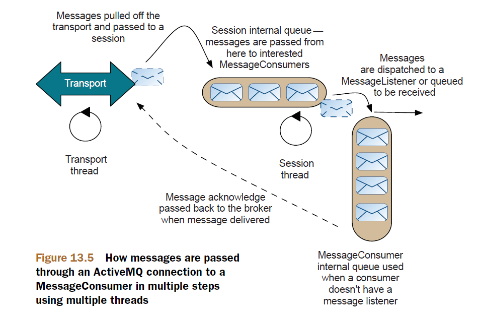

# Chapter 13

Tuning ActiveMQ for performance

This chapter covers

- Learn general tuning techniques
- How to optimize producers and consumers
- An example application that has been tuned

## Persistent versus nonpersistent messages

Nonpersistent messages are significantly faster than persistent messages there are two reasons for this:

- Messages are sent asynchronously from the message producer, so the producer doesn’t have to wait for a receipt from the broker. This is shown in figure13.1.
- Persisting messages to the message store (which typically involves writing to disk) is slow compared to messaging over a network.


> Persistent message delivery

```java
MessageProducer producer = session.createProducer(topic);
producer.setDeliveryMode(DeliveryMode.NON_PERSISTENT);
```

## Transactions

Transacted and nontransacted example


```java
public void sendTransacted() throws JMSException {
ActiveMQConnectionFactory cf = new ActiveMQConnectionFactory();
Connection connection = cf.createConnection();
connection.start();
Session session =
connection.createSession(true, Session.SESSION_TRANSACTED);
Topic topic = session.createTopic("Test.Transactions");
MessageProducer producer = session.createProducer(topic);
int count =0;
for (int i =0; i < 1000; i++) {
Message message = session.createTextMessage("message " + i);
producer.send(message);
if (i!=0 && i%10==0){
session.commit();
}
}
}

public void sendNonTransacted() throws JMSException {
ActiveMQConnectionFactory cf = new ActiveMQConnectionFactory();
Connection connection = cf.createConnection();
connection.start();
//create a default session (no transactions)
Session session =
connection.createSession(false, Session.AUTO_ACKNOWELDGE);
Topic topic = session.createTopic("Test.Transactions");
MessageProducer producer = session.createProducer(topic);
int count =0;
for (int i =0; i < 1000; i++) {
Message message = session.createTextMessage("message " + i);
producer.send(message);
}
}
```

## Embedding brokers

You can create an embedded broker with a transport connector to listen to TCP
connections but still connect to it using the VM transport.

Creating a queue service

```java
BrokerService broker = new BrokerService();
broker.setBrokerName("service");
broker.setPersistent(false);
broker.addConnector("tcp://localhost:61616");
broker.start();
ActiveMQConnectionFactory cf =
new ActiveMQConnectionFactory("vm://service");
cf.setCopyMessageOnSend(false);
Connection connection = cf.createConnection();
connection.start();
Session session =
connection.createSession(false, Session.AUTO_ACKNOWLEDGE);
final MessageProducer producer = session.createProducer(null);
Queue queue = session.createQueue("service.queue");
MessageConsumer consumer = session.createConsumer(queue);
consumer.setMessageListener(new MessageListener() {
public void onMessage(Message msg) {
try {
TextMessage textMsg = (TextMessage)msg;
String payload = "REPLY: " + textMsg.getText();
Destination replyTo = msg.getJMSReplyTo();
textMsg.clearBody();
textMsg.setText(payload);
producer.send(replyTo, textMsg);
} catch (JMSException e) {
e.printStackTrace();
}
}
});
```

Connecting a QueueRequestor

```java
ActiveMQConnectionFactory cf = new ActiveMQConnectionFactory("tcp://localhost:61616");
QueueConnection connection = cf.createQueueConnection();
connection.start();
QueueSession session = connection.createQueueSession(false, Session.AUTO_ACKNOWLEDGE);
Queue queue = session.createQueue("service.queue");
QueueRequestor requestor = new QueueRequestor(session,queue);
for(int i =0; i < 10; i++) {
    TextMessage msg = session.createTextMessage("test msg: " + i);
    TextMessage result = (TextMessage)requestor.request(msg);
    System.err.println("Result = " + result.getText());
}
```

```java
ActiveMQConnectionFactory cf = new ActiveMQConnectionFactory();
cf.setCopyMessageOnSend(false);
```

## Tuning the OpenWire protocol

> OpenWire tuning parameters

| Parameter name       | Default value | Description                                                                                                                                                                                                                                                                                                                                                                                                                                                                                                    |
| -------------------- | ------------- | -------------------------------------------------------------------------------------------------------------------------------------------------------------------------------------------------------------------------------------------------------------------------------------------------------------------------------------------------------------------------------------------------------------------------------------------------------------------------------------------------------------- |
| tcpNoDelayEnabled    | false         | Provides a hint to the peer transport to enable/disable tcpNoDelay. If this is set, it may improve performance where you’re sending lots of small messages across a relatively slow network.                                                                                                                                                                                                                                                                                                                  |
| cacheEnabled         | true          | Commonly repeated values (like producerId and                                                                                                                                    destination) are cached, enabling short keys to be passed instead. This decreases message size, which can have a positive impact on performance where network performance is relatively poor. The cache lookup involved does add overhead to CPU load on both the clients and the broker machines, so take this into account. |
| cacheSize            | 1024          | Maximum number of items kept in the cache. This shouldn’t be bigger than Short.MAX_VALUE/2. The larger the cache, the better the performance where caching is enabled. But one cache will be used with every transport connection, so bear in mind the memory overhead on the broker, especially if it’s loaded with a large number of clients.                                                                                                                                                              |
| tightEncodingEnabled | true          | A CPU-intensive way to compact messages. We recommend disabling this if the broker starts to consume all the available CPU.                                                                                                                                                                                                                                                                                                                                                                                    |

```java
String uri =
"failover://(tcp://localhost:61616?wireFormat.cacheEnabled=false&\
wireFormat.tightEncodingEnabled=false)";
ActiveMQConnectionFactory cf = new ActiveMQConnectionFactory(url);
cf.setAlwaysSyncSend(true);
```

## Tuning the TCP transport

The most commonly used transport for ActiveMQ is the TCP transport. Two parameters
directly affect performance for this transport:

- socketBufferSize

The size of the buffers used to send and receive data over the TCP transport. Usually the bigger the better (though this is operating system dependent, so it’s worth testing!). The default value is 65536, which is the size in bytes.

- tcpNoDelay

The default is false. Normally a TCP socket buffers up small pieces of data before being sent. When you enable this option, messages will be sent as soon as possible. Again, it’s worth testing this out, as whether this boosts performance can be operating system dependent

```java
String url = "failover://(tcp://localhost:61616?tcpNoDelay=true)";
ActiveMQConnectionFactory cf = new ActiveMQConnectionFactory(url);
cf.setAlwaysSyncSend(true);
```

## Optimizing message producers

> Asynchronous send

```java
ActiveMQConnectionFactory cf = new ActiveMQConnectionFactory();
cf.setUseAsyncSend(true);
```

## Producer flow control

`Producer flow control` allows the message broker to slow the rate of messages that are
passed through it when resources are running low. This typically happens when consumers
are slower than the producers, and messages are using memory in the broker
awaiting dispatch.

Producer flow control is enabled by default for persistent messages but must be
explicitly enabled for asynchronous publishing (persistent messages, or for connections
configured to always send asynchronously). You can enable flow control for asynchronous
publishing by setting the producerWindowSize property on the connection
factory.


```java
ActiveMQConnectionFactory cf = new ActiveMQConnectionFactory();
cf.setProducerWindowSize(1024000);
```

## Optimizing message consumers

## Prefetch limit



The prefetch size is the number of outstanding messages that your consumer will have
waiting to be delivered, not the memory limit.

There are different default prefetch sizes for different consumers:

- Queue consumer default prefetch size = 1000
- Queue browser consumer default prefetch size = 500
- Persistent topic consumer default prefetch size = 100
- Nonpersistent topic consumer default prefetch size = 32766

## Delivery and acknowledgment of messages

Something that should be apparent from figure 13.5 is that delivery of messages via a
`javax.jms.MessageListener.onMessage()` will always be faster with ActiveMQ than
calling `javax.jms.MessageConsumer.receive()`. If a `MessageListener` isn’t set for a
MessageConsumer, then its messages will be queued for that consumer, waiting for the
receive() method to be called. Not only will maintaining the internal queue for the
consumer be expensive, but so will the `context switch` by the application thread calling
the receive() method.

> Setting the optimizeAcknowledge property

```java
ActiveMQConnectionFactory cf = new ActiveMQConnectionFactory();
cf.setOptimizeAcknowledge(true);
```

> ActiveMQ acknowledgment modes

| Acknowledgment mode                    | Sends an acknowledgment                                                                                      | Description                                                                                                                                                                                         |
| -------------------------------------- | ------------------------------------------------------------------------------------------------------------ | --------------------------------------------------------------------------------------------------------------------------------------------------------------------------------------------------- |
| Session.SESSION_TRANSACTED             | Rolls up acknowledgments with Session.commit().                                                              | Reliable way for message consumption and performs well, providing you consume more than one message in a commit.                                                                                    |
| Session.CLIENT_ACKNOWLEDGE             | All messages up to when a message is acknowledged are consumed                                               | Can perform well, providing the application consumes a lot of messages before calling acknowledge                                                                                                   |
| Session.AUTO_ACKNOWLEDGE               | Automatically sends a message acknowledgment back to the ActiveMQ broker for every message consumed.         | This can be slow but is often the default mechanism for message consumers.                                                                                                                          |
| Session.DUPS_OK_ACKNOWLEDGE            | Allows the consumer to send one acknowledgment back to the ActiveMQ broker for a range of messages consumed. | An acknowledgment will be sent back when the prefetch limit has reached 50% full. The fastest standard way of consuming messages.                                                                   |
| ActiveMQSession.INDIVIDUAL_ACKNOWLEDGE | Sends one acknowledgment for every message consumed.                                                         | Allows great control by enabling messages to be acknowledged individually but can be slow.                                                                                                          |
| optimizeAcknowledge                    | Allows the consumer to send one acknowledgment back to the ActiveMQ broker for a range of messages consumed. | A hint that works in conjunction with Session.AUTO_ACKNOWLEDGE. An acknowledgment will be sent back when 65% of the prefetch buffer has been consumed. This is the fastest way to consume messages. |

## Asynchronous dispatch

You can disable a property called alwaysSessionAsync on the ActiveMQ
ConnectionFactory to turn this off. This allows messages to be passed directly from
the transport to the message consumer. This property can be disabled as shown in the
following code

```java
ActiveMQConnectionFactory cf = new ActiveMQConnectionFactory();
cf.setAlwaysSessionAsync(false);
```

## Tuning in action

> Creating the embedded broker

```java
import org.apache.activemq.broker.BrokerService;
import org.apache.activemq.broker.region.policy.PolicyEntry;
import org.apache.activemq.broker.region.policy.PolicyMap;
...
BrokerService broker = new BrokerService();
broker.setBrokerName("fast");
broker.getSystemUsage().getMemoryUsage().setLimit(64*1024*1024);
PolicyEntry policy = new PolicyEntry();
policy.setMemoryLimit(4 * 1024 *1024);
policy.setProducerFlowControl(false);
PolicyMap pMap = new PolicyMap();
pMap.setDefaultEntry(policy);
broker.setDestinationPolicy(pMap);
broker.addConnector("tcp://localhost:61616");
broker.start();
```

> Creating the producer

```java
ActiveMQConnectionFactory cf = new ActiveMQConnectionFactory("vm://fast");
cf.setCopyMessageOnSend(false);
Connection connection = cf.createConnection();
connection.start();
Session session = connection.createSession(false, Session.AUTO_ACKNOWLEDGE);
Topic topic = session.createTopic("test.topic");
final MessageProducer producer = session.createProducer(topic);
producer.setDeliveryMode(DeliveryMode.NON_PERSISTENT);
for (int i =0; i < 1000000;i++) {
TextMessage message = session.createTextMessage("Test:"+i);
producer.send(message);
}
```

> Creating the consumer

```java
ActiveMQConnectionFactory cf = new ActiveMQConnectionFactory("failover://(tcp://localhost:61616)");
cf.setAlwaysSessionAsync(false);
cf.setOptimizeAcknowledge(true);
Connection connection = cf.createConnection();
connection.start();
Session session = connection.createSession(false, Session.AUTO_ACKNOWLEDGE);
Topic topic = session.createTopic("test.topic?consumer.prefetchSize=32766");
MessageConsumer consumer = session.createConsumer(topic);
final AtomicInteger count = new AtomicInteger();
consumer.setMessageListener(new MessageListener() {
public void onMessage(Message message) {
TextMessage textMessage = (TextMessage)message;
try {
    if (count.incrementAndGet()%10000==0)
    System.err.println("Got = " + textMessage.getText());
} catch (JMSException e) {
    e.printStackTrace();
}
}
});
```

## Summary

In general, message performance can be improved by asking ActiveMQ to do less.
Consider the overhead of persisting messages and the cost of transporting both messages
and client acknowledgments over the wire. If possible, use reliable messaging or
batching of messages in transactions to reduce the overhead of passing a receipt from
the broker to the producer that it has received a message. You can reduce the amount
of work the ActiveMQ broker does by setting suitable memory limits (more is better)
and deciding whether producer flow control is suitable for your application. The message
consumer has to work twice as hard as the message producer, so optimizing delivery
with a MessageListener and using straight-through message processing together
with an acknowledgment mode or transactions that allow acknowledgments to be
batched can reduce this load.

In this chapter you learned about some general principles for improving performance
with any JMS-based application. We also dove into some of the internals of
ActiveMQ and how changes to the configuration can increase performance. We
learned when and when not to use those options, and their side effects. We also
brought the different aspects of performance tuning together in an example real-time
data feed application.

You should now have a better understanding of where the performance bottlenecks
may occur when using ActiveMQ, and when and why to alleviate them. We’ve
shown how to tune your message producers and message consumers, as well as the
configuration parameters and their impact on your application architecture. You
should be able to make the right architectural decisions for your application to help
performance, and have a good understanding of the downsides in terms of guaranteeing
delivery and how ActiveMQ can be used to mitigate them.