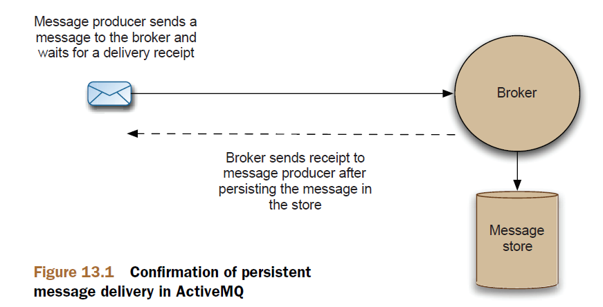

# Chapter 13

Tuning ActiveMQ for performance

This chapter covers

- Learn general tuning techniques
- How to optimize producers and consumers
- An example application that has been tuned

## Persistent versus nonpersistent messages

Nonpersistent messages are significantly faster than persistent messages there are two reasons for this:

- Messages are sent asynchronously from the message producer, so the producer doesn’t have to wait for a receipt from the broker. This is shown in figure13.1.
- Persisting messages to the message store (which typically involves writing to disk) is slow compared to messaging over a network.



> Persistent message delivery

```java
MessageProducer producer = session.createProducer(topic);
producer.setDeliveryMode(DeliveryMode.NON_PERSISTENT);
```

## Transactions

Transacted and nontransacted example


```java
public void sendTransacted() throws JMSException {
ActiveMQConnectionFactory cf = new ActiveMQConnectionFactory();
Connection connection = cf.createConnection();
connection.start();
Session session =
connection.createSession(true, Session.SESSION_TRANSACTED);
Topic topic = session.createTopic("Test.Transactions");
MessageProducer producer = session.createProducer(topic);
int count =0;
for (int i =0; i < 1000; i++) {
Message message = session.createTextMessage("message " + i);
producer.send(message);
if (i!=0 && i%10==0){
session.commit();
}
}
}

public void sendNonTransacted() throws JMSException {
ActiveMQConnectionFactory cf = new ActiveMQConnectionFactory();
Connection connection = cf.createConnection();
connection.start();
//create a default session (no transactions)
Session session =
connection.createSession(false, Session.AUTO_ACKNOWELDGE);
Topic topic = session.createTopic("Test.Transactions");
MessageProducer producer = session.createProducer(topic);
int count =0;
for (int i =0; i < 1000; i++) {
Message message = session.createTextMessage("message " + i);
producer.send(message);
}
}
```

## Embedding brokers

You can create an embedded broker with a transport connector to listen to TCP
connections but still connect to it using the VM transport.

Creating a queue service

```java
BrokerService broker = new BrokerService();
broker.setBrokerName("service");
broker.setPersistent(false);
broker.addConnector("tcp://localhost:61616");
broker.start();
ActiveMQConnectionFactory cf =
new ActiveMQConnectionFactory("vm://service");
cf.setCopyMessageOnSend(false);
Connection connection = cf.createConnection();
connection.start();
Session session =
connection.createSession(false, Session.AUTO_ACKNOWLEDGE);
final MessageProducer producer = session.createProducer(null);
Queue queue = session.createQueue("service.queue");
MessageConsumer consumer = session.createConsumer(queue);
consumer.setMessageListener(new MessageListener() {
public void onMessage(Message msg) {
try {
TextMessage textMsg = (TextMessage)msg;
String payload = "REPLY: " + textMsg.getText();
Destination replyTo = msg.getJMSReplyTo();
textMsg.clearBody();
textMsg.setText(payload);
producer.send(replyTo, textMsg);
} catch (JMSException e) {
e.printStackTrace();
}
}
});
```

Connecting a QueueRequestor

```java
ActiveMQConnectionFactory cf = new ActiveMQConnectionFactory("tcp://localhost:61616");
QueueConnection connection = cf.createQueueConnection();
connection.start();
QueueSession session = connection.createQueueSession(false, Session.AUTO_ACKNOWLEDGE);
Queue queue = session.createQueue("service.queue");
QueueRequestor requestor = new QueueRequestor(session,queue);
for(int i =0; i < 10; i++) {
    TextMessage msg = session.createTextMessage("test msg: " + i);
    TextMessage result = (TextMessage)requestor.request(msg);
    System.err.println("Result = " + result.getText());
}
```

```java
ActiveMQConnectionFactory cf = new ActiveMQConnectionFactory();
cf.setCopyMessageOnSend(false);
```

## Tuning the OpenWire protocol

> OpenWire tuning parameters

| Parameter name       | Default value | Description                                                                                                                                                                                                                                                                                                                                                                                                                                                                                                    |
| -------------------- | ------------- | -------------------------------------------------------------------------------------------------------------------------------------------------------------------------------------------------------------------------------------------------------------------------------------------------------------------------------------------------------------------------------------------------------------------------------------------------------------------------------------------------------------- |
| tcpNoDelayEnabled    | false         | Provides a hint to the peer transport to enable/disable tcpNoDelay. If this is set, it may improve performance where you’re sending lots of small messages across a relatively slow network.                                                                                                                                                                                                                                                                                                                  |
| cacheEnabled         | true          | Commonly repeated values (like producerId and                                                                                                                                    destination) are cached, enabling short keys to be passed instead. This decreases message size, which can have a positive impact on performance where network performance is relatively poor. The cache lookup involved does add overhead to CPU load on both the clients and the broker machines, so take this into account. |
| cacheSize            | 1024          | Maximum number of items kept in the cache. This shouldn’t be bigger than Short.MAX_VALUE/2. The larger the cache, the better the performance where caching is enabled. But one cache will be used with every transport connection, so bear in mind the memory overhead on the broker, especially if it’s loaded with a large number of clients.                                                                                                                                                              |
| tightEncodingEnabled | true          | A CPU-intensive way to compact messages. We recommend disabling this if the broker starts to consume all the available CPU.                                                                                                                                                                                                                                                                                                                                                                                    |

```java
String uri =
"failover://(tcp://localhost:61616?wireFormat.cacheEnabled=false&\
wireFormat.tightEncodingEnabled=false)";
ActiveMQConnectionFactory cf = new ActiveMQConnectionFactory(url);
cf.setAlwaysSyncSend(true);
```

## Tuning the TCP transport

The most commonly used transport for ActiveMQ is the TCP transport. Two parameters
directly affect performance for this transport:

- socketBufferSize

The size of the buffers used to send and receive data over the TCP transport. Usually the bigger the better (though this is operating system dependent, so it’s worth testing!). The default value is 65536, which is the size in bytes.

- tcpNoDelay

The default is false. Normally a TCP socket buffers up small pieces of data before being sent. When you enable this option, messages will be sent as soon as possible. Again, it’s worth testing this out, as whether this boosts performance can be operating system dependent

```java
String url = "failover://(tcp://localhost:61616?tcpNoDelay=true)";
ActiveMQConnectionFactory cf = new ActiveMQConnectionFactory(url);
cf.setAlwaysSyncSend(true);
```

## Optimizing message producers

> Asynchronous send

```java
ActiveMQConnectionFactory cf = new ActiveMQConnectionFactory();
cf.setUseAsyncSend(true);
```

## Producer flow control