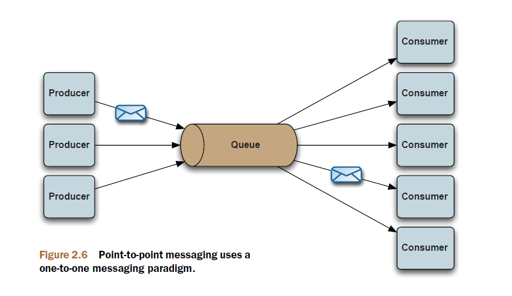
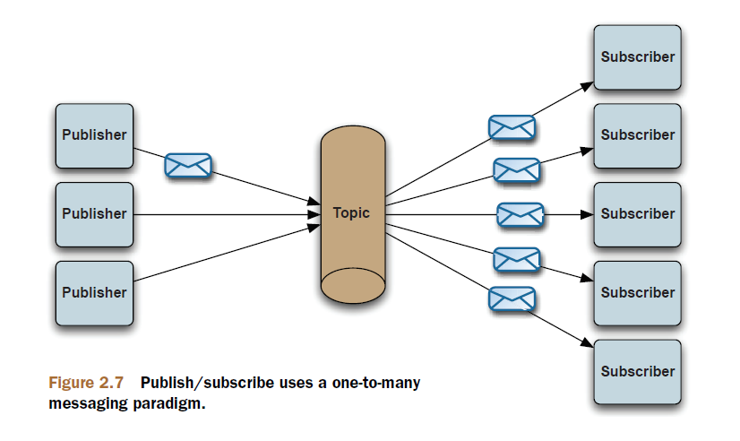

# Chapter 2

Understanding message-oriented middleware and JMS

This chapter covers

- Enterprise messaging and message-oriented middleware
- Understanding the Java Message Service (JMS)
- Using the JMS APIs for sending and receiving messages
- An example of a message-driven bean

Senders know nothing about receivers and receivers know nothing about senders.
This is known as asynchronous messaging.

## What’s the Java Message Service

JMS isn’t itself a MOM. It’s an API that abstracts the interaction between messaging
clients and MOMs in the same manner that JDBC abstracts communication with relational
databases.

## JMS API

In standardizing the API, JMS formally defined many concepts and artifacts from
the world of messaging:

- JMS client —An application is written using 100% pure Java to send and receive messages.
- Non-JMS client —An application is written using the JMS provider’s native client API to send and receive messages instead of JMS.
- JMS producer —A client application that creates and sends JMS messages.
- JMS consumer—A client application that receives and processes JMS messages.
- JMS provider—The implementation of the JMS interfaces, which is ideally written in 100% pure Java.
- JMS message—The most fundamental concept of JMS; sent and received by JMS clients.
- JMS domains—The two styles of messaging that include point-to-point and publish/subscribe.
- Administered objects —Preconfigured JMS objects that contain provider-specific configuration data for use by clients. These objects are typically accessible by clients via JNDI.
- Connection factory—Clients use a connection factory to create connections to the JMS provider.
- Destination—An object to which messages are addressed and sent and from which messages are received.

## JMS clients

JMS clients utilize the `MessageProducer` and `MessageConsumer` interfaces in some
way. It’s the responsibility of the JMS provider to furnish an implementation of each of
these interfaces. A JMS client that sends messages is known as a producer and a JMS client
that receives messages is known as a consumer. It’s possible for a JMS client to handle
both the sending and receiving of messages

A JMS message allows anything to be sent as part of
the message, including `text` and `binary` data as well as information in the headers.

## JMS selector syntax

| Item        | Values                                                                                                                 |
| ----------- | ---------------------------------------------------------------------------------------------------------------------- |
| Literals    | Booleans TRUE/FALSE; numbers such as 5, -10, +34; numbers with decimal or scientific notation such as 43.3E7, +10.5239 |
| Identifiers | A header or property field                                                                                             |
| Operators   | AND, OR, LIKE, BETWEEN, =, <>, <, >, <=, =>, +, -, *, /, IS NULL, IS NOT NULL                                          |

## MESSAGE BODY

JMS defines six Java types for the message body

- Message
- TextMessage
- MapMessage
- BytesMessage
- StreamMessage
- ObjectMessage

## JMS domains

point-to-point and publish/subscribe

### point-to-point

Each message received on the queue is delivered once and only
once to a single consumer. This is similar to a person-to-person email sent through a
mail server.

- `MessageConsumer.receive()`
- `MessageConsumer.setMessageListener()`

In this regard, the JMS provider is distributing the
messages in a sort of `round-robin` style across all the registered consumers.

### publish/subscribe

Any messages sent to the topic are automatically delivered to all
subscribers. This messaging domain is similar to subscribing to a mailing list where all
subscribers will receive all messages sent to the mailing list in a `one-to-many` paradigm

## Request/reply messaging in JMS applications

These restrictions make `temporary destinations` useful for request/reply.

## Administered objects

Administered objects contain provider-specific JMS configuration information and are
supposed to be created by a JMS administrator; hence, the name. Administered
objects are used by JMS clients. They’re used to hide provider-specific details from the
clients and to abstract the JMS provider’s administration tasks. It’s common to look up
administered objects via JNDI, but not required. This is most common when the JMS
provider is hosted in a Java EE container. The JMS spec defines two types of administered
objects: `ConnectionFactory` and `Destination`.

### ConnectionFactory

JMS clients use the `ConnectionFactory` object to create connections to a JMS provider.
Connections typically represent an open TCP socket between a client and the JMS provider,
so the overhead for a connection is large. It’s a good idea to use an implementation
that `pools connections` if possible. A connection to a JMS provider is similar to a
JDBC connection to a relational database, in that it’s used by clients to interact with the
database. JMS connections are used by JMS clients to create `javax.jms.Session` objects
that represent an interaction with the JMS provider.

### Destination

The `Destination` object encapsulates(包囊) the provider-specific address to `which messages
are sent and from which messages are consumed`. Although destinations are created
using the Session object, their lifetime matches the connection from which the session was created.

Temporary destinations are unique to the connection that was used to create
them. They’ll only live as long as the connection that created them and only the connection
that created them can create consumers for them. As mentioned previously,
temporary destinations are commonly used for request/reply messaging.

## A simple JMS application

A simple JMS application will utilize the following steps:

- 1 Acquire a JMS connection factory
- 2 Create a JMS connection using the connection factory
- 3 Start the JMS connection
- 4 Create a JMS session from the connection
- 5 Acquire a JMS destination
- 6 Create a JMS producer, OR
  - a Create a JMS producer
  - b Create a JMS message and address it to a destination
- 7 Create a JMS consumer
  - a Create a JMS consumer
  - b Optionally register a JMS message listener
- 8 Send or receive JMS message(s)
- 9 Close all JMS resources (connection, session, producer, consumer, and so forth)

> A note on multithreading in JMS applications

The JMS spec specifically defines concurrency for various objects in the JMS API and
requires that only a few objects support concurrent access. The `ConnectionFactory`,
`Connection`, and `Destination` objects are required to support concurrent access,
whereas the `Session`, `MessageProducer`, and `MessageConsumer` objects don’t support
concurrent access. The point is that the `Session`, `MessageProducer`, and
`MessageConsumer` objects shouldn’t be shared across threads in a Java application.

## Message-driven beans

Message-driven beans (MDBs) were born out of the EJB 2.0 spec. The motivation was to
allow simple JMS integration into EJBs, making asynchronous message consumption
by EJBs almost as easy as using the standard JMS APIs. Through the use of a JMS
MessageListener interface, the EJB automatically receives messages from the JMS provider
in a push style. An example of a simple MDB is shown here.