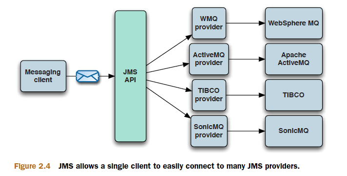
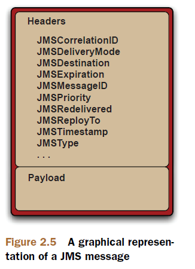

# Chapter 2

Understanding message-oriented middleware and JMS

This chapter covers

- Enterprise messaging and message-oriented middleware
- Understanding the Java Message Service (JMS)
- Using the JMS APIs for sending and receiving messages
- An example of a message-driven bean

Senders know nothing about receivers and receivers know nothing about senders.
This is known as asynchronous messaging.

## What’s the Java Message Service

JMS isn’t itself a MOM. It’s an API that abstracts the interaction between messaging
clients and MOMs in the same manner that JDBC abstracts communication with relational
databases.

## JMS API

In standardizing the API, JMS formally defined many concepts and artifacts from
the world of messaging:

- JMS client —An application is written using 100% pure Java to send and receive messages.
- Non-JMS client —An application is written using the JMS provider’s native client API to send and receive messages instead of JMS.
- JMS producer —A client application that creates and sends JMS messages.
- JMS consumer—A client application that receives and processes JMS messages.
- JMS provider—The implementation of the JMS interfaces, which is ideally written in 100% pure Java.
- JMS message—The most fundamental concept of JMS; sent and received by JMS clients.
- JMS domains—The two styles of messaging that include point-to-point and publish/subscribe.
- Administered objects —Preconfigured JMS objects that contain provider-specific configuration data for use by clients. These objects are typically accessible by clients via JNDI.
- Connection factory—Clients use a connection factory to create connections to the JMS provider.
- Destination—An object to which messages are addressed and sent and from which messages are received.

- `MessageProducer`
- `MessageConsumer`

A JMS message allows anything to be sent as part of
the message, including `text` and `binary` data as well as information in the headers.

## JMS domains