# Architecture design

系统设计

## 软件建模

- 领域问题+建模（问题）
- 软件系统（产出）

## 建模工具

- UML 马丁富勒的《UML 精粹》
- 类图 类的特性和类之间的静态关系 类之间有 6 种静态关系：关联、依赖、组合、聚合、继承、泛化
- 时序图 描述参与者之间的动态调用关系
- 组件图 组件图描述组件之间的静态关系
- 部署图 需要部署多少服务器，关键组件都部署在哪些服务器上(每个服务是I/O密集型还是CPU密集型，比如宽带资源占用等等)
- 用例图 用例图通过反映用户和软件系统的交互，描述系统的功能需求
- 状态图 状态图用来展示单个对象生命周期的状态变迁
- 活动图 活动图主要用来描述过程逻辑和业务流程

## 软件设计

软件设计过程可以拆分成需求分析、概要设计和详细设计三个阶段。

在需求分析阶段，主要是通过用例图来描述系统的功能与使用场景；对于关键的业务流程，可以通过活动图描述；如果在需求阶段就提出要和现有的某些子系统整合，那么可以通过时序图描述新系统和原来的子系统的调用关系；可以通过简化的类图进行领域模型抽象，并描述核心领域对象之间的关系；如果某些对象内部会有复杂的状态变化，比如用户、订单这些，可以用状态图进行描述。

在概要设计阶段，通过部署图描述系统最终的物理蓝图；通过组件图以及组件时序图设计软件主要模块及其关系；还可以通过组件活动图描述组件间的流程逻辑。

在详细设计阶段，主要输出的就是类图和类的时序图，指导最终的代码开发，如果某个类方法内部有比较复杂的逻辑，那么可以将这个方法的逻辑用活动图进行描述。