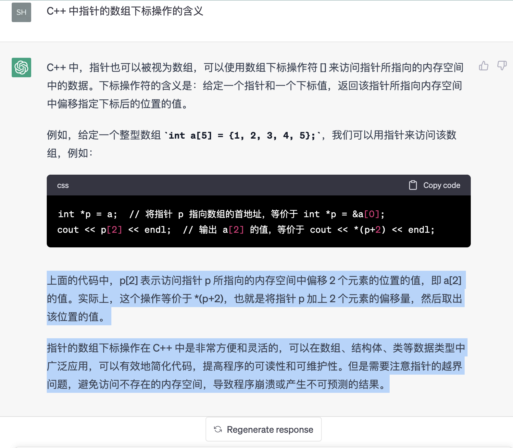

# C++ 中的数组与指针

C++ 中，指针也可以被视为数组，可以使用数组下标操作符 [] 来访问指针所指向的内存空间中的数据。下标操作符的含义是：给定一个指针和一个下标值，返回该指针所指向内存空间中偏移指定下标后的位置的值。

例如，给定一个整型数组 int a[5] = {1, 2, 3, 4, 5};，我们可以用指针来访问该数组，例如：

```c++
int *p = a;  // 将指针 p 指向数组的首地址，等价于 int *p = &a[0];
cout << p[2] << endl;  // 输出 a[2] 的值，等价于 cout << *(p+2) << endl;
```

上面的代码中，p[2] 表示访问指针 p 所指向的内存空间中偏移 2 个元素的位置的值，即 a[2] 的值。实际上，这个操作等价于 *(p+2)，也就是将指针 p 加上 2 个元素的偏移量，然后取出该位置的值。

指针的数组下标操作在 C++ 中是非常方便和灵活的，可以在数组、结构体、类等数据类型中广泛应用，可以有效地简化代码，提高程序的可读性和可维护性。但是需要注意指针的越界问题，避免访问不存在的内存空间，导致程序崩溃或产生不可预测的结果。


