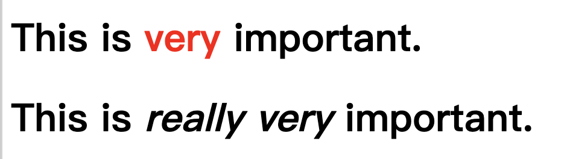

# 第2章 选择符

- 群组选择符
- 同时使用群组选择符和群组声明
- 类选择符和 ID 选择符
- 属性选择符
    - 根据部分属性值选择
- 根据文档结构选择
- 伪类选择符
- 伪元素选择符
    - 选择根元素
    - 选择空元素
    - 选择唯一的子代 :only-child
    - 选择第一个和最后一个子代 :first-child :last-child
    - 选择第一个和最后一个某种元素
    - 选择每第 n 个子元素 :nth-child()  :nth-last-child()
    - 选择每第 n 个某种元素
- 动态伪类
    - 用户操作伪类
    - UI 状态伪类
    - 启用和禁用的 UI 元素
    - 选择状态
    - 默认选项伪类
    - 可选性伪类
    - 有效性伪类
    - 范围伪类
    - 可变性伪类
    - :target 伪类
    - :lang 伪类
    - 否定 伪类
- 伪元素选择符
    - 装饰首字母
    - 装饰首行
    - ::first-letter 和 ::first-line 的限制
    - 装饰 (或创建) 前置和后置内容元素


## 元素选择符(element selector)

```css
html {
    color: black;
}

h1 {
    color: gray;
}

h2 {
    color: silver;
}color: red;
}
```

## 群组选择符

 ```css
/* 同时使用群组选择符和群组声明 */
h2,p {
    color: gray;
    background: white;
}
 ```

 ## 类选择符和 ID 选择符


 ```css
p.warning {font-weight: bold;}
span.warning {font-style: italic;}
 ```

 ## 选择符ID

 ```css
*#first-para {font-weight: bold;}
 ```


 ## 多个类

```css
p.warning.help {background: red;}
```

## 属性选择符

```css
/* 简单属性选择符 */
h1[class] {color: silver;}

p[class~="warning"] {font-weight: bold;}
```


- [fool="bar"] 选择的元素有 foo 属性，且其值以 bar 和一个英文破折号 (U+002D) 开头，或者值就是 bar 本身
- [foo~="bar"] 选择的元素有 foo 属性，且其值是包含 bar 这个词的一组词
- [foo*="bar"] 选择的元素有 foo 属性，且其值包含子串 bar
- [foo^="bar"] 选择的元素有 foo 属性，且其值以 bar 开头
- [foo$="bar"] 选择的元素有 foo 属性，且其值以 bar 结尾


## 后代选择符

```css
/* 作为 h1 元素后代的 em 元素 */
hi em {color: gray;}
```
## 选择子元素

```css
/* 使用子代连结符，即大于号 (>) */
h1 > strong {color: red;}
```

这个规则将把第一个 h1 中的 strong 元素显示为红色，第二个则不受影响:

```html
<h1>This is <strong>very</strong> important.</h1>
<h1>This is <em>really <strong>very</strong></em> important.</h1>
```



## 选择紧邻同胞元素

```css
/* 这个选择符的意思是，“选择的 p 元素紧跟在 h1 元素后面，而且二者同属一个父元素” */
h1 + p {margin-top: o;}
```
## 选择后续同胞

Selectors Level 3 引人一个新的同胞连结符，名为一般同胞连结符 (general siblingcombinator)。这个连结符使用波浪号 (~) 表示，选择一个元素后面同属一个父元素的另一个元素。

## 伪类选择符

开始之前，先说一下串联。CSS 允许把伪类拼接 (串联) 在一起。例如，可以把有鼠标悬停其上的未访问链接显示为红色，把有鼠标悬停其上的已访问链接显示为红褐色:

```css
a:link:hover (color: red;}
a:visited:hover {color: maroon;}
```

## only-of-type

这两个伪类之间的区别是，:only-of-type 匹配同胞中唯一的那种元素，而 :only-child只匹配完全没有同胞的元素。

## 选择第一个和最后一个某种元素

```css
table:first-of-type {border-top: 2px solid gray;}
```


## 装饰 (或创建) 前置和后置内容元素

```css
h2::before {content:"]]"; color: silver;}
```