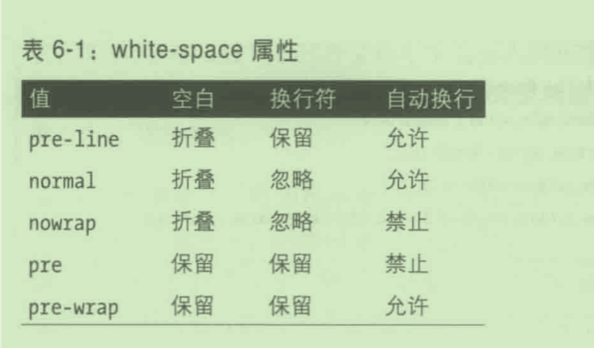

# 第6章 文本属性

- “行内”(inline) 和“块级”(block) 两个术语
- text-indent 文本缩进
- text-align 比 text-indent 还基础，它控制元素中各文本行的对齐方式。
- text-align 只能用于块级元素
- 两端对齐 justify
- letter-spacing
- text-align-last
- line-height
- line-height 纯数字
- 纵向对齐文本
- sup 和 sub (上标和下标)元素
- vertical-align: super
- vertical-align: sub
- 低端对齐
- vertical-align:bottom 把元素所在行内框的底边与行框的底边对齐
- vertical-align:text-bottom 相对行中文本的底边对齐
- 对齐后元素的具体位置取决于行中有什么元素、元素有多高，以及父元素的字号
- middle
- vertical-align:-100%; 百分数
- 单词间距和字符间距
- word-spacing
- text-decoration
- text-shadow
- white-space: pre,nowarp
- 使用 white-space 属性禁止换行
- tab-size
- 默认情况下，一个制表符相当于八个连续的空格
- 换行和断字 hyphens

## line-height

有一些元素的计算逻辑是基于（比如：vertical-align: super） `line-height` 的而不是 `font-size`。

## white-space

