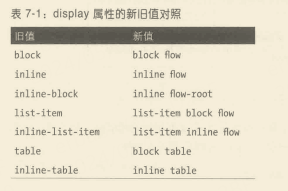
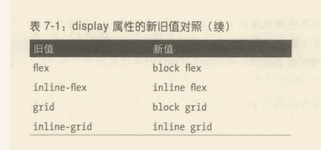

# 第7章 视觉格式化基础

- 本章全面阐述 CSS 视觉渲染的理论
- 元素框基础 element-box
- 块级框
- 行内框
- display
- box-sizing
- content-box padding-box border-box
-  box-sizing 决定的是width 从何处算起，而不是它与外边距的关系。
- 负外边距
- 右外边距 因为规则就是这样制定的:倘若元素的尺寸出现过约束，右外边距要被重置为满足算式所需的任何值(如果是从右至左书写的语言，重置的将是左外边距)
- 注意，内边距、边框和内容宽度(及高度)不能为负值。只有外边距的值可以小于零
- height 属性要么设为auto，要么设为某种类型的非负值，决不能小于零
- 折叠纵向外边距
- 负外边距和折叠
- 列表项目
- list-style-position
- 七个横向属性之和始终等于父元素的 width.
- text-algin
- 设定line-height值的最佳方式是使用纯数字
- 按比例设定行高
- box-decoration-break
- display: flow
- block和inline等关键字表示外部显示类型
- display: inline table
- display: flow-root
- display: contents

## element-box


外边距、边框和内边距都有分别针对每一边的属性，例如 margin-left 或 border-bottom，也有简写属性，例如 padding。而轮廓没有针对各边的属性。默认情况下，内容区的背景(例如颜色或平铺的图像) 出现在内边距范围内。外边距区域始终是透明的,因此透过它能看到父元素。内边距不能为负值，但是外边距可以。稍后会说明把外边距设为负值的效果

边框的线型由样式定义，例如设为 solid 或 inset，边框的颜色由 border-color 属性设定。如未设定颜色，边框的颜色与元素中内容的前景色相同。比如说，段落中的文本是白色，如果创作人员没有明确声明使用其他颜色，那么段落四周的边框也是白色的。如果边框的线型有间隙，那么默认情况下，从间隙中能看到元素的背景。最后，边框的宽度不能为负数。

- 常规流动

即渲染西方语言时从左至右、从上到下的顺序，以及传统的 HTML 文档采用的文本布局方式。注意，对非西方语言来说，流动方向可能会变。多数元素都采用常规的流动方式，除非元素浮动了、定位了，放人弹性盒或采用栅格布局了。不过本章只讨论常规流动方式下的元素。

- 非置换元素

内容包含在文档中的元素。例如，段落(p) 是非置换元素，因为段落中的文本内容在元素自身中。

- 置换元素

为其他内容占位的元素。典型的置换元素是 img，它指向一个图像文件，那个图像就插在 img 元素在文档流中的位置上。多数表单元素也是置换元素 (例如<inputtype="radio">)。


- 根元素

位于文档树顶端的元素。在 HTML 文档中，根元素是 html。在 XML 文档中，根元素可以是语言允许的任何元素，例如，RSS 文件的根元素是 rss。

- 块级框

段落、标题或 div 等元素生成的框。在常规流动模式下,块级框在框体前后都“换行”因此块级框是纵向堆叠的。display: block 声明能把任何元素生成的框体变成块级框。

- 行内框

strong 或 span 等元素生成的框体。行内框前后不“换行”。display: inline 声明能把任何元素生成的框体变成行内框。

- 行内块级框

内部特征像块级框，外部特征像行内框。行内块级框的行为与置换元素相似，但不完全相同。比如说把一个 div 元素像行内图像那样插人一行文本，这样一想你就明白了。


## 负外边距

```css
div {
    width: 500px;
    border: 3px solid black;
}

p.wide {
    margin-left: 50px;
    width: auto;
    margin-right: 10px;
    border: 3px solid gray;
}
```


## 按比例设定行高

```html
<!DOCTYPE html>
<html lang="en">

<head>
  <meta charset="UTF-8">
  <title>Lightly-HTML-Project</title>
  <link href="./css/style.css" rel="stylesheet" />
</head>

<body>
<p>
    This paragraph has a line-height of 1.5 times its font-size. In additionany elements within it
     <small>such as this small element</small> also haveline-heights 1.5 times their font-size...and that includes
     <big>this bigelement right here</big>.By using a scaling factor, line-heights scaleto match the font-size of any element.
</p>
</body>

</html>
```


```css

body{
    line-height: 1.5;
}

p {
    font-size:15px; 
    line-height: 1.5;
}

small {font-size:66%;}

big {
    font-size:200%; 
    line-height: 1em;
}


```

## flow 布局

利用这种形式可以声明 display:inline table 这样的规则，指明元素内部按照表格布局，而处理与周围内容的关系时则作为行内元素(以前的inline-table 值具有同等效果)。





