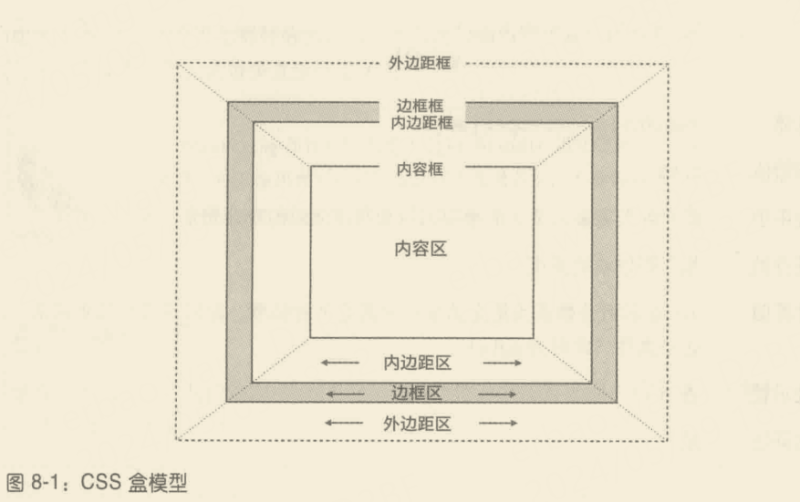
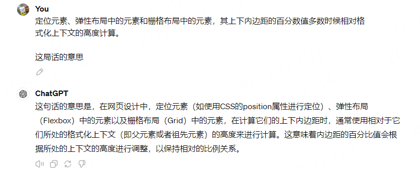

# 第8章 内边距、边框、轮廓和外边距

- 盒模型(box model)
- padding 内边距
- 元素的背景默认延伸到内边距区域
- padding: top right bottom left
- TRouBLe
- padding-top, padding-right, padding-bottom,padding-left
- 百分数值是相对父元素的宽度计算的
- 父元素的宽度对内边距百分数值的影响
- 行内元素的内边距(特殊的场景处理)
- 置换元素的内边距
- 置换元素
- 边框
- 边框有三个要素:宽度(厚度)，式样(外观)，颜色
- border-style
- 边框多个式样
- border-width
- border-color
- border
- 行内元素的边框
- 行内置换元素的边框
- border-radius
- 边框圆角是如何计算的
- 如果提供单个百分数，得到的结果更接近椭圆
- 半径不同的圆角
- 有圆角的元素依然是框体
- 复杂的圆角形状
- 单独的圆角属性
- 图像边框
- border-image-source
- border-image-slice
- border-image-outset
- border-image-repeat
- border-image
- outline-style
- outline-color
- 轮廓与边框的区别

## box model



## width height

width height 这两个属性有一点要注意:无法应用到行内非置换元素上。

比如说，为正常流动模式下生成行内框的超链接声明的 height 和 width，在遵守 CSS 标准的浏览器中会被忽略。假设应用的是下述规则:

```css
a:link {color:red;background:silver; height:15px; width: 60px;}
```

那么，链接在未访问的状态下将呈现为银底红字，而其高度和宽度由链接的内容决定，而不是 15 像素高、60 像素宽。但是，如果加上 display 属性，把值设为 inline-block或block，那么 height和width的值将被采用，分别设定链接内容区的高度和宽度。


## padding

```css
h2 {
    padding:14px 5em 0.1in 3ex;/*不同类型的长度值 */
}
```


如果你觉得这种处理方式有点奇怪，可以这样理解:正常流动模式下的多数元素，其高度恰好够容纳后代元素的内容及其内边距(这也是本章假定的行为)。如果元素的上下内边距相对父元素的高度计算，为了容纳上下内边距，父元素的高度要增加，而高度变化后，上下内边距的值又要随之变化，如此一直下去，进入无限循环。但是元素的上下内边距又不能忽略，因此规范制定人员决定相对父元素内容区的高度计算上下内边距的百分数值，原因很简单，父元素的宽度不随后代元素的宽度影响。

那么，如果元素没有声明具体的宽度呢?此时，元素框的总体宽度(包括内边距)由父元素的宽度决定。利用这一点可以实现流动布局，元素的内边距随父元素的尺寸而增大或减小。如果使用百分数值设定元素的内边距，用户改变浏览器窗口的宽度时，内边距会随之变大或减小。当然具体怎么设计由你自己决定。




```css
h2 {padding:o.5em 10%;}
```

这里，虽然上下内边距的值是固定不变的，但是两侧的内边距值会随着父元素宽度的变化而变化。

## 边框

边框有三个要素:宽度(厚度)，式样(外观)，颜色。边框宽度的默认值为medium，对应的具体值视情况而定，通常为2像素。尽管如此，但你一般见不到边框，因为默认的边框式样为 none，即不存在(稍后你将发现，这又会重置border-width的值)。

## 边框圆角是如何计算的

同样把注意力集中在左上角。左边框从距元素框顶边33%高度的位置处向内弯曲。也就是说，如果元素框的高度为100像素，就从距元素框顶边33像素处向内弯曲。
类似地，上边框从距元素框左边33%宽度处向内弯曲。如果元素框的宽度为600像素，就从距左边198像素(600x0.33=198)处向内弯曲。

## 轮廓与边框的区别

轮廓与边框之间的第一个重要区别是，轮对布局完全没有影响。任何影响都没有。轮廓只是视觉上的效果。

边框与轮廓的区别：

1. 轮廓不占空间。
2. 轮廓可以不是矩形。
3. 用户代理通常在元素处于:focus 状态时渲染轮廓。

