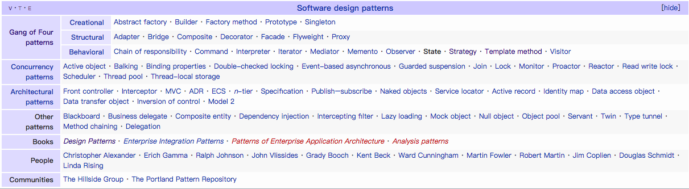

# Design Patterns

软件中的设计模式，是设计优秀可维护软件的基础。使用好的设计模式，设计出来的软件系统，更方便维护。
理解了每个设计模式的含义和应用场景，是通向架构师的必经之路。
大多框架都是使用大量的设计模式，对于阅读理解这些代码设计也大有帮助。

- [设计模式](<https://zh.wikipedia.org/wiki/%E8%AE%BE%E8%AE%A1%E6%A8%A1%E5%BC%8F_(%E8%AE%A1%E7%AE%97%E6%9C%BA)>)
- [Design Patterns](https://en.wikipedia.org/wiki/Design_Patterns)

## 分类总结

下面的图片是来自 `wiki` 的图片。并对设计模式进行了分类

- Gang of Four patterns
- Concurrency patterns
- Architectural patterns
- Other patterns

## 列表

- [Observer Pattern](observer-pattern.md)
- [State Pattern](state-pattern.md)
- [Strategy pattern(Policy Pattern)](strategy-pattern.md)
- [Reactor Pattern(from wiki)](https://en.wikipedia.org/wiki/Reactor_pattern)
- [Template method pattern](template-method-pattern.md)

## 模型

- [线程模型](https://my.oschina.net/u/1024107/blog/752025)
- [Reactor 线程模型](https://blog.csdn.net/u013074465/article/details/46276967)
