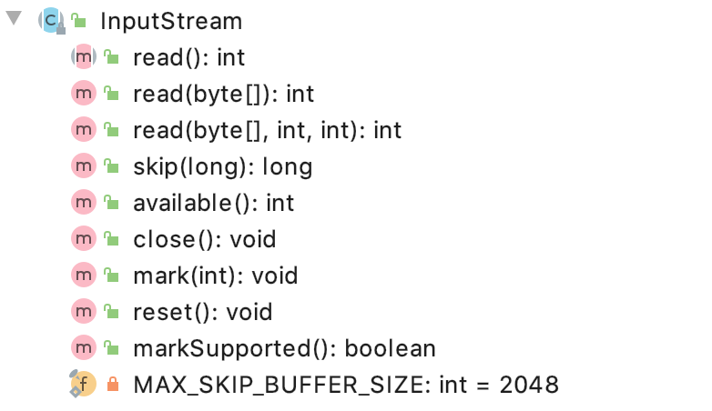
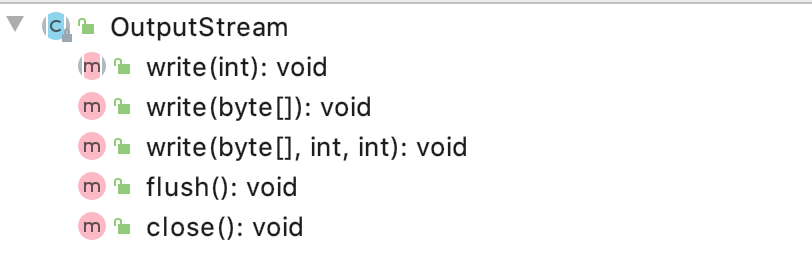

# ChannelBuffer

- [ChannelBuffer](#channelbuffer)
  - [UML](#uml)
  - [decode init](#decode-init)
  - [encode init](#encode-init)
  - [ChannelBufferInputStream](#channelbufferinputstream)
  - [ChannelBufferOutputStream](#channelbufferoutputstream)

`org.apache.dubbo.remoting.transport.netty4.ChannelBuffer` 是参照 `Netty` 的 `ChannelBuffer` 的实现

Netty 3.0 `org.jboss.netty.buffer.ChannelBuffer`

## UML


在 `dubbo` 中的 `ChannelBuffer` 的实现类是 `org.apache.dubbo.remoting.transport.netty4.NettyBackedChannelBuffer`

## decode init

```java
// NettyCodecAdapter -> InternalDecoder
private class InternalDecoder extends ByteToMessageDecoder {
    @Override
    protected void decode(ChannelHandlerContext ctx, ByteBuf input, List<Object> out) throws Exception {
        // 这里把 io.netty.buffer.ByteBuf 包装成了 NettyBackedChannelBuffer
        ChannelBuffer message = new NettyBackedChannelBuffer(input);
        NettyChannel channel = NettyChannel.getOrAddChannel(ctx.channel(), url, handler);
        try {
            // decode object.
            do {
                int saveReaderIndex = message.readerIndex();
                Object msg = codec.decode(channel, message);
                if (msg == Codec2.DecodeResult.NEED_MORE_INPUT) {
                    message.readerIndex(saveReaderIndex);
                    break;
                } else {
                    //is it possible to go here ?
                    if (saveReaderIndex == message.readerIndex()) {
                        throw new IOException("Decode without read data.");
                    }
                    if (msg != null) {
                        out.add(msg);
                    }
                }
            } while (message.readable());
        } finally {
            NettyChannel.removeChannelIfDisconnected(ctx.channel());
        }
    }
}
```

## encode init

```java
// NettyCodecAdapter -> InternalEncoder
private class InternalEncoder extends MessageToByteEncoder {
    @Override
    protected void encode(ChannelHandlerContext ctx, Object msg, ByteBuf out) throws Exception {
         // 这里把 io.netty.buffer.ByteBuf 包装成了 NettyBackedChannelBuffer
        org.apache.dubbo.remoting.buffer.ChannelBuffer buffer = new NettyBackedChannelBuffer(out);
        Channel ch = ctx.channel();
        NettyChannel channel = NettyChannel.getOrAddChannel(ch, url, handler);
        try {
            codec.encode(channel, buffer, msg);
        } finally {
            NettyChannel.removeChannelIfDisconnected(ch);
        }
    }
}
```

## ChannelBufferInputStream

```java
// ChannelBufferInputStream
// ChannelBufferInputStream 的作用就是把 ChannelBuffer 变成 InputStream 对象
// 方便给序列表协议进行反序列化(把byte转换成Java 对象)
public class ChannelBufferInputStream extends InputStream {

    private final ChannelBuffer buffer;
    private final int startIndex;
    private final int endIndex;

    public ChannelBufferInputStream(ChannelBuffer buffer) {
        this(buffer, buffer.readableBytes());
    }
    // 省略其他方法
}
```



## ChannelBufferOutputStream

```java
// ChannelBufferOutputStream
// 把 ChannelBuffer 转换成 OutputStream
// 方便给序列化协议进行序列化(把Java对象转换成byte)
public class ChannelBufferOutputStream extends OutputStream {

    private final ChannelBuffer buffer;
    private final int startIndex;

    public ChannelBufferOutputStream(ChannelBuffer buffer) {
        if (buffer == null) {
            throw new NullPointerException("buffer");
        }
        this.buffer = buffer;
        startIndex = buffer.writerIndex();
    }
    // 省略其他方法
}
```



这里说明下为什么需要把 `ChannelBuffer` 转成成 `OutputStream` 或 `InputStream`

因为 `OutputStream` 和 `InputStream` 是 Java 中 流的基础类，不管是任何序列协议都是基于这二个类进行`序列化`和`反序列化`

`OutputStream` 和 `InputStream` 相当于 Java 中关于流的规范
