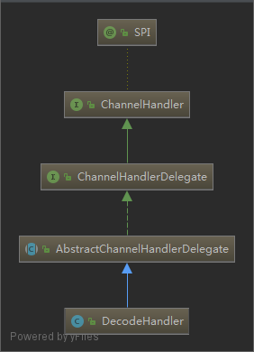
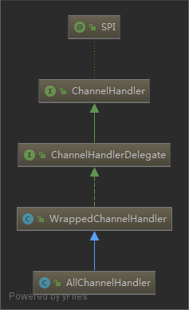

# ChannelHandler

`dubbo` 中的 `ChannelHandler` 用来处理所有 IO 相关的事件的转发：编码，解码，序列化，反序列化

`ChannelHandler` 使用了包装类，常见的 handler:

- DubboProtocol#ExchangeHandler
- HeaderExchangeHandler
- DecodeHandler
- MultiMessageHandler
- HeartbeatHandler
- AllChannelHandler
- NettyServerHandler
- NettyServer
- NettyClientHandler
- NettyClient

`dubbo` 服务器端的 `handler` 链:

服务器端的事件从 `decoder` -> `DubboProtocol#requestHandler`

- decoder
  - encoder
    - IdleStateHandler
      - NettyServerHandler
        - NettyServer
          - MultiMessageHandler
            - HeartbeatHandler
              - AllChannelHandler
                - DecodeHandler
                  - HeaderExchangeHandler
                    - DubboProtocol#requestHandler

`dubbo` 客户端端的 `handler` 链:

- decoder
  - encoder
    - IdleStateHandler
      - NettyClientHandler
        - NettyClient
              - MultiMessageHandler
                  - HeartbeatHandler
                      - AllChannelHandler
                          - DecodeHandler
                              - HeaderExchangeHandler
                                  - DubboProtocol#requestHandler

客户端端的事件从 `decoder` -> `DubboProtocol#requestHandler`

## DecodeHandler

## AllChannelHandler

## HeaderExchangeHandler