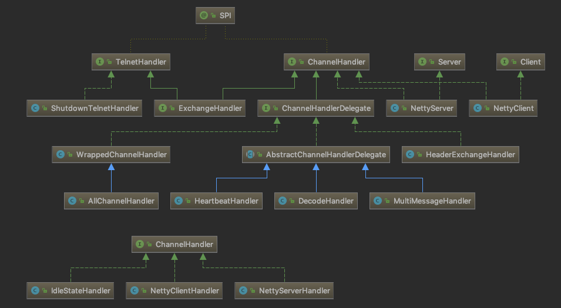

# ChannelHandler

- [ChannelHandler](#channelhandler)
  - [demo](#demo)
  - [常见的 handler](#%E5%B8%B8%E8%A7%81%E7%9A%84-handler)
  - [dubbo handler 链](#dubbo-handler-%E9%93%BE)
  - [DecodeHandler](#decodehandler)
  - [AllChannelHandler](#allchannelhandler)
  - [HeaderExchangeHandler](#headerexchangehandler)

`dubbo` 中的 `ChannelHandler` 用来处理所有 IO 相关的事件的转发：编码，解码，序列化，反序列化

> 实现类预览：



`dubbo` 中的 `ChannelHandler` 之间使用了包装，从而形成类似链式的调用,每种 `ChannelHandler` 类实现不同的功能

## demo

```java
interface ChannelHandler {
    void say();
}

class A implements ChannelHandler {

    public void say() {
        System.out.println("A#say ...");
    }

}

class B implements ChannelHandler {

    private ChannelHandler chanelHandler;

    public B(ChannelHandler chanelHandler) {
        this.chanelHandler = chanelHandler;
    }

    public void say() {
        chanelHandler.say();
        System.out.println("B#say ...");
    }
}

// 在 B 实例化的时候，实例化 A 并把 A 当作构造参数 传入 B 中
// 再调用的时候，可以同时执行 A，B两个类的方法
// 如果 ChannelHandler 中有多个方法，那么 A B 可以实现，覆盖 不同的方法
// 起到不同的作用
public static void main(String[] args){

  new B(new A()).say();
  // A#say ...
  // B#say ...
}

```

而在 `dubbo` 中，对 `ChannelHandler` 进行了更多层的包装

## 常见的 handler

> 按照模块分类

- protocol
  - org.apache.dubbo.rpc.protocol.dubbo.DubboProtocol.ExchangeHandler
- exchange
  - org.apache.dubbo.remoting.exchange.support.header.HeaderExchangeHandler
  - org.apache.dubbo.remoting.exchange.support.header.HeartbeatHandler
- transport
  - org.apache.dubbo.remoting.transport.DecodeHandler
  - org.apache.dubbo.remoting.transport.MultiMessageHandler
  - org.apache.dubbo.remoting.transport.dispatcher.all.AllChannelHandler
  - org.apache.dubbo.remoting.transport.netty4.NettyServerHandler
  - org.apache.dubbo.remoting.transport.netty4.NettyServer
  - org.apache.dubbo.remoting.transport.netty4.NettyClientHandler
  - org.apache.dubbo.remoting.transport.netty4.NettyClient

## dubbo handler 链

`dubbo` 服务器端的 `handler` 链:

服务器端的事件从 `decoder` -> `DubboProtocol#requestHandler`

```java
Netty
-> decoder
  -> encoder
    -> IdleStateHandler
      -> NettyServerHandler
        -> NettyServer
          -> MultiMessageHandler
            -> HeartbeatHandler
              -> AllChannelHandler
                -> DecodeHandler
                  -> HeaderExchangeHandler
                    -> DubboProtocol#requestHandler
```

上面的 `decoder` 和 `encoder` 是 `io.netty.channel.ChannelHandler` 的实现类

`decoder` 和 `encoder` 他们会把具体实现交给 `org.apache.dubbo.remoting.Codec2` 的实现类，进行编码/解码的处理

`org.apache.dubbo.remoting.Codec2` 会返回 编码/解码之后的 `Object` 交给 `io.netty.channel.ChannelHandler`

`io.netty.channel.ChannelHandler` 再转发给 `org.apache.dubbo.remoting.ChannelHandler`

可参考 `org.apache.dubbo.remoting.transport.netty4.NettyCodecAdapter` 的代码

`dubbo` 客户端端的 `handler` 链:

```java
Netty
-> decoder
  -> encoder
    -> IdleStateHandler
      -> NettyClientHandler
        -> NettyClient
          -> MultiMessageHandler
            -> HeartbeatHandler
              -> AllChannelHandler
                -> DecodeHandler
                  -> HeaderExchangeHandler
                    -> DubboProtocol#requestHandler
```

客户端端的事件从 `decoder` -> `DubboProtocol#requestHandler`

## DecodeHandler


## AllChannelHandler


## HeaderExchangeHandler
