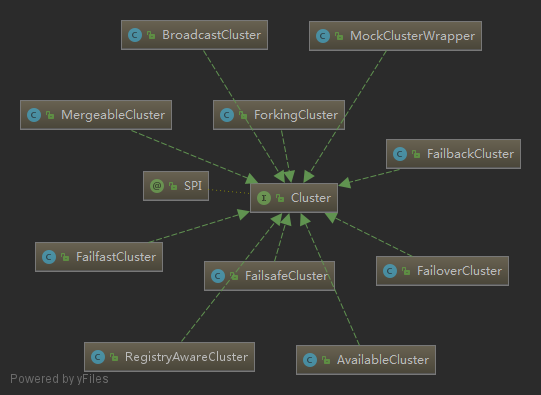

# Cluster

- [Cluster](#Cluster)
  - [uml](#uml)
  - [interface](#interface)
  - [FailoverCluster](#FailoverCluster)
  - [MergeableCluster](#MergeableCluster)
  - [Directory](#Directory)
  - [RegistryDirectory](#RegistryDirectory)

## uml



## interface

```java
// failover
@SPI(FailoverCluster.NAME)
public interface Cluster {

    @Adaptive
    <T> Invoker<T> join(Directory<T> directory) throws RpcException;

}
```

- AvailableCluster
- BroadcastCluster
- FailoverCluster
- FailbackCluster
- FailfastCluster
- FailsafeCluster
- ForkingCluster
- MergeableCluster

## FailoverCluster

默认使用 `FailoverCluster`,`FailoverCluster` 的行为是：如果集群中的一个调用出错，会重试调用其他的服务，默认调用 3 次

这也是一个需要注意的点，默认调用 3 次，如果接口的幂等没有做好，会产生额外的福作用

## MergeableCluster

## Directory

```java
public interface Directory<T> extends Node {
    Class<T> getInterface();
    List<Invoker<T>> list(Invocation invocation) throws RpcException;
}
```

## RegistryDirectory
