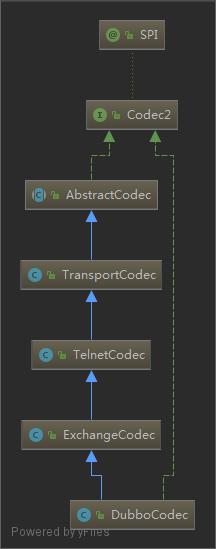
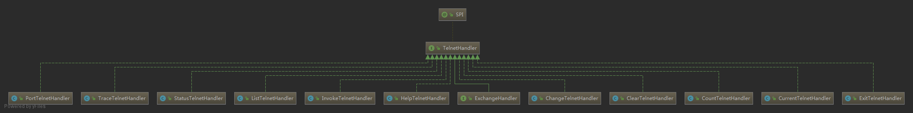

# Codec2

- [Codec2](#codec2)
  - [简介](#简介)
  - [Codec2 interface](#codec2-interface)
  - [Dubbo Head 定义](#dubbo-head-定义)
  - [Magic number](#magic-number)
  - [Dubbo Head+Body 解析](#dubbo-headbody-解析)
    - [ExchangeCodec-encodeRequest](#exchangecodec-encoderequest)
    - [ExchangeCodec-encodeResponse](#exchangecodec-encoderesponse)
    - [ExchangeCodec-decode](#exchangecodec-decode)
  - [DubboCodec-decodeBody](#dubbocodec-decodebody)
  - [DubboCodec](#dubbocodec)
  - [DubboCountCodec](#dubbocountcodec)
  - [DecodeableRpcResult](#decodeablerpcresult)
  - [DecodeableRpcInvocation](#decodeablerpcinvocation)
  - [TelnetCodec](#telnetcodec)
    - [TelnetHandler](#telnethandler)
  - [好文链接](#好文链接)

## 简介

此文介绍 `Dubbo` `传输协议`的具体实现。

> 知识储备：

- 需要对 `Java IO` 有基本的了解
- 知道如何把 `byte` 数组转换成 `int`,`long` 等基本类型
- 了解IP和TCP协议

`dubbo` 中的协议是通过 `head + body` 组成的变长协议

`dubbo` 协议设计图:


> Variable Part 部分


如果对TCP，IP 协议的定义有了解。那么上面的图更容易理解。下面是`TCP`控制传输协议的定义。

> IP 协议


> TCP 协议


这里说下TCP/IP也是通过 Head+Body 组合的协议（大多数的网络字节协议都是这个组合）。head 一般存储特殊信息，如`IP`的Head中存储了IP地址，`TCP`的Head存储了端口号。Body 存储的是存 `纯数据`。

如果把 `IP协议`+`TCP协议`+`dubbo协议` 放在一起看：dubbo协议就是TCP的Body,TCP就是IP协议的body。如下图：


> 上面说了IP协议，TCP协议，duboo协议，目的就是要知道dubbo协议的组成，而下面的Codec2实现就是对dubbo协议Head和Body解析。

## Codec2 interface

`Codec2` 的作用：

1. 半包 粘包解析
2. head 解析
3. body 长度解析
4. body 解析
5. 对象序列化
6. 对象反序列化
7. telnet 协议解析

`org.apache.dubbo.remoting.Codec2` 实现类：

> 按照模块分类

- transport
  - org.apache.dubbo.remoting.transport.AbstractCodec
  - org.apache.dubbo.remoting.transport.codec.TransportCodec
  - org.apache.dubbo.remoting.transport.codec.CodecAdapter
- protocol
  - org.apache.dubbo.rpc.protocol.dubbo.DubboCountCodec
  - org.apache.dubbo.rpc.protocol.dubbo.DubboCodec
- exchange
  - org.apache.dubbo.remoting.exchange.codec.ExchangeCodec
- telnet
  - org.apache.dubbo.remoting.telnet.codec.TelnetCodec

```java
// Codec2 接口定义
@SPI
public interface Codec2 {

    // ChannelBuffer Dubbo中对byte[]的抽象+封装。可从ChannelBuffer读取数据，或者写入数据到ChannelBuffer中
    // Java对象 => byte[] 字节
    @Adaptive({Constants.CODEC_KEY})
    void encode(Channel channel, ChannelBuffer buffer, Object message) throws IOException;

    // byte[] 字节=> Java对象
    @Adaptive({Constants.CODEC_KEY})
    Object decode(Channel channel, ChannelBuffer buffer) throws IOException;


    enum DecodeResult {
        NEED_MORE_INPUT, SKIP_SOME_INPUT
    }

}
```

类图：


## Dubbo Head 定义

`ExchangeCodec` 中定义了dubbo协议的Head中使用的关键信息。

`ExchangeCodec` 中 `encode` 方法负责编码 `Request` & `Response` 和 `String(telent)` 而 `decode` 负责解析协议的 `head` 部分

`decodeBody` 方法负责解码 `body` 而 `decodeBody` 方法被 `DubboCodec` 类重写了 因此 `body` 的解析在 `DubboCodec#decodeBody` 方法中

`ExchangeCodec` 中定义的Head相关的字段

```java
// header length.
protected static final int HEADER_LENGTH = 16;
// magic header.
protected static final short MAGIC = (short) 0xdabb;
protected static final byte MAGIC_HIGH = Bytes.short2bytes(MAGIC)[0];
protected static final byte MAGIC_LOW = Bytes.short2bytes(MAGIC)[1];
// message flag.
protected static final byte FLAG_REQUEST = (byte) 0x80;
protected static final byte FLAG_TWOWAY = (byte) 0x40;
protected static final byte FLAG_EVENT = (byte) 0x20;
protected static final int SERIALIZATION_MASK = 0x1f;
```

> 表格化：

| 字段               | 10 进制 | 16 进制 | 2 进制           |
| ------------------ | ------- | ------- | ---------------- |
| HEADER_LENGTH      | 16      | 10      | 00010000         |
| MAGIC              | 55995   | dabb    | 1101101010111011 |
| MAGIC_HIGH         | 218     | da      | 11011010         |
| MAGIC_LOW          | 187     | bb      | 10111011         |
| FLAG_REQUEST       | -128    | 80      | 10000000         |
| FLAG_TWOWAY        | 64      | 40      | 01000000         |
| FLAG_EVENT         | 32      | 20      | 00100000         |
| SERIALIZATION_MASK | 31      | 1f      | 00011111         |

这个表中虽然列出了 10 进制，16 进制，但是我们关心的其实是二进制，
Java 中的 `&` 和 `|` 可以利用二进制的特性，方便的进行条件的判断，
Java 中的 true 和 false 只能表示两种结果，但是使用二进制，并利用 `&` 和 `|`
进行运算和组合，可以表达出更多的条件组合

java nio 中的巧妙运用，可以参考这个文章: [nio-selection-key.md](../java/nio-selection-key.md)

## Magic number

要理解 `dubbo` 的协议就需要先了解一些关于 `Magic number` 的知识， 可以参考维基百科 [Magic number](<https://en.wikipedia.org/wiki/Magic_number_(programming)>)

`Magic number` 可以用来区分文件的类型如: `.zip` -> `(50 4B)` `.java` -> `(CAFEBABE)`

`dubbo` 中用二个 `MAGIC_HIGH` 和 `MAGIC_LOW` 来识别 `dubbo` 自定义的协议(如果在读取协议 `head` 时，遇到了上面的二个值，就认为是协议的开始，进行解码操作，先解析head,再解析body)

## Dubbo Head+Body 解析

下面先看下 `dubbo` 是如何进行编码的（把一个对象转成 byte 数据进行网络传输）

dubbo 中编码操作有两种 `encodeRequest` 和 `encodeResponse`,而这个二种操作的细微区别就是 `encodeResponse` 多了设置 `status` 这一步骤

### ExchangeCodec-encodeRequest

encode 操作把Java对象转化成byte[]字节

下面是`Dubbo`协议`Request Head + Body`的实现。

```java
// 这里说下编码（写数据）的整体思路：
// 先写入 body 再写 head
// 由于 head 中需要写入数据长度,即 Data length 的值，因此需要先写 body 计算出 body 长度，再写入 head 中
// 这里的实现是:
// 在写入 body 数据之前保存 writeIndex
// 接着改变 writeIndex 写入数据 body, 在写入body 之后，可以根据 writeIndex 计算出 body 的长度(Data length)
// 获取 Data length 之后，改变 writeIndex 把长度写入到 head 中，这样 head 中就有了数据长度的信息
protected void encodeRequest(Channel channel, ChannelBuffer buffer, Request req) throws IOException {
    // 获取 序列化对象
    Serialization serialization = getSerialization(channel);
    // header. 创建长度为 HEADER_LENGTH 的数组
    byte[] header = new byte[HEADER_LENGTH];
    // set magic number.
    // 设置 magic number 用来表示协议的开始，
    // 可以在 ExchangeCodec#decode 看到解码时的操作
    Bytes.short2bytes(MAGIC, header);
    // set request and serialization flag.
    // 如果 serialization.getContentTypeId() = 2 = (00000010)
    //  10000000 | 00000010 = 10000010 这里其实就是把 序列化的ID 放在 header[2] 中
    header[2] = (byte) (FLAG_REQUEST | serialization.getContentTypeId());
    if (req.isTwoWay()) {
        // 10000010 | 01000000 = (11000010)
        header[2] |= FLAG_TWOWAY;
    }
    if (req.isEvent()) {
        // 11000010 | 00100000 = (11100010)
        header[2] |= FLAG_EVENT;
    }
    // 因为 FLAG_REQUEST 和 FLAG_TWOWAY 和 FLAG_EVENT 二进制中 1 的都在不同的位置上
    // 因为进行 | 操作就是就是把这个三个标记放入到 head[2] 中
    // 可以用一个字节的值表示 3 个值，减少字节占用数
    // set request id.
    // 从协议的设计图中可知 head[3] 应该是存储的 status 信息
    // encodeRequest 是请求编码,没有state,因此跳过 head[3]
    // reqId 放在 head[4] 中，下面的就是这个操作
    Bytes.long2bytes(req.getId(), header, 4);// 4*8 =32 与 RPC Request ID  Bit 那一列刚好对应
    // encode request data.
    // 获取 写索引的位置,方便在计算出 data length 之后进行第二次写入
    int savedWriteIndex = buffer.writerIndex();
    // 改变写索引的位置，目的是为了写入 body
    buffer.writerIndex(savedWriteIndex + HEADER_LENGTH);
    // 把 ChannelBuffer 包装成 OutputStream
    ChannelBufferOutputStream bos = new ChannelBufferOutputStream(buffer);
    // 获取 ObjectOutput 容器
    ObjectOutput out = serialization.serialize(channel.getUrl(), bos);
    // 根据不同的请求类型
     // req.getData() 对象类型其实是 RpcInvocation
    if (req.isEvent()) {
        // 如果是事件，简单的执行 writeObject
        encodeEventData(channel, out, req.getData());
    } else {
        // 否则从 RpcInvocation 获取 版本,方法,参数类型,参数,attachment 进行写入
        // RpcInvocation 是通过 InvokerInvocationHandler 的 createInvocation 方法创建的
        // 它会把 方法名称 和 方法参数 进行包装
        // encodeRequestData 其实就是 RpcInvocation 进行序列化，进行网络传输
        encodeRequestData(channel, out, req.getData(), req.getVersion());
    }
    out.flushBuffer();// 这里为什么不是在 head 写入之后，再执行 flush ?
    if (out instanceof Cleanable) {
        ((Cleanable) out).cleanup();
    }
    bos.flush();
    bos.close();
    // 获取写入的数据长度
    int len = bos.writtenBytes();
    // 检查数据长度是否过大
    checkPayload(channel, len);
    // 从协议的设计图中可知 head[12] 应该是存储数据的长度，这里写入数据长度信息
    Bytes.int2bytes(len, header, 12);
    // write 更新写的索引, 写 head 此时 head 中已经有了 data length 信息
    buffer.writerIndex(savedWriteIndex);
    buffer.writeBytes(header); // write header.
    buffer.writerIndex(savedWriteIndex + HEADER_LENGTH + len);
}

// DubboCodec.encodeRequestData
@Override
protected void encodeRequestData(Channel channel, ObjectOutput out, Object data, String version) throws IOException {
    RpcInvocation inv = (RpcInvocation) data;
    out.writeUTF(version);
    out.writeUTF(inv.getAttachment(PATH_KEY));
    out.writeUTF(inv.getAttachment(VERSION_KEY));
    out.writeUTF(inv.getMethodName());
    out.writeUTF(ReflectUtils.getDesc(inv.getParameterTypes()));
    Object[] args = inv.getArguments();
    if (args != null) {
        for (int i = 0; i < args.length; i++) {
            out.writeObject(encodeInvocationArgument(channel, inv, i));
        }
    }
    out.writeObject(inv.getAttachments());
}
```

### ExchangeCodec-encodeResponse

下面是`Dubbo`协议`Response Head + Body`的实现。

```java
// encodeResponse 中的处理和 encodeRequest 差别不大
// encodeResponse 多了设置 header[3] = status; 状态字段 这个步骤
protected void encodeResponse(Channel channel, ChannelBuffer buffer, Response res) throws IOException {
    int savedWriteIndex = buffer.writerIndex();
    try {
        Serialization serialization = getSerialization(channel);
        // header.
        byte[] header = new byte[HEADER_LENGTH];
        // set magic number.
        Bytes.short2bytes(MAGIC, header);
        // set request and serialization flag.
        header[2] = serialization.getContentTypeId();
        if (res.isHeartbeat()) {
            header[2] |= FLAG_EVENT;
        }
        // set response status.
        // 设置 status
        byte status = res.getStatus();
        header[3] = status;
        // set request id.
        Bytes.long2bytes(res.getId(), header, 4);
        buffer.writerIndex(savedWriteIndex + HEADER_LENGTH);
        ChannelBufferOutputStream bos = new ChannelBufferOutputStream(buffer);
        ObjectOutput out = serialization.serialize(channel.getUrl(), bos);
        // encode response data or error message.
        if (status == Response.OK) {
            if (res.isHeartbeat()) {
                encodeHeartbeatData(channel, out, res.getResult());
            } else {
                encodeResponseData(channel, out, res.getResult(), res.getVersion());
            }
        } else {
            out.writeUTF(res.getErrorMessage());
        }
        out.flushBuffer();
        if (out instanceof Cleanable) {
            ((Cleanable) out).cleanup();
        }
        bos.flush();
        bos.close();
        int len = bos.writtenBytes();
        checkPayload(channel, len);
        Bytes.int2bytes(len, header, 12);
        // write
        buffer.writerIndex(savedWriteIndex);
        buffer.writeBytes(header); // write header.
        buffer.writerIndex(savedWriteIndex + HEADER_LENGTH + len);
    } catch (Throwable t) {
        // clear buffer
        buffer.writerIndex(savedWriteIndex);
        // send error message to Consumer, otherwise, Consumer will wait till timeout.
        if (!res.isEvent() && res.getStatus() != Response.BAD_RESPONSE) {
            Response r = new Response(res.getId(), res.getVersion());
            r.setStatus(Response.BAD_RESPONSE);
            if (t instanceof ExceedPayloadLimitException) {
                logger.warn(t.getMessage(), t);
                try {
                    r.setErrorMessage(t.getMessage());
                    channel.send(r);
                    return;
                } catch (RemotingException e) {
                    logger.warn("Failed to send bad_response info back: " + t.getMessage() + ", cause: " + e.getMessage(), e);
                }
            } else {
                // FIXME log error message in Codec and handle in caught() of IoHanndler?
                logger.warn("Fail to encode response: " + res + ", send bad_response info instead, cause: " + t.getMessage(), t);
                try {
                    r.setErrorMessage("Failed to send response: " + res + ", cause: " + StringUtils.toString(t));
                    channel.send(r);
                    return;
                } catch (RemotingException e) {
                    logger.warn("Failed to send bad_response info back: " + res + ", cause: " + e.getMessage(), e);
                }
            }
        }
        // Rethrow exception
        if (t instanceof IOException) {
            throw (IOException) t;
        } else if (t instanceof RuntimeException) {
            throw (RuntimeException) t;
        } else if (t instanceof Error) {
            throw (Error) t;
        } else {
            throw new RuntimeException(t.getMessage(), t);
        }
    }
}
```

### ExchangeCodec-decode

decode 操作把byte[]字节转化成Java对象

```java
    @Override
    public Object decode(Channel channel, ChannelBuffer buffer) throws IOException {
        // 从 buffer 中读取 可读数据的长度
        int readable = buffer.readableBytes();
        // 初始化一个 HEADER_LENGTH 长度的 byte 数组，用来存储协议头
        // Math.min 如果可读取的数据小于 HEADER_LENGTH，就读取部分数据，否则读取的数据长度为 HEADER_LENGTH
        byte[] header = new byte[Math.min(readable, HEADER_LENGTH)];
        // 读取数据
        buffer.readBytes(header);
        // 继续读取协议的其他部分
        return decode(channel, buffer, readable, header);
    }

    // 这里读取协议的其他部分
    @Override
    protected Object decode(Channel channel, ChannelBuffer buffer, int readable, byte[] header) throws IOException {
        // check magic number.
        // 如果 readable > 0 那么 header[0] 就不会出现数组越界
        // readable > 1 header[1] 也是同样的道理
        // header[0] != MAGIC_HIGH ||  header[1] != MAGIC_LOW
        // 说明协议不是 dubbo protocol (执行 TelnetCodec#decode 相关的解码操作)
        if (readable > 0 && header[0] != MAGIC_HIGH
                || readable > 1 && header[1] != MAGIC_LOW) {
            int length = header.length;
            // header.length < readable 数组的长度小于可读取的数据（其实数组就是放不下多余的数据）
            // 使用 Bytes.copyOf 复制一个新的数组
            if (header.length < readable) {
                header = Bytes.copyOf(header, readable);
                // 读取数据到 head 中，从 length 处开始读取
                // 读取数据的长度 = readable - length （因为 readable 中存在有些数据已经被读取过了，不需要再次重复读取了）
                buffer.readBytes(header, length, readable - length);
            }
            // 从 byte 数据中循环遍历找到新的 head 开始的索引位置
            for (int i = 1; i < header.length - 1; i++) {
                if (header[i] == MAGIC_HIGH && header[i + 1] == MAGIC_LOW) {
                    // 更新 readIndex下次读取的位置，下一个读取从这个新的位置开始读取
                    buffer.readerIndex(buffer.readerIndex() - header.length + i);
                    // copy 一个新的数组，长度为 i
                    // 这些 0 到 i 的数据会被 copy 到 header 中 进行 TelnetCodec#decode 操作
                    //（会被认为是 telnet 协议进行解码）
                    // 这里就使 dubbo 同时支持了 telnet 协议和自定义的 dubbo protocol
                    header = Bytes.copyOf(header, i);
                    break;
                }
            }
            // 调用父类 TelnetCodec#decode,进行 telnet 协议解码
            return super.decode(channel, buffer, readable, header);
        }
        // check length.
        // 如果可读的数据小于 HEADER_LENGTH ，终止读取
        if (readable < HEADER_LENGTH) {
            return DecodeResult.NEED_MORE_INPUT;
        }

        // get data length.
        // 从 header 数组的 12 位置开始读取数据，计算出数据的长度
        int len = Bytes.bytes2int(header, 12);
        // checkPayload 检查数据长度是否过长 默认 8M，超过会报错
        checkPayload(channel, len);

        // 可读取的数据太少，终止读取
        int tt = len + HEADER_LENGTH;
        if (readable < tt) {
            return DecodeResult.NEED_MORE_INPUT;
        }

        // limit input stream.
        // 把 ChannelBuffer 转化成 java.io.InputStream 方便在 decodeBody 进行反序列化操作
        ChannelBufferInputStream is = new ChannelBufferInputStream(buffer, len);

        try {
            // 开始读取 body 实现在 DubboCodec#decodeBody
            return decodeBody(channel, is, header);
        } finally {
            if (is.available() > 0) {
                try {
                    if (logger.isWarnEnabled()) {
                        logger.warn("Skip input stream " + is.available());
                    }
                    StreamUtils.skipUnusedStream(is);
                } catch (IOException e) {
                    logger.warn(e.getMessage(), e);
                }
            }
        }
    }
```
关于`ChannelBufferInputStream`可以参考 [dubbo-channel-buffer.md](dubbo-channel-buffer.md)

## DubboCodec-decodeBody

```java
// 1.获取 flag
// 2.获取 proto
// 3.反序列化
// 4.返回 Response/Request
@Override
protected Object decodeBody(Channel channel, InputStream is, byte[]header) throws IOException {
    // 首先我们知道: 一字节中有8位 1b = 8bit
    // header[2] = (byte) (FLAG_REQUEST | serialization.getContentTypeId())
    // 这个是 ExchangeCodec-encodeRequest 里面的操作
    // header[2] 就是利用二进制的 | 操作特性，同时把 flag 和 serialization id 用一个值存储（减少字节数）
    // 在 decode 的时候利用 & 计算出 serialization id
    // 例子：
    // 假如 serialization.getContentTypeId() = 2 = 00000010
    // 那么 (FLAG_REQUEST | 00000010 ) = (10000000 | 00000010) =(10000010)
    // 那么 (flag & SERIALIZATION_MASK) = (10000010 & 00011111) = 00000010
    // 这里利用二进制的特性,计算出序列化的id
    // set request and serialization flag.
    byte flag = header[2], proto = (byte) (flag & SERIALIZATION_MASK);
    // get request id.
    long id = Bytes.bytes2long(header, 4); // 4*8 =32 与 RPC Request ID  Bit 32 那一列刚好对应
    // flag & FLAG_REQUEST 这里因为存在 3 种 flag，而他们二进制的 1 都在不同的位置上
    // 因此 一种 flag 和另一种 flag 进行 & 运算 结果总是 0 (二进制 00000000)
    if ((flag & FLAG_REQUEST) == 0) {// 等于 0 说不不是 FLAG_REQUEST 就当做响应处理
        // decode response.
        Response res = new Response(id);
        if ((flag & FLAG_EVENT) != 0) {// 判断是否是 FLAG_EVENT
            res.setEvent(true);
        }
        // get status.
        byte status = header[3];
        res.setStatus(status);
        try {
            // 反序列化
            ObjectInput in = CodecSupport.deserialize(channel.getUrl(), is, proto);
            if (status == Response.OK) {
                Object data;
                if (res.isHeartbeat()) {// 心跳事件
                    data = decodeHeartbeatData(channel, in);
                } else if (res.isEvent()) {// 其他事件
                    data = decodeEventData(channel, in);
                } else {// 正常的请求响应
                    // DecodeableRpcResult 包含了  Exception,Attachment,result 3 部分
                    // 分别进行不同的解析操作
                    DecodeableRpcResult result;
                    if (channel.getUrl().getParameter(
                            Constants.DECODE_IN_IO_THREAD_KEY,
                            Constants.DEFAULT_DECODE_IN_IO_THREAD)) {
                        result = new DecodeableRpcResult(channel, res, is,
                                (Invocation) getRequestData(id), proto);
                        result.decode();// 解析这三个部分
                    } else {
                        result = new DecodeableRpcResult(channel, res,
                                new UnsafeByteArrayInputStream(readMessageData(is)),
                                (Invocation) getRequestData(id), proto);
                    }
                    data = result;
                }
                res.setResult(data);
            } else {
                res.setErrorMessage(in.readUTF());
            }
        } catch (Throwable t) {
            if (log.isWarnEnabled()) {
                log.warn("Decode response failed: " + t.getMessage(), t);
            }
            res.setStatus(Response.CLIENT_ERROR);
            res.setErrorMessage(StringUtils.toString(t));
        }
        return res;
    } else {
        // 请求解码
        // decode request.
        Request req = new Request(id);
        req.setVersion(Version.getProtocolVersion());// 协议版本
        req.setTwoWay((flag & FLAG_TWOWAY) != 0);// 利用二进制运算设置 flag
        if ((flag & FLAG_EVENT) != 0) {
            req.setEvent(true);
        }
        try {
            Object data;
            // 反序列化
            // ObjectInput 可以看做是 byte 数据容器,从 ObjectInput 可以读取到对象
            ObjectInput in = CodecSupport.deserialize(channel.getUrl(), is, proto);
            if (req.isHeartbeat()) {
                data = decodeHeartbeatData(channel, in);
            } else if (req.isEvent()) {
                data = decodeEventData(channel, in);
            } else {
                // DecodeableRpcInvocation 同样包含了  Exception,Attachment,result 3 部分
                // DecodeableRpcInvocation 对 RpcInvocation 进行了包装
                DecodeableRpcInvocation inv;
                if (channel.getUrl().getParameter(
                        Constants.DECODE_IN_IO_THREAD_KEY,
                        Constants.DEFAULT_DECODE_IN_IO_THREAD)) {
                    inv = new DecodeableRpcInvocation(channel, req, is, proto);
                    inv.decode();// 解析这三个部分
                } else {
                    inv = new DecodeableRpcInvocation(channel, req,
                            new UnsafeByteArrayInputStream(readMessageData(is)), proto);
                }
                data = inv;
            }
            req.setData(data);
        } catch (Throwable t) {
            if (log.isWarnEnabled()) {
                log.warn("Decode request failed: " + t.getMessage(), t);
            }
            // bad request
            req.setBroken(true);
            req.setData(t);
        }
        return req;
    }
}
```

上面说过 `dubbo` 的协议是 `head + body`,`decodeBody` 也就是从 `InputStream` 经过 `序列化` 解析出 `ObjectInput` 对象

## DubboCodec



DubboCodec 实现的方法：

- `decodeBody`
- `encodeResponseData`
- `encodeRequestData`

`encodeResponseData` 和 `encodeRequestData` 都有一个重载的方法，多了一个参数 `String version`

```java
// DubboCodec
public static final String DUBBO_VERSION = Version.getProtocolVersion();

//  Version
public static final String DEFAULT_DUBBO_PROTOCOL_VERSION = "2.0.2";
```

`DubboCodec` 虽然是 `Codec2` 的子类，但是并没有实现 `Codec2` 的二个核心方法 `encode` 和 `decode`

而实现了 `ExchangeCodec` 的 `decodeBody` 方法,`encode` 和 `decode` 方法继承自 `ExchangeCodec` 类

## DubboCountCodec

`DubboCountCodec` 对 `DubboCodec` 进行了简单的包装，重写了 `decode` 方法

会返回 `MultiMessage` 可以同时解码出多个 `Object`

## DecodeableRpcResult 和 DecodeableRpcInvocation

`DecodeableRpcResult 和 DecodeableRpcInvocation`主要处理协议中的`Variable Part` 部分的byte[]。和具体的序列化实现相关。
具体可以参考的`DecodeableRpcResult#decode`和`DecodeableRpcInvocation#decode`方法

- [DecodeableRpcResult](https://github.com/apache/dubbo/blob/2.6.x/dubbo-rpc/dubbo-rpc-dubbo/src/main/java/com/alibaba/dubbo/rpc/protocol/dubbo/DecodeableRpcResult.java) 解码 RPC 结果
- [DecodeableRpcInvocation](https://github.com/apache/dubbo/blob/2.6.x/dubbo-rpc/dubbo-rpc-dubbo/src/main/java/com/alibaba/dubbo/rpc/protocol/dubbo/DecodeableRpcInvocation.java) 解码 RPC 请求 

下面列出代码片段，上面的逻辑能看懂，下面的逻辑类似，是对RPC请求(RpcInvocation)和RPC结果(RpcResult)进行处理。

```java
// DecodeableRpcResult
public class DecodeableRpcResult extends RpcResult implements Codec, Decodeable {
    // ...
}

// RpcResult
public class RpcResult implements Result, Serializable {

    private static final long serialVersionUID = -6925924956850004727L;

    private Object result;

    private Throwable exception;

    private Map<String, String> attachments = new HashMap<String, String>();

    public RpcResult() {
    }
    // ...
}
```

```java
// DecodeableRpcInvocation
public class DecodeableRpcInvocation extends RpcInvocation implements Codec, Decodeable {
    // ...
}
// RpcInvocation
public class RpcInvocation implements Invocation, Serializable {

    private static final long serialVersionUID = -4355285085441097045L;

    private String methodName;

    private Class<?>[] parameterTypes;

    private Object[] arguments;

    private Map<String, String> attachments;

    private transient Invoker<?> invoker;

    public RpcInvocation() {
    }

    // ...
}
```


## TelnetCodec

`ExchangeCodec` 在进行 `decode` 操作的时候，先读取 `header[0]` 和 `header[1]` 中的 `MAGIC_HIGH` 和 `MAGIC_LOW`

如果不存在，就调用父类 `TelnetCodec` 的 `decode` 方法进行解码操作(解码完成之后返回 String),解码操作完成之后进行 `channelHandler` 的转发

最终在 `HeaderExchangeHandler` 进行 `telnet` 相关的处理

代码片段:

```java
// ExchangeCodec
// check magic number.
if (readable > 0 && header[0] != MAGIC_HIGH
        || readable > 1 && header[1] != MAGIC_LOW) {
    int length = header.length;
    if (header.length < readable) {
        header = Bytes.copyOf(header, readable);
        buffer.readBytes(header, length, readable - length);
    }
    for (int i = 1; i < header.length - 1; i++) {
        if (header[i] == MAGIC_HIGH && header[i + 1] == MAGIC_LOW) {
            buffer.readerIndex(buffer.readerIndex() - header.length + i);
            header = Bytes.copyOf(header, i);
            break;
        }
    }
    return super.decode(channel, buffer, readable, header);
}

// HeaderExchangeHandler
// ....
else if (message instanceof String) {// 如果解码的结果对象是 String
                if (isClientSide(channel)) {
                    Exception e = new Exception("Dubbo client can not supported string message: " + message + " in channel: " + channel + ", url: " + channel.getUrl());
                    logger.error(e.getMessage(), e);
                } else {
                    String echo = handler.telnet(channel, (String) message);// 处理 telnet
                    if (echo != null && echo.length() > 0) {
                        channel.send(echo);
                    }
                }
            }
// ...
```

### TelnetHandler

`TelnetHandler` 类图



## 好文链接

- [Dubbo 协议设计](https://dubbo.apache.org/zh/docs/concepts/rpc-protocol/)
- [Magic number](<https://en.wikipedia.org/wiki/Magic_number_(programming)>)
