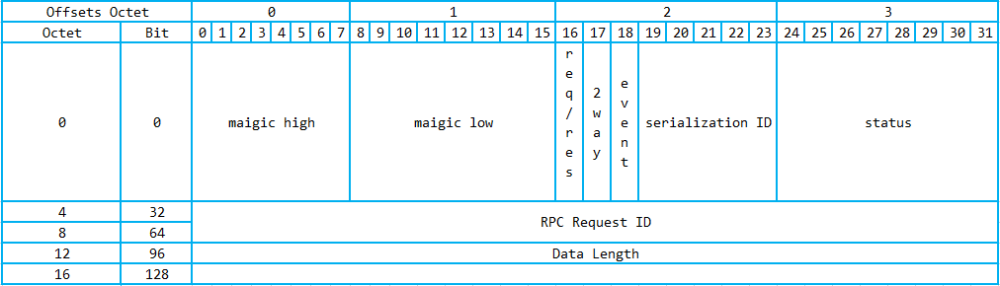

# Codec2

- [Codec2](#codec2)
  - [Codec2 interface](#codec2-interface)
  - [DubboCountCodec](#dubbocountcodec)
  - [DubboCodec](#dubbocodec)
    - [DubboCodec-decodeBody](#dubbocodec-decodebody)
  - [ExchangeCodec](#exchangecodec)
    - [ExchangeCodec-decode](#exchangecodec-decode)
  - [TelnetCodec](#telnetcodec)
  - [好文链接](#%E5%A5%BD%E6%96%87%E9%93%BE%E6%8E%A5)

`dubbo` 中的协议是通过 `head + body` 组成的变长协议



`Codec2` 解决的作用：

1. 半包 粘包
2. head 解析
3. body 解析
4. body 长度
5. 对象序列化
6. 对象反序列化

`org.apache.dubbo.remoting.Codec2` 实现类：

> 按照模块分类

- transport
  - org.apache.dubbo.remoting.transport.AbstractCodec
  - org.apache.dubbo.remoting.transport.codec.TransportCodec
  - org.apache.dubbo.remoting.transport.codec.CodecAdapter
- protocol
  - org.apache.dubbo.rpc.protocol.dubbo.DubboCountCodec
  - org.apache.dubbo.rpc.protocol.dubbo.DubboCodec
- exchange
  - org.apache.dubbo.remoting.exchange.codec.ExchangeCodec
- telnet
  - org.apache.dubbo.remoting.telnet.codec.TelnetCodec

## Codec2 interface

```java
@SPI
public interface Codec2 {

    @Adaptive({Constants.CODEC_KEY})
    void encode(Channel channel, ChannelBuffer buffer, Object message) throws IOException;

    @Adaptive({Constants.CODEC_KEY})
    Object decode(Channel channel, ChannelBuffer buffer) throws IOException;


    enum DecodeResult {
        NEED_MORE_INPUT, SKIP_SOME_INPUT
    }

}
```

类图：


## DubboCountCodec

`DubboCountCodec` 对 `DubboCodec` 进行了简单的包装，重写了 `decode` 方法

会返回 `MultiMessage` 可以同时解码出多个 `Object`

## DubboCodec


DubboCodec 实现的方法：

- decodeBody
- encodeResponseData
- encodeRequestData

`encodeResponseData` 和 `encodeRequestData` 都有一个重载的方法，多了一个参数 `String version`

```java
// DubboCodec
public static final String DUBBO_VERSION = Version.getProtocolVersion();

//  Version
public static final String DEFAULT_DUBBO_PROTOCOL_VERSION = "2.0.2";
```

`DubboCodec` 虽然是 `Codec2` 的子类，但是并没有实现 `Codec2` 的二个核心方法 `encode` 和 `decode`

而实现了 `ExchangeCodec` 的 `decodeBody` 方法,`encode` 和 `decode` 方法继承自 `ExchangeCodec` 类

下面看 `decodeBody` 的具体实现

### DubboCodec-decodeBody

```java
// 1.获取 flag
// 2.获取 proto
// 3.反序列化
// 4.返回 Response/Request
@Override
protected Object decodeBody(Channel channel, InputStream is, byte[]header) throws IOException {
    byte flag = header[2], proto = (byte) (flag & SERIALIZATION_MASK);
    // get request id.
    long id = Bytes.bytes2long(header, 4);
    if ((flag & FLAG_REQUEST) == 0) {
        // decode response.
        Response res = new Response(id);
        if ((flag & FLAG_EVENT) != 0) {
            res.setEvent(true);
        }
        // get status.
        byte status = header[3];
        res.setStatus(status);
        try {
            ObjectInput in = CodecSupport.deserialize(channel.getUrl(), is, proto);
            if (status == Response.OK) {
                Object data;
                if (res.isHeartbeat()) {
                    data = decodeHeartbeatData(channel, in);
                } else if (res.isEvent()) {
                    data = decodeEventData(channel, in);
                } else {
                    DecodeableRpcResult result;
                    if (channel.getUrl().getParameter(
                            Constants.DECODE_IN_IO_THREAD_KEY,
                            Constants.DEFAULT_DECODE_IN_IO_THREAD)) {
                        result = new DecodeableRpcResult(channel, res, is,
                                (Invocation) getRequestData(id), proto);
                        result.decode();
                    } else {
                        result = new DecodeableRpcResult(channel, res,
                                new UnsafeByteArrayInputStream(readMessageData(is)),
                                (Invocation) getRequestData(id), proto);
                    }
                    data = result;
                }
                res.setResult(data);
            } else {
                res.setErrorMessage(in.readUTF());
            }
        } catch (Throwable t) {
            if (log.isWarnEnabled()) {
                log.warn("Decode response failed: " + t.getMessage(), t);
            }
            res.setStatus(Response.CLIENT_ERROR);
            res.setErrorMessage(StringUtils.toString(t));
        }
        return res;
    } else {
        // decode request.
        Request req = new Request(id);
        req.setVersion(Version.getProtocolVersion());
        req.setTwoWay((flag & FLAG_TWOWAY) != 0);
        if ((flag & FLAG_EVENT) != 0) {
            req.setEvent(true);
        }
        try {
            Object data;
            ObjectInput in = CodecSupport.deserialize(channel.getUrl(), is, proto);
            if (req.isHeartbeat()) {
                data = decodeHeartbeatData(channel, in);
            } else if (req.isEvent()) {
                data = decodeEventData(channel, in);
            } else {
                DecodeableRpcInvocation inv;
                if (channel.getUrl().getParameter(
                        Constants.DECODE_IN_IO_THREAD_KEY,
                        Constants.DEFAULT_DECODE_IN_IO_THREAD)) {
                    inv = new DecodeableRpcInvocation(channel, req, is, proto);
                    inv.decode();
                } else {
                    inv = new DecodeableRpcInvocation(channel, req,
                            new UnsafeByteArrayInputStream(readMessageData(is)), proto);
                }
                data = inv;
            }
            req.setData(data);
        } catch (Throwable t) {
            if (log.isWarnEnabled()) {
                log.warn("Decode request failed: " + t.getMessage(), t);
            }
            // bad request
            req.setBroken(true);
            req.setData(t);
        }
        return req;
    }
}
```

上面说过 `dubbo` 的协议是 `head + body`,`decodeBody` 也就是从 `InputStream` 经过 `序列化` 解析出 `ObjectInput` 对象

## ExchangeCodec

`ExchangeCodec` 中定义的字段

```java
// header length.
protected static final int HEADER_LENGTH = 16;
// magic header.
protected static final short MAGIC = (short) 0xdabb;
protected static final byte MAGIC_HIGH = Bytes.short2bytes(MAGIC)[0];
protected static final byte MAGIC_LOW = Bytes.short2bytes(MAGIC)[1];
// message flag.
protected static final byte FLAG_REQUEST = (byte) 0x80;
protected static final byte FLAG_TWOWAY = (byte) 0x40;
protected static final byte FLAG_EVENT = (byte) 0x20;
protected static final int SERIALIZATION_MASK = 0x1f;
````

> 表格化：

| 字段               | 10 进制 | 16 进制 | 2 进制           |
| ------------------ | ------- | ------- | ---------------- |
| HEADER_LENGTH      | 16      | 10      | 10000            |
| MAGIC              | 55995   | dabb    | 1101101010111011 |
| MAGIC_HIGH         | 218     | da      | 11011010         |
| MAGIC_LOW          | 187     | bb      | 10111011         |
| FLAG_REQUEST       | 128     | 80      | 10000000         |
| FLAG_TWOWAY        | 64      | 40      | 1000000          |
| FLAG_EVENT         | 32      | 20      | 100000           |
| SERIALIZATION_MASK | 31      | 1f      | 11111            |

这个表中虽然列出了 10 进制，16 进制，但是我们关心的其实是二进制，
Java 中的 `&` 和 `|` 可以利用二进制的特性，方便的进行条件的判断，
Java 中的 true 和 false 只能表示两种结果，但是使用二进制，并利用 `&` 和 `|`
进行运算和组合，可以表达出更多的条件组合

可以参考这个文章: [nio-selection-key.md](../java/nio-selection-key.md)

### ExchangeCodec-decode

```java
    @Override
    public Object decode(Channel channel, ChannelBuffer buffer) throws IOException {
        // 从 buffer 中读取 可读数据的长度
        int readable = buffer.readableBytes();
        // 初始化一个 HEADER_LENGTH 长度的 byte 数组，用来存储协议头
        // Math.min 如果可读取的数据小于 HEADER_LENGTH，就读取部分数据，否则读取的数据长度为 HEADER_LENGTH
        byte[] header = new byte[Math.min(readable, HEADER_LENGTH)];
        // 读取数据
        buffer.readBytes(header);
        // 继续读取协议的其他部分
        return decode(channel, buffer, readable, header);
    }

    // 这里读取协议的其他部分
    @Override
    protected Object decode(Channel channel, ChannelBuffer buffer, int readable, byte[] header) throws IOException {
        // check magic number.
        // 如果 readable > 0 那么 header[0] 就不会出现数组越界
        // readable > 1 header[1] 也是同样的道理
        // header[0] != MAGIC_HIGH ||  header[1] != MAGIC_LOW
        // 说明协议不是 dubbo protocol (执行 TelnetCodec#decode 相关的解码操作)
        if (readable > 0 && header[0] != MAGIC_HIGH
                || readable > 1 && header[1] != MAGIC_LOW) {
            int length = header.length;
            // header.length < readable 数组的长度小于可读取的数据（其实数组就是放不下多余的数据）
            // 使用 Bytes.copyOf 复制一个新的数组
            if (header.length < readable) {
                header = Bytes.copyOf(header, readable);
                // 读取数据到 head 中，从 length 处开始读取
                // 读取数据的长度 = readable - length （因为 readable 中存在有些数据已经被读取过了，不需要再次重复读取了）
                buffer.readBytes(header, length, readable - length);
            }
            // 从 byte 数据中循环遍历找到新的 head 开始的索引位置
            for (int i = 1; i < header.length - 1; i++) {
                if (header[i] == MAGIC_HIGH && header[i + 1] == MAGIC_LOW) {
                    // 更新 readIndex下次读取的位置，下一个读取从这个新的位置开始读取
                    buffer.readerIndex(buffer.readerIndex() - header.length + i);
                    // copy 一个新的数组，长度为 i
                    // 这些 0 到 i 的数据会被 copy 到 header 中 进行 TelnetCodec#decode 操作
                    //（会被任务是 telnet 协议进行解码）
                    // 这里就使 dubbo 同时支持了 telnet 协议和自定义的 dubbo protocol
                    header = Bytes.copyOf(header, i);
                    break;
                }
            }
            // 调用父类 TelnetCodec#decode,进行 telnet 协议解码
            return super.decode(channel, buffer, readable, header);
        }
        // check length.
        // 如果可读的数据小于 HEADER_LENGTH ，终止读取
        if (readable < HEADER_LENGTH) {
            return DecodeResult.NEED_MORE_INPUT;
        }

        // get data length.
        // 从 header 数组的 12 位置开始读取数据，计算出数据的长度
        int len = Bytes.bytes2int(header, 12);
        // checkPayload 检查数据长度是否过长 默认 8M，超过会报错
        checkPayload(channel, len);

        // 可读取的数据太少，终止读取
        int tt = len + HEADER_LENGTH;
        if (readable < tt) {
            return DecodeResult.NEED_MORE_INPUT;
        }

        // limit input stream.
        // 把 ChannelBuffer 转化成 java.io.InputStream 方便在 decodeBody 进行反序列化操作
        ChannelBufferInputStream is = new ChannelBufferInputStream(buffer, len);

        try {
            // 开始读取 body 实现在 DubboCodec#decodeBody
            return decodeBody(channel, is, header);
        } finally {
            if (is.available() > 0) {
                try {
                    if (logger.isWarnEnabled()) {
                        logger.warn("Skip input stream " + is.available());
                    }
                    StreamUtils.skipUnusedStream(is);
                } catch (IOException e) {
                    logger.warn(e.getMessage(), e);
                }
            }
        }
    }
```

🔗 [DubboCodec#decodeBody](#DubboCodec-decodeBody)

## TelnetCodec

## 好文链接

- [dubbo-protocol](http://dubbo.incubator.apache.org/zh-cn/blog/dubbo-protocol.html)
