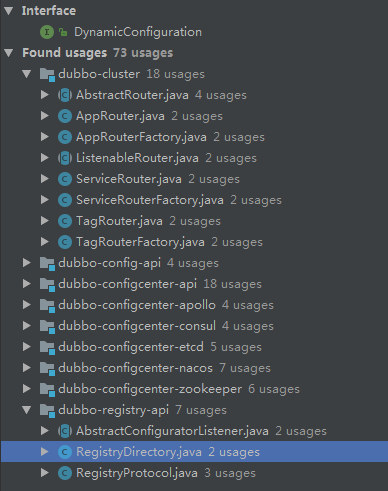

# DynamicConfiguration

## configcenter

配置中心，配置提供了动态修改服务配置的功能（入口）,可与 `dubbo-admin` 配合使用

## useage

从依赖可以看到目前的 `DynamicConfiguration` 主要应用在 `Cluster` 的 `Routter` 和 `Registry` 模块

`TagRouter` 模块可以通过配置中心，动态的修改路由规则，实现服务调用的自由的切换

关于 `TagRouter` 可参考这个 [dubbo-router.md](dubbo-router.md)
