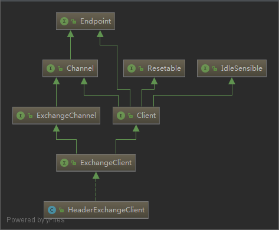
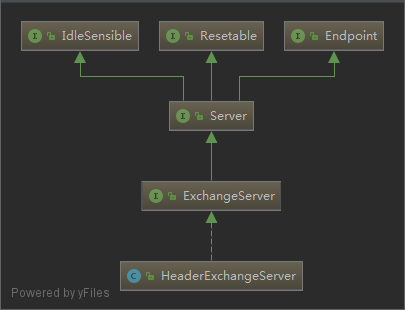

# Exchanger

- [Exchanger](#exchanger)
  - [HeaderExchanger](#headerexchanger)
  - [HeaderExchangeClient](#headerexchangeclient)
  - [HeaderExchangeServer](#headerexchangeserver)
  - [HeaderExchangeHandler](#headerexchangehandler)
    - [connected](#connected)
    - [disconnected](#disconnected)
    - [sent](#sent)
    - [received](#received)
  - [DecodeHandler](#decodehandler)

## HeaderExchanger

```java
public class HeaderExchanger implements Exchanger {

    public static final String NAME = "header";

    @Override
    public ExchangeClient connect(URL url, ExchangeHandler handler) throws RemotingException {
        // HeaderExchangeClient 包装了 返回的 Client
        // 同时包装了 DecodeHandler 和 HeaderExchangeHandler
        return new HeaderExchangeClient(Transporters.connect(url, new DecodeHandler(new HeaderExchangeHandler(handler))), true);
    }

    @Override
    public ExchangeServer bind(URL url, ExchangeHandler handler) throws RemotingException {
        // HeaderExchangeServer 包装了 Transporters.bind 返回的 Server
        // 同时包装了 DecodeHandler 和 HeaderExchangeHandler
        return new HeaderExchangeServer(Transporters.bind(url, new DecodeHandler(new HeaderExchangeHandler(handler))));
    }

}
```

参考 [dubbo-protocol-dubbo-protocol.md](dubbo-protocol-dubbo-protocol.md#NettyClientHandler) 进行 ChannelHandler 填充之后的数据流向：

```log
    TCP
    ↓
    Netty
    ↓
    Codec2
    ↓
    NettyClientHandler
    ↓
    NettyClient
    ↓
    DecodeHandler
    ↓
    HeaderExchangeHandler
    ↓
    DubboProtocol#requestHandler (ExchangeHandler)
    ↓
    Invoker
```

上面的图中多了 `DecodeHandler` 和 `HeaderExchangeHandler` 分析它们重写那些方法， 就知道它们的作用

| HeaderExchangeClient                                           | HeaderExchangeServer                                           |
| -------------------------------------------------------------- | -------------------------------------------------------------- |
|  |  |

## HeaderExchangeClient

```java
// HeaderExchangeClient 包装了 HeaderExchangeChannel
// 同时启动了二个定时任务
// startReconnectTask(url) 重新连接检查任务
// startHeartBeatTask(url) 心跳检查任务
public HeaderExchangeClient(Client client, boolean startTimer) {
    Assert.notNull(client, "Client can't be null");
    this.client = client;
    this.channel = new HeaderExchangeChannel(client);
    if (startTimer) {
        URL url = client.getUrl();
        startReconnectTask(url);
        startHeartBeatTask(url);
    }
}
```

## HeaderExchangeServer

```java
// HeaderExchangeServer 从构造函数可以看出，它包装了从 Transporters.bind 返回的 Server
// 同事启动了一个闲置检查任务
public HeaderExchangeServer(Server server) {
    Assert.notNull(server, "server == null");
    this.server = server;
    startIdleCheckTask(getUrl());
}
```

## HeaderExchangeHandler

`org.apache.dubbo.remoting.exchange.support.header.HeaderExchangeHandler`

HeaderExchangeHandler 重写了下面的几个方法:

- connected
- disconnected
- sent
- received
- caught
- getHandler

### connected

```java
    @Override
    public void connected(Channel channel) throws RemotingException {
        channel.setAttribute(KEY_READ_TIMESTAMP, System.currentTimeMillis());
        channel.setAttribute(KEY_WRITE_TIMESTAMP, System.currentTimeMillis());
        // 把当前的 channle 包装成 HeaderExchangeChannel
        ExchangeChannel exchangeChannel = HeaderExchangeChannel.getOrAddChannel(channel);
        try {
            handler.connected(exchangeChannel);
        } finally {
            HeaderExchangeChannel.removeChannelIfDisconnected(channel);
        }
    }
```

### disconnected

```java
    @Override
    public void disconnected(Channel channel) throws RemotingException {
        channel.setAttribute(KEY_READ_TIMESTAMP, System.currentTimeMillis());
        channel.setAttribute(KEY_WRITE_TIMESTAMP, System.currentTimeMillis());
        // 把当前的 channle 包装成 HeaderExchangeChannel
        ExchangeChannel exchangeChannel = HeaderExchangeChannel.getOrAddChannel(channel);
        try {
            handler.disconnected(exchangeChannel);
        } finally {
            DefaultFuture.closeChannel(channel);
            HeaderExchangeChannel.removeChannelIfDisconnected(channel);
        }
    }
```

### sent

```java
    @Override
    public void sent(Channel channel, Object message) throws RemotingException {
        Throwable exception = null;
        try {
            channel.setAttribute(KEY_WRITE_TIMESTAMP, System.currentTimeMillis());
            // 把当前的 channle 包装成 HeaderExchangeChannel
            ExchangeChannel exchangeChannel = HeaderExchangeChannel.getOrAddChannel(channel);
            try {
                handler.sent(exchangeChannel, message);
            } finally {
                HeaderExchangeChannel.removeChannelIfDisconnected(channel);
            }
        } catch (Throwable t) {
            exception = t;
        }
        if (message instanceof Request) {
            Request request = (Request) message;
            DefaultFuture.sent(channel, request);
        }
        if (exception != null) {
            if (exception instanceof RuntimeException) {
                throw (RuntimeException) exception;
            } else if (exception instanceof RemotingException) {
                throw (RemotingException) exception;
            } else {
                throw new RemotingException(channel.getLocalAddress(), channel.getRemoteAddress(),
                        exception.getMessage(), exception);
            }
        }
    }
```

### received

```java
    // 这里是在接受到消息是，根据消息类型，做不同的处理
    // isEvent 设置 Channel 属性事件
    // isTwoWay 消息需要执行回复，会执行 ExchangeHandler#reply 事件
    // Request
    // Response 会找到 Future 并设置结果，唤醒等待的线程
    // String 支持 telnet
    @Override
    public void received(Channel channel, Object message) throws RemotingException {
        channel.setAttribute(KEY_READ_TIMESTAMP, System.currentTimeMillis());
        // 把当前的 channle 包装成 HeaderExchangeChannel
        final ExchangeChannel exchangeChannel = HeaderExchangeChannel.getOrAddChannel(channel);
        try {
            if (message instanceof Request) {
                // handle request.
                Request request = (Request) message;
                if (request.isEvent()) {
                    handlerEvent(channel, request);
                } else {
                    if (request.isTwoWay()) {
                        handleRequest(exchangeChannel, request);
                    } else {
                        handler.received(exchangeChannel, request.getData());
                    }
                }
            } else if (message instanceof Response) {
                handleResponse(channel, (Response) message);
            } else if (message instanceof String) {
                if (isClientSide(channel)) {
                    Exception e = new Exception("Dubbo client can not supported string message: " + message + " in channel: " + channel + ", url: " + channel.getUrl());
                    logger.error(e.getMessage(), e);
                } else {
                    String echo = handler.telnet(channel, (String) message);
                    if (echo != null && echo.length() > 0) {
                        channel.send(echo);
                    }
                }
            } else {
                handler.received(exchangeChannel, message);
            }
        } finally {
            HeaderExchangeChannel.removeChannelIfDisconnected(channel);
        }
    }
```

## DecodeHandler

支持 `Decodeable`