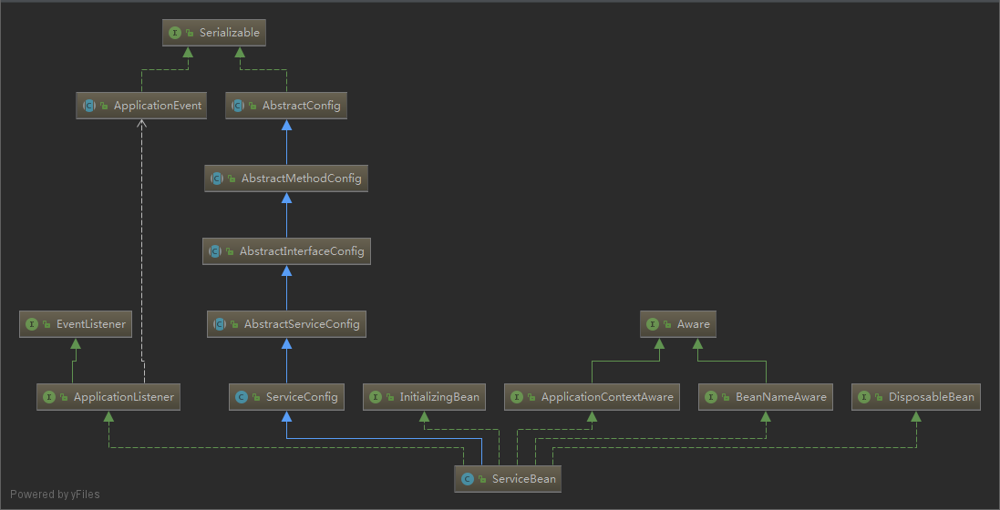

# dubbo init

从以下这个几个方面分析 `dubbo` 初始化：

- provider init（服务提供者初始化）
  - export(服务的暴露)
  - registry(服务的注册)
- consumer init

一个简单的 dubbo 例子

- [demo of dubbo](https://github.com/web1992/dubbos)

## provider init

初始化过程，以下面的这个简单的 xml 配置为例子

provider 的初始化，其实是类 `ServiceBean`的初始化过程,具体的实现在 `ServiceConfig`类中

> 说明：

dubbo 很多可扩展的类方法(如 protocol,registry)，都是基于 dubbo 的 SPI 机制进行方法调用的，如果要想理解代码的执行逻辑，最好对 dubbo 的 SPI 的机制有所了解。

> dubbo-provider.xml

```xml
<?xml version="1.0" encoding="UTF-8"?>
<beans xmlns:xsi="http://www.w3.org/2001/XMLSchema-instance"
       xmlns:dubbo="http://dubbo.apache.org/schema/dubbo"
       xmlns="http://www.springframework.org/schema/beans"
       xsi:schemaLocation="http://www.springframework.org/schema/beans http://www.springframework.org/schema/beans/spring-beans-4.3.xsd
       http://dubbo.apache.org/schema/dubbo http://dubbo.apache.org/schema/dubbo/dubbo.xsd">

    <!-- provider's application name, used for tracing dependency relationship -->
    <dubbo:application name="demo-provider"/>

    <dubbo:registry address="multicast://224.5.6.7:1234" />

    <!-- use dubbo protocol to export service on port 20880 -->
    <dubbo:protocol name="dubbo"/>

    <!-- service implementation, as same as regular local bean -->
    <bean id="demoService" class="cn.web1992.dubbo.demo.provider.DemoServiceImpl"/>

    <!-- declare the service interface to be exported -->
    <dubbo:service interface="cn.web1992.dubbo.demo.DemoService" ref="demoService"/>

</beans>
```

`dubbo`的初始化是以 spring 的扩展点为基础，进行配置，实现初始化的。

源码`org.apache.dubbo.config.spring.schema.DubboNamespaceHandler`

`spring`扩展点的相关配置，可以参照这个例子 [spring-extensible-xml](https://github.com/web1992/springs/tree/master/spring-extensible-xml)

下面是`DubboNamespaceHandler`源码：

```java
public class DubboNamespaceHandler extends NamespaceHandlerSupport {

    static {
        Version.checkDuplicate(DubboNamespaceHandler.class);
    }

    @Override
    public void init() {
        registerBeanDefinitionParser("application", new DubboBeanDefinitionParser(ApplicationConfig.class, true));
        registerBeanDefinitionParser("module", new DubboBeanDefinitionParser(ModuleConfig.class, true));
        registerBeanDefinitionParser("registry", new DubboBeanDefinitionParser(RegistryConfig.class, true));
        registerBeanDefinitionParser("config-center", new DubboBeanDefinitionParser(ConfigCenterBean.class, true));
        registerBeanDefinitionParser("metadata-report", new DubboBeanDefinitionParser(MetadataReportConfig.class, true));
        registerBeanDefinitionParser("monitor", new DubboBeanDefinitionParser(MonitorConfig.class, true));
        registerBeanDefinitionParser("provider", new DubboBeanDefinitionParser(ProviderConfig.class, true));
        registerBeanDefinitionParser("consumer", new DubboBeanDefinitionParser(ConsumerConfig.class, true));
        registerBeanDefinitionParser("protocol", new DubboBeanDefinitionParser(ProtocolConfig.class, true));
        registerBeanDefinitionParser("service", new DubboBeanDefinitionParser(ServiceBean.class, true));
        registerBeanDefinitionParser("reference", new DubboBeanDefinitionParser(ReferenceBean.class, false));
        registerBeanDefinitionParser("annotation", new AnnotationBeanDefinitionParser());
    }

}
```

从上面的代码可以看到熟悉的字样`application`，`service`，`reference`，`registry`等等

> 说明

`<dubbo:service />` 这个可以看做是一个 spring `<bean />`,bean 标签需要 Spring 容器进行解析，
而`<dubbo:service />`是我们自定义的格式需要我们`自己`进行相关的`解析`，`初始化`等操作，而`DubboNamespaceHandler`
中包含了这些解析自定义标签相关的实现类。

`DubboBeanDefinitionParser`实现了`BeanDefinitionParser`中的`BeanDefinition parse(Element element, ParserContext parserContext)`方法

这个方法返回一个`BeanDefinition`,本质就是根据 xml 中的配置信息，生成一个`BeanDefinition`实例交给 spring 容器。

### ServiceBean

`<dubbo:service />`标签对应的解析类是`ServiceBean`

> `ServiceBean` 类图：



从类图中可以看到，`ServiceBean`实现了 Spring 相关类的很多接口，如`InitializingBean`,`ApplicationListener`

而 dubbo 相关初始是在`ApplicationListener`的实现方法中触发的，代码如下：

`export()`方法是入口

```java
    @Override
    public void onApplicationEvent(ContextRefreshedEvent event) {
        if (!isExported() && !isUnexported()) {
            if (logger.isInfoEnabled()) {
                logger.info("The service ready on spring started. service: " + getInterface());
            }
            export();
        }
    }
```

> 这里思考下，为什么在`ContextRefreshedEvent`事件中进行服务的初始化？

`ServiceBean`中会根据配置，来初始化服务，如使用`netty`启动本地服务，注册服务到`zookeeper`等

> `dubbo` 服务提供者的初始化过程，这里主要分析服务的`export`(暴露)和`registry`(注册)
>
> 下面分析`export`和`registry` 这两个过程

### export

`export` 的主要作用是在本地启动一个 `TCP` 服务，并生成一个 `Exporter` 对象

以下面的 `DemoService` 为例子

```xml
<dubbo:service interface="cn.web1992.dubbo.demo.DemoService" ref="demoService"/>
```

export 过程会把 `DemoService`这个接口中的所有的方法进行解析，拼接成一个`URL` 字符串， 当作一种资源，在暴露服务的时候使用。

`ServiceConfig`中会调用`protocol.export`进行服务的暴露，而我使用的 protocol 配置是`<dubbo:protocol name="dubbo"/>`
因此会使用`DubboProtocol`进行服务的暴露

`ServiceConfig`代码片段：

```java
// proxyFactory 是通过 SPI 机制来找具体的实现类的
Invoker<?> invoker = proxyFactory.getInvoker(ref, (Class) interfaceClass, registryURL.addParameterAndEncoded(Constants.EXPORT_KEY, url.toFullString()));
DelegateProviderMetaDataInvoker wrapperInvoker = new DelegateProviderMetaDataInvoker(invoker, this);
// export 方法也是通过 SPI 机制调用具体的实现类的
// 这里protocol.export的实现类是 RegistryProtocol
Exporter<?> exporter = protocol.export(wrapperInvoker);
```

`RegistryProtocol` 的`export`方法

```java
  @Override
    public <T> Exporter<T> export(final Invoker<T> originInvoker) throws RpcException {
        URL registryUrl = getRegistryUrl(originInvoker);
        // url to export locally
        URL providerUrl = getProviderUrl(originInvoker);

        // Subscribe the override data
        // FIXME When the provider subscribes, it will affect the scene : a certain JVM exposes the service and call
        //  the same service. Because the subscribed is cached key with the name of the service, it causes the
        //  subscription information to cover.
        final URL overrideSubscribeUrl = getSubscribedOverrideUrl(providerUrl);
        final OverrideListener overrideSubscribeListener = new OverrideListener(overrideSubscribeUrl, originInvoker);
        overrideListeners.put(overrideSubscribeUrl, overrideSubscribeListener);

        providerUrl = overrideUrlWithConfig(providerUrl, overrideSubscribeListener);
        //export invoker
        // 进行服务的暴露
        // 这里是使用 DubboProtocol 进行服务的暴露
        final ExporterChangeableWrapper<T> exporter = doLocalExport(originInvoker, providerUrl);

        // url to registry
        final Registry registry = getRegistry(originInvoker);
        final URL registeredProviderUrl = getRegisteredProviderUrl(providerUrl, registryUrl);
        ProviderInvokerWrapper<T> providerInvokerWrapper = ProviderConsumerRegTable.registerProvider(originInvoker,
                registryUrl, registeredProviderUrl);
        //to judge if we need to delay publish
        boolean register = registeredProviderUrl.getParameter("register", true);
        if (register) {
            // 这里进行服务的注册
            register(registryUrl, registeredProviderUrl);
            providerInvokerWrapper.setReg(true);
        }

        // Deprecated! Subscribe to override rules in 2.6.x or before.
        registry.subscribe(overrideSubscribeUrl, overrideSubscribeListener);

        exporter.setRegisterUrl(registeredProviderUrl);
        exporter.setSubscribeUrl(overrideSubscribeUrl);
        //Ensure that a new exporter instance is returned every time export
        return new DestroyableExporter<>(exporter);
    }
```

`DubboProtocol`的代码片段：

```java
 @Override
    public <T> Exporter<T> export(Invoker<T> invoker) throws RpcException {
        URL url = invoker.getUrl();
        // ...
        // 在这里启动tcp服务
        // 会调用 createServer 创建服务
        openServer(url);
        optimizeSerialization(url);
        return exporter;
    }
```

`createServer` 方法中会使用 `server = Exchangers.bind(url, requestHandler);` 调用`Transporter`实现类`NettyTransporter`启动一个 `TCP` 服务

> `ExchangeServer`和`Transporter`实现类的查找都是通过 `dubbo`的`SPI` 机制,`SPI` 的实现类，可以参考：[dubbo-extension-loader](dubbo-extension-loader.md)

`NettyTransporter`的代码片段：

```java
public class NettyTransporter implements Transporter {

   public static final String NAME = "netty";

   @Override
   public Server bind(URL url, ChannelHandler listener) throws RemotingException {
       return new NettyServer(url, listener);
   }

   @Override
   public Client connect(URL url, ChannelHandler listener) throws RemotingException {
       return new NettyClient(url, listener);
   }

}
```

`NettyServer`的代码片段：

下面的代码是 `Netty` 启动的经典代码

```java
 @Override
    protected void doOpen() throws Throwable {
        bootstrap = new ServerBootstrap();

        bossGroup = new NioEventLoopGroup(1, new DefaultThreadFactory("NettyServerBoss", true));
        workerGroup = new NioEventLoopGroup(getUrl().getPositiveParameter(Constants.IO_THREADS_KEY, Constants.DEFAULT_IO_THREADS),
                new DefaultThreadFactory("NettyServerWorker", true));

        final NettyServerHandler nettyServerHandler = new NettyServerHandler(getUrl(), this);
        channels = nettyServerHandler.getChannels();

        bootstrap.group(bossGroup, workerGroup)
                .channel(NioServerSocketChannel.class)
                .childOption(ChannelOption.TCP_NODELAY, Boolean.TRUE)
                .childOption(ChannelOption.SO_REUSEADDR, Boolean.TRUE)
                .childOption(ChannelOption.ALLOCATOR, PooledByteBufAllocator.DEFAULT)
                .childHandler(new ChannelInitializer<NioSocketChannel>() {
                    @Override
                    protected void initChannel(NioSocketChannel ch) throws Exception {
                        NettyCodecAdapter adapter = new NettyCodecAdapter(getCodec(), getUrl(), NettyServer.this);
                        ch.pipeline()//.addLast("logging",new LoggingHandler(LogLevel.INFO))//for debug
                                .addLast("decoder", adapter.getDecoder())
                                .addLast("encoder", adapter.getEncoder())
                                .addLast("handler", nettyServerHandler);
                    }
                });
        // bind
        ChannelFuture channelFuture = bootstrap.bind(getBindAddress());
        channelFuture.syncUninterruptibly();
        channel = channelFuture.channel();

    }
```

### registry

`registry`的主要作用是把本地启动的服务信息， 如：ip+端口+ 接口+方法等信息，注册到服务中心（如：zookeeper）

### invoker

```java
ServiceBean
        -> Protocol
        -> ExchangeServer
        -> Transporter
        -> Server
```

```java
exportLocal(url);

```

## consumer init
