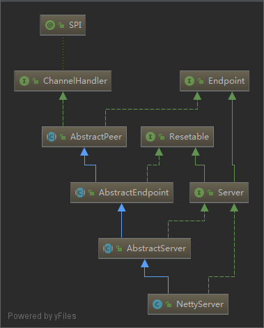
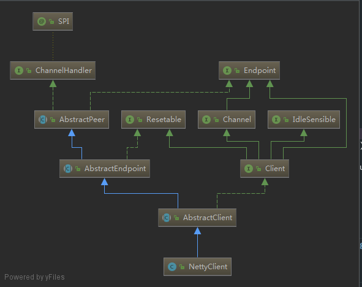

# DubboProtocol

`DubboProtocol` 的 `export` 方法用来启动 `TCP` 通信的服务器，返回 `Exporter`

`DubboProtocol` 的 `refer` 方法用来启动 `TCP` 通信的客户端，返回 `Invoker`

- [DubboProtocol](#dubboprotocol)
  - [export](#export)
    - [openServer](#openserver)
    - [createServer](#createserver)
    - [ExchangeHandler](#exchangehandler)
    - [NettyServer](#nettyserver)
    - [Server](#server)
  - [refer](#refer)
    - [getClients](#getclients)
    - [initClient](#initclient)
    - [NettyClient](#nettyclient)
  - [ChannelHandler](#channelhandler)
    - [NettyClientHandler](#nettyclienthandler)
    - [NettyServerHandler](#nettyserverhandler)

## export

```java
    // 暴露服务，返回 Exporter 对象
    @Override
    public <T> Exporter<T> export(Invoker<T> invoker) throws RpcException {
        URL url = invoker.getUrl();

        // export service.
        String key = serviceKey(url);
        DubboExporter<T> exporter = new DubboExporter<T>(invoker, key, exporterMap);
        exporterMap.put(key, exporter);

        //export an stub service for dispatching event
        Boolean isStubSupportEvent = url.getParameter(Constants.STUB_EVENT_KEY, Constants.DEFAULT_STUB_EVENT);
        Boolean isCallbackservice = url.getParameter(Constants.IS_CALLBACK_SERVICE, false);
        if (isStubSupportEvent && !isCallbackservice) {
            String stubServiceMethods = url.getParameter(Constants.STUB_EVENT_METHODS_KEY);
            if (stubServiceMethods == null || stubServiceMethods.length() == 0) {
                if (logger.isWarnEnabled()) {
                    logger.warn(new IllegalStateException("consumer [" + url.getParameter(Constants.INTERFACE_KEY) +
                            "], has set stubproxy support event ,but no stub methods founded."));
                }
            } else {
                stubServiceMethodsMap.put(url.getServiceKey(), stubServiceMethods);
            }
        }

        openServer(url);
        optimizeSerialization(url);
        return exporter;
    }
```

### openServer

```java
    // 创建服务 Server 对象,并放到 serverMap
    // Server 在这里代表了一种服务资源，可以参考下面 Server 接口的简单解释
    private void openServer(URL url) {
        // find server.
        String key = url.getAddress();
        //client can export a service which's only for server to invoke
        boolean isServer = url.getParameter(Constants.IS_SERVER_KEY, true);
        if (isServer) {
            ExchangeServer server = serverMap.get(key);
            if (server == null) {
                synchronized (this) {
                    server = serverMap.get(key);
                    if (server == null) {
                        serverMap.put(key, createServer(url));
                    }
                }
            } else {
                // server supports reset, use together with override
                server.reset(url);
            }
        }
    }
```

### createServer

```java
    // 创建服务器
    // 首先进行参数的完善,并检查
    // Exchangers 通过 SPI 加载 Exchanger 实现类 HeaderExchanger
    // Transporters 通过 SPI 加载 Transporter 实现类 NettyTransporter
    // Transporter 是对底层进行网络传输层的抽象，如 NettyTransporter
    private ExchangeServer createServer(URL url) {
        // send readonly event when server closes, it's enabled by default
        url = url.addParameterIfAbsent(Constants.CHANNEL_READONLYEVENT_SENT_KEY, Boolean.TRUE.toString());
        // enable heartbeat by default
        url = url.addParameterIfAbsent(Constants.HEARTBEAT_KEY, String.valueOf(Constants.DEFAULT_HEARTBEAT));
        String str = url.getParameter(Constants.SERVER_KEY, Constants.DEFAULT_REMOTING_SERVER);

        if (str != null && str.length() > 0 && !ExtensionLoader.getExtensionLoader(Transporter.class).hasExtension(str)) {
            throw new RpcException("Unsupported server type: " + str + ", url: " + url);
        }

        url = url.addParameter(Constants.CODEC_KEY, DubboCodec.NAME);
        ExchangeServer server;
        try {
            // 这里把 requestHandler 当做参数给了 Exchangers
            // 最终成为 NettyServer 的一个成员变量
            //  而这个变量测试继承来自 AbstractPeer
            server = Exchangers.bind(url, requestHandler);
        } catch (RemotingException e) {
            throw new RpcException("Fail to start server(url: " + url + ") " + e.getMessage(), e);
        }
        str = url.getParameter(Constants.CLIENT_KEY);
        if (str != null && str.length() > 0) {
            Set<String> supportedTypes = ExtensionLoader.getExtensionLoader(Transporter.class).getSupportedExtensions();
            if (!supportedTypes.contains(str)) {
                throw new RpcException("Unsupported client type: " + str);
            }
        }
        return server;
    }

```

### ExchangeHandler


从图上可以看到 `ExchangeHandler` 其实也是一个 `ChannelHandler`, `ChannelHandler` 会处理网络 IO 相关的事件，
如 连接事件，关闭连接事件，读事件，写事件等等，如果熟悉 Netty 的底层事件，那么理解这个很容易
这里的 `ChannelHandler` 和 Netty 中的 `ChannelHandler` 作用类似，都是处理 IO 相关的事件。

`requestHandler` 是在 [createServer](#createServer) 方法的中通过 `Exchangers.bind(url, requestHandler);` 当做参数给 `NettyServer` 的父类的

```java
private ExchangeHandler requestHandler = new ExchangeHandlerAdapter() {
    @Override
    public CompletableFuture<Object> reply(ExchangeChannel channel, Object message) throws RemotingException {
        if (message instanceof Invocation) {
            Invocation inv = (Invocation) message;
            Invoker<?> invoker = getInvoker(channel, inv);
            // need to consider backward-compatibility if it's a callback
            if (Boolean.TRUE.toString().equals(inv.getAttachments().get(IS_CALLBACK_SERVICE_INVOKE))) {
                String methodsStr = invoker.getUrl().getParameters().get("methods");
                boolean hasMethod = false;
                if (methodsStr == null || !methodsStr.contains(",")) {
                    hasMethod = inv.getMethodName().equals(methodsStr);
                } else {
                    String[] methods = methodsStr.split(",");
                    for (String method : methods) {
                        if (inv.getMethodName().equals(method)) {
                            hasMethod = true;
                            break;
                        }
                    }
                }
                if (!hasMethod) {
                    logger.warn(new IllegalStateException("The methodName " + inv.getMethodName()
                            + " not found in callback service interface ,invoke will be ignored."
                            + " please update the api interface. url is:"
                            + invoker.getUrl()) + " ,invocation is :" + inv);
                    return null;
                }
            }
            RpcContext rpcContext = RpcContext.getContext();
            rpcContext.setRemoteAddress(channel.getRemoteAddress());
            Result result = invoker.invoke(inv);
            if (result instanceof AsyncRpcResult) {
                return ((AsyncRpcResult) result).getResultFuture().thenApply(r -> (Object) r);
            } else {
                return CompletableFuture.completedFuture(result);
            }
        }
        throw new RemotingException(channel, "Unsupported request: "
                + (message == null ? null : (message.getClass().getName() + ": " + message))
                + ", channel: consumer: " + channel.getRemoteAddress() + " --> provider: " + channel.getLocalAddress());
    }
    @Override
    public void received(Channel channel, Object message) throws RemotingException {
        if (message instanceof Invocation) {
            reply((ExchangeChannel) channel, message);
        } else {
            super.received(channel, message);
        }
    }
    @Override
    public void connected(Channel channel) throws RemotingException {
        invoke(channel, Constants.ON_CONNECT_KEY);
    }
    @Override
    public void disconnected(Channel channel) throws RemotingException {
        if (logger.isInfoEnabled()) {
            logger.info("disconnected from " + channel.getRemoteAddress() + ",url:" + channel.getUrl());
        }
        invoke(channel, Constants.ON_DISCONNECT_KEY);
    }
    private void invoke(Channel channel, String methodKey) {
        Invocation invocation = createInvocation(channel, channel.getUrl(), methodKey);
        if (invocation != null) {
            try {
                received(channel, invocation);
            } catch (Throwable t) {
                logger.warn("Failed to invoke event method " + invocation.getMethodName() + "(), cause: " + t.getMessage(), t);
            }
        }
    }
    private Invocation createInvocation(Channel channel, URL url, String methodKey) {
        String method = url.getParameter(methodKey);
        if (method == null || method.length() == 0) {
            return null;
        }
        RpcInvocation invocation = new RpcInvocation(method, new Class<?>[0], new Object[0]);
        invocation.setAttachment(Constants.PATH_KEY, url.getPath());
        invocation.setAttachment(Constants.GROUP_KEY, url.getParameter(Constants.GROUP_KEY));
        invocation.setAttachment(Constants.INTERFACE_KEY, url.getParameter(Constants.INTERFACE_KEY));
        invocation.setAttachment(Constants.VERSION_KEY, url.getParameter(Constants.VERSION_KEY));
        if (url.getParameter(Constants.STUB_EVENT_KEY, false)) {
            invocation.setAttachment(Constants.STUB_EVENT_KEY, Boolean.TRUE.toString());
        }
        return invocation;
    }
};
```

### NettyServer



`NettyServer` 的主要作用：

1. NettyServer 在初始的时候，包装 ExchangeHandler (ExchangeHandler 可认为是一个回调函数)
2. 启动服务器，等待客户端连接，生成 ExchangeServer
3. 处理 IO 事件，并在 ExchangeHandler 中传递

```java
    // 这里可以看到十分经典的 Netty 服务启动代码
    // 1. 配置 bossGroup workerGroup 可以理解工作线程组
    //    bossGroup 处理服务器的工作，因此线程数是1，减少线程上下文的切换开销
    //    workerGroup 处理已经连接到服务器的客户端相关的事件，而这个线程数是可配置的
    // 2. 设置 TCP 相关的参数
    // 3. 设置 ChannelHandler
    //    addLast 执行了3次，添加了3个 ChannelHandler 处理 IO 事件
    @Override
    protected void doOpen() throws Throwable {
        bootstrap = new ServerBootstrap();

        bossGroup = new NioEventLoopGroup(1, new DefaultThreadFactory("NettyServerBoss", true));
        workerGroup = new NioEventLoopGroup(getUrl().getPositiveParameter(Constants.IO_THREADS_KEY, Constants.DEFAULT_IO_THREADS),
                new DefaultThreadFactory("NettyServerWorker", true));

        // 这里的 this 也就是 NettyServer 自己
        // NettyServer 是一个 ChannelHandler 通过 addLast 方法添加到 Netty 的 pipeline 中处理 IO 事件
        final NettyServerHandler nettyServerHandler = new NettyServerHandler(getUrl(), this);
        channels = nettyServerHandler.getChannels();

        bootstrap.group(bossGroup, workerGroup)
                .channel(NioServerSocketChannel.class)
                .childOption(ChannelOption.TCP_NODELAY, Boolean.TRUE)
                .childOption(ChannelOption.SO_REUSEADDR, Boolean.TRUE)
                .childOption(ChannelOption.ALLOCATOR, PooledByteBufAllocator.DEFAULT)
                .childHandler(new ChannelInitializer<NioSocketChannel>() {
                    @Override
                    protected void initChannel(NioSocketChannel ch) throws Exception {
                        NettyCodecAdapter adapter = new NettyCodecAdapter(getCodec(), getUrl(), NettyServer.this);
                        ch.pipeline()//.addLast("logging",new LoggingHandler(LogLevel.INFO))//for debug
                                .addLast("decoder", adapter.getDecoder())
                                .addLast("encoder", adapter.getEncoder())
                                .addLast("handler", nettyServerHandler);
                    }
                });
        // bind
        ChannelFuture channelFuture = bootstrap.bind(getBindAddress());
        channelFuture.syncUninterruptibly();
        channel = channelFuture.channel();

    }
```

关于 `NettyServer` 可以看这个文章 [NettyServer](dubbo-remoting-server.md)

### Server

```java
// 从 Server 定义方法可以看出， Server 中引用了代表客户端与服务器连接的 Channel 资源
// 提供了 getChannels 和 getChannel 方法，方便查询（管理,操作）这些资源
public interface Server extends Endpoint, Resetable {

    /**
     * is bound.
     *
     * @return bound
     */
    boolean isBound();

    /**
     * get channels.
     *
     * @return channels
     */
    Collection<Channel> getChannels();

    /**
     * get channel.
     *
     * @param remoteAddress
     * @return channel
     */
    Channel getChannel(InetSocketAddress remoteAddress);

    @Deprecated
    void reset(org.apache.dubbo.common.Parameters parameters);

}
```

## refer

当消费者启动的时候，会调用 `refer` 这个方法

```java
    // refer 返回一个 DubboInvoker
    // DubboInvoker 中包含了ExchangeClient 表示客户端与服务器的连接
    @Override
    public <T> Invoker<T> refer(Class<T> serviceType, URL url) throws RpcException {
        optimizeSerialization(url);
        // create rpc invoker.
        DubboInvoker<T> invoker = new DubboInvoker<T>(serviceType, url, getClients(url), invokers);
        invokers.add(invoker);
        return invoker;
    }
```

### getClients

```java
    // 首先查询配置，看是共享客户端，还是不需要共享
    // 默认是只有一个客户端连接
    // getSharedClient 会创建一个 ExchangeClient 并放入缓存中
    private ExchangeClient[] getClients(URL url) {
        // whether to share connection
        boolean service_share_connect = false;
        int connections = url.getParameter(Constants.CONNECTIONS_KEY, 0);
        // if not configured, connection is shared, otherwise, one connection for one service
        if (connections == 0) {
            service_share_connect = true;
            connections = 1;
        }

        ExchangeClient[] clients = new ExchangeClient[connections];
        for (int i = 0; i < clients.length; i++) {
            if (service_share_connect) {
                clients[i] = getSharedClient(url);
            } else {
                clients[i] = initClient(url);
            }
        }
        return clients;
    }
```

### initClient

```java
    /**
     * Create new connection
     */
    private ExchangeClient initClient(URL url) {

        // client type setting.
        String str = url.getParameter(Constants.CLIENT_KEY, url.getParameter(Constants.SERVER_KEY, Constants.DEFAULT_REMOTING_CLIENT));

        url = url.addParameter(Constants.CODEC_KEY, DubboCodec.NAME);
        // enable heartbeat by default
        url = url.addParameterIfAbsent(Constants.HEARTBEAT_KEY, String.valueOf(Constants.DEFAULT_HEARTBEAT));

        // BIO is not allowed since it has severe performance issue.
        if (str != null && str.length() > 0 && !ExtensionLoader.getExtensionLoader(Transporter.class).hasExtension(str)) {
            throw new RpcException("Unsupported client type: " + str + "," +
                    " supported client type is " + StringUtils.join(ExtensionLoader.getExtensionLoader(Transporter.class).getSupportedExtensions(), " "));
        }

        ExchangeClient client;
        try {
            // connection should be lazy
            if (url.getParameter(Constants.LAZY_CONNECT_KEY, false)) {
                client = new LazyConnectExchangeClient(url, requestHandler);
            } else {
                // 创建客户端连接
                client = Exchangers.connect(url, requestHandler);
            }
        } catch (RemotingException e) {
            throw new RpcException("Fail to create remoting client for service(" + url + "): " + e.getMessage(), e);
        }
        return client;
    }

```

### NettyClient

`NettyClient` 类图

| NettyClient                                  | NettyServer                                  |
| -------------------------------------------- | -------------------------------------------- |
|  |  |

从上面的类图对比可以看到,`NettyClient` 和 `NettyServer` 实现了很多类似的接口

`NettyClient` 主要的功能：

1. NettyClient 在初始化的时候，包装从 DubboProtocol 传递来的参数 ExchangeHandler (ExchangeHandler 可以理解为回调函数)
2. 与服务器建立连接，创建 ExchangeClient 并返回给 DubboProtocol 包装成 Invoker
3. 处理 IO 事件，并在 ExchangeHandler 中传递

## ChannelHandler

不管是 `NettyServer` 还是 `NettyClient` 中的 `ChannelHandler` 都在负责处理具体的 `IO` 事件和业务逻辑的

因此理解了 `org.apache.dubbo.remoting.ChannelHandler` 就对 `dubbo` 中 `IO` 相关的东西了解个大概了

dubbo 中量实现了 netty 的相关的 hander, `NettyClientHandler` 和 `NettyServerHandler`

`NettyClientHandler` 和 `NettyServerHandler` 把 `org.apache.dubbo.remoting.ChannelHandler` 通过构造方法进行包装，

从而把 Netty 中的 IO 事件，传递到 dubbo 自定义的 ChannelHandler 中，执行 dubbo 相关的业务逻辑

具体的构造过程，看下面的代码片段

### NettyClientHandler

```java
// 这里的 this 其实是 NettyClient
// NettyClient 本质也是 org.apache.dubbo.remoting.ChannelHandler
final NettyClientHandler nettyClientHandler = new NettyClientHandler(getUrl(), this);

// 解码/编码 器
// NettyCodecAdapter 封装了把
// io.netty.buffer.ByteBuf 转化 org.apache.dubbo.remoting.buffer.ChannelBuffer
// 把 org.apache.dubbo.remoting.buffer.ChannelBuffer 转化 io.netty.buffer.ByteBuf 相关的操作
// InternalEncoder 负责编码
// InternalDecoder 负责解码
// InternalEncoder 和 InternalDecoder 把编码/解码的操作传递给 Codec2
// 解码(decoder): ByteBuf -> ChannelBuffer -> Object  把 byte 字节转化成 java 对象
// 编码(encoder): Object -> ChannelBuffer -> ByteBuf  把 java 对象转化成 byte 字节
NettyCodecAdapter adapter = new NettyCodecAdapter(getCodec(), getUrl(), NettyClient.this);
```

上面通过 `org.apache.dubbo.remoting.buffer.ChannelBuffer` 和 `org.apache.dubbo.remoting.ChannelHandler` 对 netty

相关的 `io.netty.buffer.ByteBuf` 和 `io.netty.channel.ChannelHandler` 进行了包装，后续替换 netty 底层通信框架时，提供了可能

> 当进行网络通信的时候，数据的流向如下：

```log
    TCP
    ↓
    Netty
    ↓
    Codec2
    ↓
    NettyClientHandler
    ↓
    NettyClient
    ↓
    DubboProtocol#requestHandler (ExchangeHandler)
    ↓
    Invoker
```

### NettyServerHandler

`NettyServerHandler` 其实是为了包装 `NettyServer` 而存在的，数据的流向和 `NettyClientHandler` 一样

```java
// 这里的 this 其实是 NettyServer
// NettyServer 本质也是 org.apache.dubbo.remoting.ChannelHandler
final NettyServerHandler nettyServerHandler = new NettyServerHandler(getUrl(), this);

// 解码/编码 器
NettyCodecAdapter adapter = new NettyCodecAdapter(getCodec(), getUrl(), NettyServer.this);
```