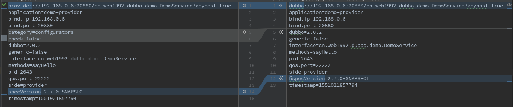

# RegistryProtocol

- [RegistryProtocol](#registryprotocol)
  - [成员变量](#%E6%88%90%E5%91%98%E5%8F%98%E9%87%8F)
  - [export](#export)
  - [registryUrl](#registryurl)
  - [providerUrl](#providerurl)
  - [overrideSubscribeUrl](#overridesubscribeurl)
  - [doLocalExport](#dolocalexport)
  - [ExporterChangeableWrapper](#exporterchangeablewrapper)
  - [refer](#refer)
  - [Cluster and Router and Directory](#cluster-and-router-and-directory)

1. `RegistryProtocol` 是基于 SPI 机制加载的
2. 调用 `DubboProtocol`
3. 注册服务到注册中心

## 成员变量

```java
// 下面的这几个成员变量都是通过 SPI 中的 injectExtension 方法进行注入的
private Cluster cluster;
private Protocol protocol;
private RegistryFactory registryFactory;
private ProxyFactory proxyFactory;
```

关于 `injectExtension` 可参考: [ExtensionLoader->injectExtension](dubbo-extension-loader.md#injectExtension)


从图中可以看到，上面的几个变量都是 `dubbo` 的自适应接口，接口中的有些方法实现了自适应

关于自适应可参考： [createAdaptiveExtensionClassCode](dubbo-extension-loader.md#createAdaptiveExtensionClassCode) 和 [Protocol$Adaptive](dubbo-extension-loader.md#ProtocolAdaptive)

## export

```java
// export 方法主要做两件事情：
// 1. 调用 DubboProtocol 启动本地的 TCP 服务
// 2. 调用 Registry 注册服务
// 3. 生成 registryUrl providerUrl subscribeUrl 用来注册，订阅服务
@Override
public <T> Exporter<T> export(final Invoker<T> originInvoker) throwsRpcException {
    // registryUrl providerUrl 是根据 Invoker 中的参数配置，添加额外的参数，用来注册服务使用
    URL registryUrl = getRegistryUrl(originInvoker);
    // url to export locally
    URL providerUrl = getProviderUrl(originInvoker);
    // Subscribe the override data
    // FIXME When the provider subscribes, it will affect the scene : a certain JVM exposes the service and call
    //  the same service. Because the subscribed is cached key with the name of the service, it causes the
    //  subscription information to cover.
    final URL overrideSubscribeUrl = getSubscribedOverrideUrl(providerUrl);
    final OverrideListener overrideSubscribeListener = new OverrideListener(overrideSubscribeUrl, originInvoker);
    overrideListeners.put(overrideSubscribeUrl, overrideSubscribeListener);
    providerUrl = overrideUrlWithConfig(providerUrl, overrideSubscribeListener);
    //export invoker
    // 启动本地服务，生成包装之后的 Exporter
    final ExporterChangeableWrapper<T> exporter = doLocalExport(originInvoker, providerUrl);
    // url to registry
    // 获取注册中心
    final Registry registry = getRegistry(originInvoker);
    final URL registeredProviderUrl = getRegisteredProviderUrl(providerUrl, registryUrl);
    ProviderInvokerWrapper<T> providerInvokerWrapper = ProviderConsumerRegTable.registerProvider(originInvoker,
            registryUrl, registeredProviderUrl);
    //to judge if we need to delay publish
    boolean register = registeredProviderUrl.getParameter("register", true);
    if (register) {
        // 这里注册服务到注册中心，如 zookeeper
        register(registryUrl, registeredProviderUrl);
        providerInvokerWrapper.setReg(true);
    }
    // Deprecated! Subscribe to override rules in 2.6.x or before.
    registry.subscribe(overrideSubscribeUrl, overrideSubscribeListener);
    exporter.setRegisterUrl(registeredProviderUrl);
    exporter.setSubscribeUrl(overrideSubscribeUrl);
    //Ensure that a new exporter instance is returned every time export
    return new DestroyableExporter<>(exporter);
}
```

下面看下 `registryUrl` `providerUrl` `overrideSubscribeUrl` 中参数的区别，就可以明白他们之前的区别了

## registryUrl

registryUrl 需要 url 解码

`registryUrl = multicast 信息 + provider 信息`

```url
multicast://224.5.6.7:1234/org.apache.dubbo.registry.RegistryService?application=demo-provider
dubbo=2.0.2
export=dubbo://192.168.0.6:20880/cn.web1992.dubbo.demo.DemoService?anyhost=true
application=demo-provider
bind.ip=192.168.0.6
bind.port=20880
dubbo=2.0.2
generic=false
interface=cn.web1992.dubbo.demo.DemoService
methods=sayHello
pid=2643
qos.port=22222
side=provider
specVersion=2.7.0-SNAPSHOT
timestamp=1551021857794
pid=2643
qos.port=22222
specVersion=2.7.0-SNAPSHOT
timestamp=1551021857773
```

## providerUrl

```url
dubbo://192.168.0.6:20880/cn.web1992.dubbo.demo.DemoService?anyhost=true
application=demo-provider
bind.ip=192.168.0.6
bind.port=20880
dubbo=2.0.2
generic=false
interface=cn.web1992.dubbo.demo.DemoService
methods=sayHello
pid=2643
qos.port=22222
side=provider
specVersion=2.7.0-SNAPSHOT
timestamp=1551021857794
```

## overrideSubscribeUrl

```url
provider://192.168.0.6:20880/cn.web1992.dubbo.demo.DemoService?anyhost=true
application=demo-provider
bind.ip=192.168.0.6
bind.port=20880
category=configurators
check=false
dubbo=2.0.2
generic=false
interface=cn.web1992.dubbo.demo.DemoService
methods=sayHello
pid=2643
qos.port=22222
side=provider
specVersion=2.7.0-SNAPSHOT
timestamp=1551021857794
```

providerUrl vs subscribeUrl



## doLocalExport

```java
// 这个方法会在本地启动一个 TCP 服务
private <T> ExporterChangeableWrapper<T> doLocalExport(final Invoker<T> originInvoker, URL providerUrl) {
    String key = getCacheKey(originInvoker);
    ExporterChangeableWrapper<T> exporter = (ExporterChangeableWrapper<T>) bounds.get(key);
    if (exporter == null) {
        synchronized (bounds) {
            exporter = (ExporterChangeableWrapper<T>) bounds.get(key);
            if (exporter == null) {
                final Invoker<?> invokerDelegete = new InvokerDelegate<T>(originInvoker, providerUrl);
                // protocol.export 启动本地服务，并对 exporter 进行保障
                exporter = new ExporterChangeableWrapper<T>((Exporter<T>) protocol.export(invokerDelegete), originInvoker);
                bounds.put(key, exporter);
            }
        }
    }
    return exporter;
}
```

`protocol.export` 方法实际是调用的 `DubboProtocol` 类中的方法，具体参考 [DubboProtocol](dubbo-protocol-dubbo-protocol.md)

## ExporterChangeableWrapper

## refer

当消费者启动的时候，会调用 `refer` 这个方法

```java
// refer 的主要作用是 customer 通过注册中心，获取服务列表，并建立 TCP 连接
// 具体的逻辑在 doRefer 方法中
public <T> Invoker<T> refer(Class<T> type, URL url) throws RpcException {
    url = URLBuilder.from(url)
            .setProtocol(url.getParameter(REGISTRY_KEY, DEFAULT_REGISTRY))
            .removeParameter(REGISTRY_KEY)
            .build();
    // 获取注册中
    Registry registry = registryFactory.getRegistry(url);
    if (RegistryService.class.equals(type)) {
        return proxyFactory.getInvoker((T) registry, type, url);
    }
    // group="a,b" or group="*"
    // 查询 dubbo 服务分组的信息
    Map<String, String> qs = StringUtils.parseQueryString(url.getParameterAndDecoded(REFER_KEY));
    String group = qs.get(GROUP_KEY);
    if (group != null && group.length() > 0) {
        if ((COMMA_SPLIT_PATTERN.split(group)).length > 1 || "*".equals(group)) {
            return doRefer(getMergeableCluster(), registry, type, url);
        }
    }
    return doRefer(cluster, registry, type, url);
}

// RegistryDirectory 与 registry 进行关了，当 registry 注册服务之后
// 会把可用的服务列表包装成功 List<Invoker> 存储在 RegistryDirectory 中
// 而后调用 Invoker invoker = cluster.join(directory); 包装成 Invoker
// 当后续 customer 进行服务调用的时候，会通过 Invoker 找到 directory，再找到 List<Invoker>
// 从中选择一个 Invoker 进行RPC 调用
// 此外 RegistryDirectory 中使用 RouterChain 获取 Router 实现路由方式的调用
private <T> Invoker<T> doRefer(Cluster cluster, Registry registry, Class<T> type, URL url) {
    RegistryDirectory<T> directory = new RegistryDirectory<T>(type, url);
    directory.setRegistry(registry);
    directory.setProtocol(protocol);
    // all attributes of REFER_KEY
    Map<String, String> parameters = new HashMap<String, String>(directory.getUrl().getParameters());
    URL subscribeUrl = new URL(CONSUMER_PROTOCOL, parameters.remove(REGISTER_IP_KEY), 0, type.getName(), parameters);
    if (!ANY_VALUE.equals(url.getServiceInterface()) && url.getParameter(REGISTER_KEY, true)) {
        directory.setRegisteredConsumerUrl(getRegisteredConsumerUrl(subscribeUrl, url));
        registry.register(directory.getRegisteredConsumerUrl());
    }
    directory.buildRouterChain(subscribeUrl);
    directory.subscribe(subscribeUrl.addParameter(CATEGORY_KEY,
            PROVIDERS_CATEGORY + "," + CONFIGURATORS_CATEGORY + "," + ROUTERS_CATEGORY));
    Invoker invoker = cluster.join(directory);
    ProviderConsumerRegTable.registerConsumer(invoker, url, subscribeUrl, directory);
    return invoker;
}
```

## Cluster and Router and Directory

这里简单的说下 `Cluster` , `Router` , `Directory` 三者之间的关系

`Directory` 中维护了 `RouterChain` 通过 `RouterChain` 来获取 `Router`

`Cluster` 的作用是从  `List<Invoker>` 中选择一个 `Invoker` 进行调用，并返回结果

而 `Cluster`  中的 `List<Invoker>` 则是通过 `Directory` 经过 `RouterChain` 执行 `route` 选择过滤出来的

而最终被选择的 `Invoker` 还需要经过 `LoadBalance` 最终选择一个 `Invoker` 进行 `RPC` 调用

具体的可以参考：

- [dubbo-cluster.md](dubbo-cluster.md)
- [dubbo-router.md](dubbo-router.md)
- [dubbo-load-balance.md](dubbo-load-balance.md)

因此一个 `RPC` 请求的最终路径是：

```java
Proxy -> Invoker -> Directory -> RouterChain -> Router -> LoadBalance -> Invoker
// 第一个 Invoker 可以看做是对 List<Invoker> 一组 Invoker 的包装(如：FailoverClusterInvoker)
// 而经过上面的过滤执行，最终会选择一个实际的 Invoker(DubboInvoker) 进行 RPC 调用
```
