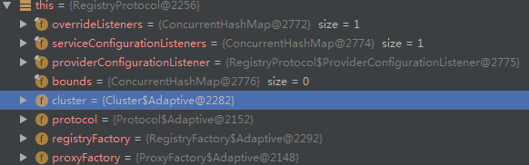

# RegistryProtocol

1. `RegistryProtocol` 是基于 SPI 机制加载的
2. 调用 `DubboProtocol`
3. 注册服务到注册中心

## 成员变量

```java
    // 下面的这几个成员变量都是通过 SPI 中的 injectExtension 方法进行注入的
    private Cluster cluster;
    private Protocol protocol;
    private RegistryFactory registryFactory;
    private ProxyFactory proxyFactory;
```

关于 `injectExtension` 可参考: [ExtensionLoader->injectExtension](dubbo-extension-loader.md#injectExtension)



从图中可以看到，上面的几个变量都是 dubbo 的自适应接口，接口中的方法实现了自适应

关于自适应可参考： [createAdaptiveExtensionClassCode](dubbo-extension-loader.md#createAdaptiveExtensionClassCode) 和 [Protocol$Adaptive](dubbo-extension-loader.md#ProtocolAdaptive)

## export

```java
    @Override
    public <T> Exporter<T> export(final Invoker<T> originInvoker) throws RpcException {
        URL registryUrl = getRegistryUrl(originInvoker);
        // url to export locally
        URL providerUrl = getProviderUrl(originInvoker);

        // Subscribe the override data
        // FIXME When the provider subscribes, it will affect the scene : a certain JVM exposes the service and call
        //  the same service. Because the subscribed is cached key with the name of the service, it causes the
        //  subscription information to cover.
        final URL overrideSubscribeUrl = getSubscribedOverrideUrl(providerUrl);
        final OverrideListener overrideSubscribeListener = new OverrideListener(overrideSubscribeUrl, originInvoker);
        overrideListeners.put(overrideSubscribeUrl, overrideSubscribeListener);

        providerUrl = overrideUrlWithConfig(providerUrl, overrideSubscribeListener);
        //export invoker
        final ExporterChangeableWrapper<T> exporter = doLocalExport(originInvoker, providerUrl);

        // url to registry
        final Registry registry = getRegistry(originInvoker);
        final URL registeredProviderUrl = getRegisteredProviderUrl(providerUrl, registryUrl);
        ProviderInvokerWrapper<T> providerInvokerWrapper = ProviderConsumerRegTable.registerProvider(originInvoker,
                registryUrl, registeredProviderUrl);
        //to judge if we need to delay publish
        boolean register = registeredProviderUrl.getParameter("register", true);
        if (register) {
            register(registryUrl, registeredProviderUrl);
            providerInvokerWrapper.setReg(true);
        }

        // Deprecated! Subscribe to override rules in 2.6.x or before.
        registry.subscribe(overrideSubscribeUrl, overrideSubscribeListener);

        exporter.setRegisterUrl(registeredProviderUrl);
        exporter.setSubscribeUrl(overrideSubscribeUrl);
        //Ensure that a new exporter instance is returned every time export
        return new DestroyableExporter<>(exporter);
    }
```

## doLocalExport

```java
    private <T> ExporterChangeableWrapper<T> doLocalExport(final Invoker<T> originInvoker, URL providerUrl) {
        String key = getCacheKey(originInvoker);
        ExporterChangeableWrapper<T> exporter = (ExporterChangeableWrapper<T>) bounds.get(key);
        if (exporter == null) {
            synchronized (bounds) {
                exporter = (ExporterChangeableWrapper<T>) bounds.get(key);
                if (exporter == null) {

                    final Invoker<?> invokerDelegete = new InvokerDelegate<T>(originInvoker, providerUrl);
                    exporter = new ExporterChangeableWrapper<T>((Exporter<T>) protocol.export(invokerDelegete), originInvoker);
                    bounds.put(key, exporter);
                }
            }
        }
        return exporter;
    }
```

## ExporterChangeableWrapper

## refer