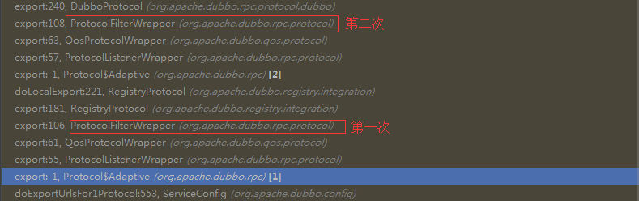

# Protocol

- [Protocol](#protocol)
  - [RegistryProtocol & DubboProtocol](#registryprotocol--dubboprotocol)
  - [DubboProtocol](#dubboprotocol)
  - [RegistryProtocol](#registryprotocol)
  - [Protocol\$Adaptive](#protocoladaptive)
  - [ProtocolFilterWrapper](#protocolfilterwrapper)
  - [ProtocolListenerWrapper](#protocollistenerwrapper)
    - [ListenerExporterWrapper](#listenerexporterwrapper)
    - [ListenerInvokerWrapper](#listenerinvokerwrapper)
  - [QosProtocolWrapper](#qosprotocolwrapper)

`Protocol`中主要有两个方法：`export`和`refer`

`Protocol`的两个主要的实现类是`DubboProtocol`和`RegistryProtocol`

`Protocol` 源码链接 [Protocol.java](https://github.com/apache/incubator-dubbo/blob/master/dubbo-rpc/dubbo-rpc-api/src/main/java/org/apache/dubbo/rpc/Protocol.java)

```java

// Protocol 是在 dubbo 中十分重要的概念
// RegistryProtocol 和 DubboProtocol 是 Protocol 的两个抽象
// DubboProtocol 负责服务的启动&客户端服务的连接
// RegistryProtocol 负责服务的注册
// Protocol 中的主要方法是 export 和 refer
// 通过 export 方法，暴露，注册服务
// 通过 refer 方法，发现，订阅服务
// expor 主要是服务器相关的业务，如启用一个 Netty 服务，并暴露服务
// refer 主要是客户端相关的业务，如注册，订阅一个服务
// destroy 负责服务的关闭，取消注册，取消订阅
// 如果要完全理解 Protocol 的功能，理解`RegistryProtocol` 和 `DubboProtocol` 的实现就可以
// export 返回的Exporter实例，refer 返回的 Invoker 实例都是经过层层包装的包装类，从而实现 Filter 等功能
// 包装类的生成有些是在代码中写死的，而有些是通过 SPI 机制生成的包装对象
@SPI("dubbo")
public interface Protocol {

    int getDefaultPort();

    @Adaptive
    <T> Exporter<T> export(Invoker<T> invoker) throws RpcException;

    @Adaptive
    <T> Invoker<T> refer(Class<T> type, URL url) throws RpcException;

    void destroy();

}
```

## RegistryProtocol & DubboProtocol

在服务启动的时候，会在 `RegistryProtocol` 中调用 `DubboProtocol` 的 `export` 方法，

而 `RegistryProtocol` & `DubboProtocol` 都是基于 SPI 加载进行调用的，都被包装类进行了包装，如：`ProtocolFilterWrapper`

这也是导致 `ProtocolFilterWrapper` 代码中有 `if (Constants.REGISTRY_PROTOCOL.equals(xx)){}` 这个判断的原因

`ProtocolFilterWrapper` 包装了 `RegistryProtocol` & `DubboProtocol` 这个两个类，因此 `export` 方法会被执行两次，如果不进行判断

那么 `buildInvokerChain` 方法就会重复执行两次，导致错误

看一个线程帧栈图：



> `ProtocolFilterWrapper` 的代码逻辑

```java
    @Override
    public <T> Exporter<T> export(Invoker<T> invoker) throws RpcException {
        if (Constants.REGISTRY_PROTOCOL.equals(invoker.getUrl().getProtocol())) {
            return protocol.export(invoker);
        }
        return protocol.export(buildInvokerChain(invoker, Constants.SERVICE_FILTER_KEY, Constants.PROVIDER));
    }

    @Override
    public <T> Invoker<T> refer(Class<T> type, URL url) throws RpcException {
        if (Constants.REGISTRY_PROTOCOL.equals(url.getProtocol())) {
            return protocol.refer(type, url);
        }
        return buildInvokerChain(protocol.refer(type, url), Constants.REFERENCE_FILTER_KEY, Constants.CONSUMER);
    }
```

## DubboProtocol

> DubboProtocol#export

```java
    // export 这个方法主要给服务提供者（provider）使用
    @Override
    public <T> Exporter<T> export(Invoker<T> invoker) throws RpcException {
        URL url = invoker.getUrl();

        // export service.
        String key = serviceKey(url);
        DubboExporter<T> exporter = new DubboExporter<T>(invoker, key, exporterMap);
        exporterMap.put(key, exporter);

        //export an stub service for dispatching event
        Boolean isStubSupportEvent = url.getParameter(Constants.STUB_EVENT_KEY, Constants.DEFAULT_STUB_EVENT);
        Boolean isCallbackservice = url.getParameter(Constants.IS_CALLBACK_SERVICE, false);
        if (isStubSupportEvent && !isCallbackservice) {
            String stubServiceMethods = url.getParameter(Constants.STUB_EVENT_METHODS_KEY);
            if (stubServiceMethods == null || stubServiceMethods.length() == 0) {
                if (logger.isWarnEnabled()) {
                    logger.warn(new IllegalStateException("consumer [" + url.getParameter(Constants.INTERFACE_KEY) +
                            "], has set stubproxy support event ,but no stub methods founded."));
                }
            } else {
                stubServiceMethodsMap.put(url.getServiceKey(), stubServiceMethods);
            }
        }
        // openServer 方法会创建一个 TCP 服务
        openServer(url);
        optimizeSerialization(url);
        return exporter;
    }
```

> DubboProtocol#refer

```java
    // 这个服务给 client 端使用
    @Override
    public <T> Invoker<T> refer(Class<T> serviceType, URL url) throws RpcException {
        optimizeSerialization(url);
        // create rpc invoker.
        // getClients 方法会创建客户端与服务器的连接
        DubboInvoker<T> invoker = new DubboInvoker<T>(serviceType, url, getClients(url), invokers);
        invokers.add(invoker);
        return invoker;
    }
```

## RegistryProtocol

> export

```java
    @Override
    public <T> Exporter<T> export(final Invoker<T> originInvoker) throws RpcException {
        URL registryUrl = getRegistryUrl(originInvoker);
        // url to export locally
        URL providerUrl = getProviderUrl(originInvoker);

        // Subscribe the override data
        // FIXME When the provider subscribes, it will affect the scene : a certain JVM exposes the service and call
        //  the same service. Because the subscribed is cached key with the name of the service, it causes the
        //  subscription information to cover.
        final URL overrideSubscribeUrl = getSubscribedOverrideUrl(providerUrl);
        final OverrideListener overrideSubscribeListener = new OverrideListener(overrideSubscribeUrl, originInvoker);
        overrideListeners.put(overrideSubscribeUrl, overrideSubscribeListener);

        providerUrl = overrideUrlWithConfig(providerUrl, overrideSubscribeListener);
        //export invoker
        final ExporterChangeableWrapper<T> exporter = doLocalExport(originInvoker, providerUrl);

        // url to registry
        final Registry registry = getRegistry(originInvoker);
        final URL registeredProviderUrl = getRegisteredProviderUrl(providerUrl, registryUrl);
        ProviderInvokerWrapper<T> providerInvokerWrapper = ProviderConsumerRegTable.registerProvider(originInvoker,
                registryUrl, registeredProviderUrl);
        //to judge if we need to delay publish
        boolean register = registeredProviderUrl.getParameter("register", true);
        if (register) {
            register(registryUrl, registeredProviderUrl);
            providerInvokerWrapper.setReg(true);
        }

        // Deprecated! Subscribe to override rules in 2.6.x or before.
        registry.subscribe(overrideSubscribeUrl, overrideSubscribeListener);

        exporter.setRegisterUrl(registeredProviderUrl);
        exporter.setSubscribeUrl(overrideSubscribeUrl);
        //Ensure that a new exporter instance is returned every time export
        return new DestroyableExporter<>(exporter);
    }
```

> refer

```java
    @Override
    @SuppressWarnings("unchecked")
    public <T> Invoker<T> refer(Class<T> type, URL url) throws RpcException {
        url = url.setProtocol(url.getParameter(REGISTRY_KEY, DEFAULT_REGISTRY)).removeParameter(REGISTRY_KEY);
        Registry registry = registryFactory.getRegistry(url);
        if (RegistryService.class.equals(type)) {
            return proxyFactory.getInvoker((T) registry, type, url);
        }

        // group="a,b" or group="*"
        Map<String, String> qs = StringUtils.parseQueryString(url.getParameterAndDecoded(REFER_KEY));
        String group = qs.get(Constants.GROUP_KEY);
        if (group != null && group.length() > 0) {
            if ((COMMA_SPLIT_PATTERN.split(group)).length > 1 || "*".equals(group)) {
                return doRefer(getMergeableCluster(), registry, type, url);
            }
        }
        // 这里对这个方法进行分析
        return doRefer(cluster, registry, type, url);
    }

    // cluster 这个参数是在 RegistryProtocol 被加载(SPI)的时候，通过反射注入的
    // 具体可参照 ExtensionLoader#injectExtension 这个方法
    // cluster 如果没有设置默认是 FailoverCluster
    // cluster 加载可以看下面的 Cluster$Adaptive 代码片段
    private <T> Invoker<T> doRefer(Cluster cluster, Registry registry, Class<T> type, URL url) {
        RegistryDirectory<T> directory = new RegistryDirectory<T>(type, url);
        directory.setRegistry(registry);
        directory.setProtocol(protocol);
        // all attributes of REFER_KEY
        Map<String, String> parameters = new HashMap<String, String>(directory.getUrl().getParameters());
        URL subscribeUrl = new URL(CONSUMER_PROTOCOL, parameters.remove(REGISTER_IP_KEY), 0, type.getName(), parameters);
        if (!ANY_VALUE.equals(url.getServiceInterface()) && url.getParameter(REGISTER_KEY, true)) {
            registry.register(getRegisteredConsumerUrl(subscribeUrl, url));
        }
        directory.buildRouterChain(subscribeUrl);
        directory.subscribe(subscribeUrl.addParameter(CATEGORY_KEY,
                PROVIDERS_CATEGORY + "," + CONFIGURATORS_CATEGORY + "," + ROUTERS_CATEGORY));

        Invoker invoker = cluster.join(directory);
        ProviderConsumerRegTable.registerConsumer(invoker, url, subscribeUrl, directory);
        return invoker;
    }
```

> Cluster\$Adaptive

`Cluster$Adaptive` 是通过代码动态生成的

```java
public class Cluster$Adaptive implements org.apache.dubbo.rpc.cluster.Cluster {
    public org.apache.dubbo.rpc.Invoker join(org.apache.dubbo.rpc.cluster.Directory arg0) throws org.apache.dubbo.rpc.RpcException {
        if (arg0 == null) {
            throw new IllegalArgumentException("org.apache.dubbo.rpc.cluster.Directory argument == null");
        }
        if (arg0.getUrl() == null) {
            throw new IllegalArgumentException("org.apache.dubbo.rpc.cluster.Directory argument getUrl() == null");
        }
        org.apache.dubbo.common.URL url = arg0.getUrl();
        String extName = url.getParameter("cluster", "failover");
        if (extName == null) {
            throw new IllegalStateException("Fail to get extension(org.apache.dubbo.rpc.cluster.Cluster) name from url(" + url.toString() + ") use keys([cluster])");
        }
        org.apache.dubbo.rpc.cluster.Cluster extension = (org.apache.dubbo.rpc.cluster.Cluster) ExtensionLoader.getExtensionLoader(org.apache.dubbo.rpc.cluster.Cluster.class).getExtension(extName);
        return extension.join(arg0);
    }
}
```

## Protocol\$Adaptive

`Protocol$Adaptive` 可参照：[Protocol\$Adaptive](dubbo-extension-loader.md#protocoladaptive)

## ProtocolFilterWrapper

1. 基于装饰器设计
2. 通过 SPI 加载 项目中的 `Filter`

```java
    // export 是服务提供者调用,进行服务的暴露
    // Constants.PROVIDER 加载服务提供方法的 Filter
    @Override
    public <T> Exporter<T> export(Invoker<T> invoker) throws RpcException {
        if (Constants.REGISTRY_PROTOCOL.equals(invoker.getUrl().getProtocol())) {
            return protocol.export(invoker);
        }
        return protocol.export(buildInvokerChain(invoker, Constants.SERVICE_FILTER_KEY, Constants.PROVIDER));
    }

    // refer 是服务消费者调用
    // Constants.CONSUMER 加载消费者的 Filter
    @Override
    public <T> Invoker<T> refer(Class<T> type, URL url) throws RpcException {
        if (Constants.REGISTRY_PROTOCOL.equals(url.getProtocol())) {
            return protocol.refer(type, url);
        }
        return buildInvokerChain(protocol.refer(type, url), Constants.REFERENCE_FILTER_KEY, Constants.CONSUMER);
    }
```

`buildInvokerChain`

```java

    private static <T> Invoker<T> buildInvokerChain(final Invoker<T> invoker, String key, String group) {
        Invoker<T> last = invoker;
        // 加载系统的 Filter 和自定义的 Filter
        // invoker.getUrl() url 中解析的 Filter 也会被加载
        List<Filter> filters = ExtensionLoader.getExtensionLoader(Filter.class).getActivateExtension(invoker.getUrl(), key, group);
        if (!filters.isEmpty()) {
            for (int i = filters.size() - 1; i >= 0; i--) {
                final Filter filter = filters.get(i);
                final Invoker<T> next = last;
                // 对当前的 invoker 进行包装
                // 重写了 invoke 方法，通过 filter 进行调用
                last = new Invoker<T>() {

                    @Override
                    public Class<T> getInterface() {
                        return invoker.getInterface();
                    }

                    @Override
                    public URL getUrl() {
                        return invoker.getUrl();
                    }

                    @Override
                    public boolean isAvailable() {
                        return invoker.isAvailable();
                    }

                    @Override
                    public Result invoke(Invocation invocation) throws RpcException {
                        // 重写 invoke 方法
                        // 使用 filter 进行调用
                        Result result = filter.invoke(next, invocation);
                        if (result instanceof AsyncRpcResult) {
                            AsyncRpcResult asyncResult = (AsyncRpcResult) result;
                            asyncResult.thenApplyWithContext(r -> filter.onResponse(r, invoker, invocation));
                            return asyncResult;
                        } else {
                            return filter.onResponse(result, invoker, invocation);
                        }
                    }

                    @Override
                    public void destroy() {
                        invoker.destroy();
                    }

                    @Override
                    public String toString() {
                        return invoker.toString();
                    }
                };
            }
        }
        return last;
    }
```

## ProtocolListenerWrapper

`ProtocolListenerWrapper` 主要做作用是加载 `ListenerExporterWrapper` 和 `ListenerInvokerWrapper`

对 `Export` 和 `Invoker` 进行包装

### ListenerExporterWrapper

`export` 在执行 `exporter.unexport()` 时，会通知所有注册的 `ExporterListener`

### ListenerInvokerWrapper

`invoker` 在执行 `invoker.destroy()` 时，会通知所有注册的 `InvokerListener`

## QosProtocolWrapper

`QosProtocolWrapper` 的作用是通过重写 `export` 和 `refer` 启动 `QosServer`

这样`服务提供者`和`服务消费者`会分别启动一个 `QosServer` 服务

重写 `destroy` 用来关闭 `QosServer` 服务
