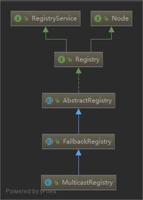
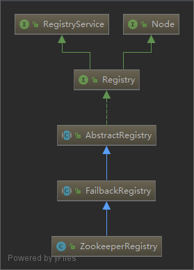

# Registry

`dubbo` 提供了服务的动态发现，注册功能，而这些功能的实现就是 `Registry` 接口

`Registry` 是通过 `RegistryFactory` 创建的，而 `RegistryFactory` 实现了 `dubbo` 自适应

- [Registry](#registry)
  - [RegistryService](#registryservice)
  - [AbstractRegistry](#abstractregistry)
  - [FailbackRegistry](#failbackregistry)
  - [MulticastRegistry](#multicastregistry)
    - [uml](#uml)
    - [简介](#简介)
    - [MulticastRegistry init](#multicastregistry-init)
  - [ZookeeperRegistry](#zookeeperregistry)

## RegistryService

```java
// 接口中定义的方法
public interface RegistryService {
    void register(URL url);
    void unregister(URL url);
    void subscribe(URL url, NotifyListener listener);
    void unsubscribe(URL url, NotifyListener listener);
    List<URL> lookup(URL url);
}
```

## AbstractRegistry

## FailbackRegistry

`FailbackRegistry` 中定义了几个 map 存储注册失败的服务信息，同时与定时器关联，在定时器中进行重试注册

```java
private final ConcurrentMap<URL, FailedRegisteredTask> failedRegistered = new ConcurrentHashMap<URL, FailedRegisteredTask>();
private final ConcurrentMap<URL, FailedUnregisteredTask> failedUnregistered = new ConcurrentHashMap<URL, FailedUnregisteredTask>();
private final ConcurrentMap<Holder, FailedSubscribedTask> failedSubscribed = new ConcurrentHashMap<Holder, FailedSubscribedTask>();
private final ConcurrentMap<Holder, FailedUnsubscribedTask> failedUnsubscribed = new ConcurrentHashMap<Holder, FailedUnsubscribedTask>();
private final ConcurrentMap<Holder, FailedNotifiedTask> failedNotified = new ConcurrentHashMap<Holder, FailedNotifiedTask>();
```

## MulticastRegistry

### uml



### 简介

`Multicast` 多播注册 (注意这里不是 `Broadcast` 广播)

`Multicast` 只对属于同一个组的地址发送数据,而 `Broadcast` 是对所有的 Ip 地址发送数据

因此有下面的操作:

```java
// 把地址加入 一个组
NetUtils.joinMulticastGroup(multicastSocket, multicastAddress);
```

### MulticastRegistry init

```java
public MulticastRegistry(URL url) {
    // super 调用父类的方法
    // AbstractRegistry 会检查服务注册文件是否存在，如果存在，那么就加载文件
    super(url);
    if (url.isAnyHost()) {
        throw new IllegalStateException("registry address == null");
    }
    try {
        // multicastAddress  其实是多播的组
        multicastAddress = InetAddress.getByName(url.getHost());
        checkMulticastAddress(multicastAddress);
        multicastPort = url.getPort() <= 0 ? DEFAULT_MULTICAST_PORT : url.getPort();
        // multicastSocket 是本地地址
        multicastSocket = new MulticastSocket(multicastPort);
        // 这里把 multicastSocket 加入 multicastAddress 组中
        NetUtils.joinMulticastGroup(multicastSocket, multicastAddress);
        // 启动一个线程，检测 socket 是否关闭
        // 没有关闭，就一直接口数据
        Thread thread = new Thread(new Runnable() {
            @Override
            public void run() {
                byte[] buf = new byte[2048];
                DatagramPacket recv = new DatagramPacket(buf, buf.length);
                while (!multicastSocket.isClosed()) {
                    try {
                        multicastSocket.receive(recv);
                        String msg = new String(recv.getData()).trim();
                        int i = msg.indexOf('\n');
                        if (i > 0) {
                            msg = msg.substring(0, i).trim();
                        }
                        // 接受消息
                        // 因为这段代码在 Runnable 内部中
                        // 因此使用 MulticastRegistry.this.receive 引用 MulticastRegistry 中的方法
                        MulticastRegistry.this.receive(msg, (InetSocketAddress) recv.getSocketAddress());
                        Arrays.fill(buf, (byte) 0);// 清空 byte 数组
                    } catch (Throwable e) {
                        if (!multicastSocket.isClosed()) {
                            logger.error(e.getMessage(), e);
                        }
                    }
                }
            }
        }, "DubboMulticastRegistryReceiver");
        thread.setDaemon(true);
        thread.start();
    } catch (IOException e) {
        throw new IllegalStateException(e.getMessage(), e);
    }
    this.cleanPeriod = url.getParameter(Constants.SESSION_TIMEOUT_KEY, Constants.DEFAULT_SESSION_TIMEOUT);
    if (url.getParameter("clean", true)) {
        this.cleanFuture = cleanExecutor.scheduleWithFixedDelay(new Runnable() {
            @Override
            public void run() {
                try {
                    clean(); // Remove the expired
                } catch (Throwable t) { // Defensive fault tolerance
                    logger.error("Unexpected exception occur at clean expired provider, cause: " + t.getMessage(), t);
                }
            }
        }, cleanPeriod, cleanPeriod, TimeUnit.MILLISECONDS);
    } else {
        this.cleanFuture = null;
    }
}

// receive 方法中根据消息的开头，处理 注册，订阅，取消注册这些消息
private void receive(String msg, InetSocketAddress remoteAddress) {
    if (logger.isInfoEnabled()) {
        logger.info("Receive multicast message: " + msg + " from " + remoteAddress);
    }
    if (msg.startsWith(Constants.REGISTER)) {
        URL url = URL.valueOf(msg.substring(Constants.REGISTER.length()).trim());
        registered(url);
    } else if (msg.startsWith(Constants.UNREGISTER)) {
        URL url = URL.valueOf(msg.substring(Constants.UNREGISTER.length()).trim());
        unregistered(url);
    } else if (msg.startsWith(Constants.SUBSCRIBE)) {
        URL url = URL.valueOf(msg.substring(Constants.SUBSCRIBE.length()).trim());
        Set<URL> urls = getRegistered();
        if (CollectionUtils.isNotEmpty(urls)) {
            for (URL u : urls) {
                if (UrlUtils.isMatch(url, u)) {
                    String host = remoteAddress != null && remoteAddress.getAddress() != null ? remoteAddress.getAddress().getHostAddress() : url.getIp();
                    if (url.getParameter("unicast", true) // Whether the consumer's machine has only one process
                            && !NetUtils.getLocalHost().equals(host)) { // Multiple processes in the same machine cannot be unicast with unicast or there will be only one process receiving information
                        unicast(Constants.REGISTER + " " + u.toFullString(), host);
                    } else {
                        multicast(Constants.REGISTER + " " + u.toFullString());
                    }
                }
            }
        }
    }/* else if (msg.startsWith(UNSUBSCRIBE)) {
    }*/
}

// MulticastRegistry 实现了 FailbackRegistry 的几个模板方法：
// doRegister
// doUnregister
// doSubscribe
// doUnsubscribe
// 上面的几个方法在对应的 RegistryService 接口中定义的方法被调用
@Override
public void doRegister(URL url) {
    multicast(Constants.REGISTER + " " + url.toFullString());
}
@Override
public void doUnregister(URL url) {
    multicast(Constants.UNREGISTER + " " + url.toFullString());
}
@Override
public void doSubscribe(URL url, NotifyListener listener) {
    if (Constants.ANY_VALUE.equals(url.getServiceInterface())) {
        admin = true;
    }
    multicast(Constants.SUBSCRIBE + " " + url.toFullString());
    synchronized (listener) {
        try {
            listener.wait(url.getParameter(Constants.TIMEOUT_KEY, Constants.DEFAULT_TIMEOUT));
        } catch (InterruptedException e) {
        }
    }
}
@Override
public void doUnsubscribe(URL url, NotifyListener listener) {
    if (!Constants.ANY_VALUE.equals(url.getServiceInterface()) && url.getParameter(Constants.REGISTER_KEY, true)) {
        unregister(url);
    }
    multicast(Constants.UNSUBSCRIBE + " " + url.toFullString());
}
```

## ZookeeperRegistry

基于 `zookeeper`的服务注册发现

