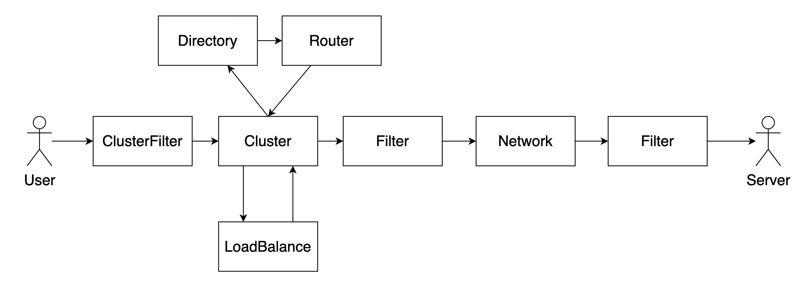

# dubbo 3.0

## Links

- [Dubbo3.0服务自省设计](https://mercyblitz.github.io/2020/05/11/Apache-Dubbo-%E6%9C%8D%E5%8A%A1%E8%87%AA%E7%9C%81%E6%9E%B6%E6%9E%84%E8%AE%BE%E8%AE%A1/)
- [MetadataService](https://cn.dubbo.apache.org/zh/blog/2022/08/18/18-dubbo3%e5%85%83%e6%95%b0%e6%8d%ae%e6%9c%8d%e5%8a%a1metadataservice%e7%9a%84%e5%af%bc%e5%87%ba/)
- [Dubbo3.0服务发现](https://cn.dubbo.apache.org/zh/docs3-v2/java-sdk/concepts-and-architecture/service-discovery/)
- [Dubbo 服务调用](https://cn.dubbo.apache.org/zh/docs3-v2/java-sdk/concepts-and-architecture/service-invocation/)
- [元数据中心](https://cn.dubbo.apache.org/zh/docs3-v2/java-sdk/reference-manual/metadata-center/overview/)
- [元数据中心 ZK](https://cn.dubbo.apache.org/zh/docs3-v2/java-sdk/reference-manual/metadata-center/zookeeper/)

## invoke-arch.jpeg

