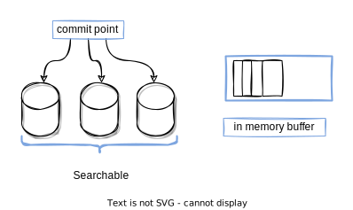

## 11 分片

- 为什么搜索是近实时的？
- 为什么文档的CRUD操作是实时的？
- ES怎样保证更新持久化，即使断电也不会丢失？ 
- 为什么删除文档不会立即释放空间？ 
- 什么是 refresh，flush, optimize API ，以及什么时候你该使用它们？
- 倒排索引
- 写入磁盘的倒排索引是不可变的
- 段（额外的倒排索引）
- 动态索引
- 提交点(commit poin)
- per-segment search
- 段是不可变的
- 近实时搜索
- fsync 是昂贵的
- `.del`文件
- refeash API
- translog 事务日志
- 合并段
- 日志的特点:不会被修改，值需要一个段即可

## 倒排索引

支持一个字段多个值的最佳数据结构是倒排索引。倒排索引包含了出现在所有文档中唯一的 值或词的有序列表，以及每个词所属的文档列表。

|Term | Doc 1 | Doc 2 | Doc 3 | ...
------|-------|-------|-------|---------
|brown | X | | X | ... 
|fox | X | X | X | ... 
|quick | X | X | | ... 
|the | X | | X | ...

当讨论倒排索引时，我们说的是把文档加入索引。因为之前，一个倒排索引是用来索引 整个非结构化的文本文档。ES中的文档是一个结构化的JSON文档。实际上，每一个 JSON文档中被索引的字段都有它自己的倒排索引。

在全文检索的早些时候，会为整个文档集合建立一个大索引，并且写入磁盘。只有新的索引 准备好了，它就会替代旧的索引，最近的修改才可以被检索。

## 段 segment

下一个需要解决的问题是如何在保持不可变好处的同时更新倒排索引。答案是，使用多个索引。不是重写整个倒排索引，而是增加额外的索引反映最近的变化。每个倒排索引都可以按顺序 查询，从最老的开始，最后把结果聚合。

一个段(segment)是有 完整功能的倒排索引，但是现在Lucene中的索引指的是段的集合，再加上提交点(commit point，包括所有段的文件)。

当一个请求被接受，所有段依次查询。所有段上的Term统计信息被聚合，确保每个term和文 档的相关性被正确计算。通过这种方式，新的文档以较小的代价加入索引。

## es pre segment

当一个请求被接受，所有段依次查询。所有段上的Term统计信息被聚合，确保每个term和文 档的相关性被正确计算。通过这种方式，新的文档以较小的代价加入索引。

## 删除和更新

段是不可变的，所以文档既不能从旧的段中移除，旧的段也不能更新以反映文档最新的版 本。相反，每一个提交点包括一个.del文件，包含了段上已经被删除的文档。 当一个文档被删除，它实际上只是在.del文件中被标记为删除，依然可以匹配查询，但是最终 返回之前会被从结果中删除。

文档的更新操作是类似的：当一个文档被更新，旧版本的文档被标记为删除，新版本的文档 在新的段中索引。也许该文档的不同版本都会匹配一个查询，但是更老版本会从结果中删除。

## 近实时搜索

因为 per-segment search 机制，索引和搜索一个文档之间是有延迟的。新的文档会在几分钟 内可以搜索，但是这依然不够快。 

磁盘是瓶颈。提交一个新的段到磁盘需要 fsync 操作，确保段被物理地写入磁盘，即时电源 失效也不会丢失数据。但是 fsync 是昂贵的，它不能在每个文档被索引的时就触发。

所以需要一种更轻量级的方式使新的文档可以被搜索，这意味这移除 fsync 。 

位于Elasticsearch和磁盘间的是文件系统缓存。如前所说，在内存索引缓存中的文档（图1） 被写入新的段（图2），但是新的段首先写入文件系统缓存，这代价很低，之后会被同步到磁 盘，这个代价很大。但是一旦一个文件被缓存，它也可以被打开和读取，就像其他文件一 样。

## refeash API

refeash API 在Elesticsearch中，这种写入打开一个新段的轻量级过程，叫做refresh。默认情况下，每个 分片每秒自动刷新一次。这就是为什么说Elasticsearch是近实时的搜索了：文档的改动不会 立即被搜索，但是会在一秒内可见。

在ES中，进行一次提交并删除事务日志的操作叫做 flush 。分片每30分钟，或事务日志过大 会进行一次flush操作。

## 事务日志

事务日志记录了没有flush到硬盘的所有操作。当故障重启后，ES会用最近一次提交点从硬盘 恢复所有已知的段，并且从日志里恢复所有的操作。 事务日志还用来提供实时的CRUD操作。当你尝试用ID进行CRUD时，它在检索相关段内的文 档前会首先检查日志最新的改动。这意味着ES可以实时地获取文档的最新版本。
