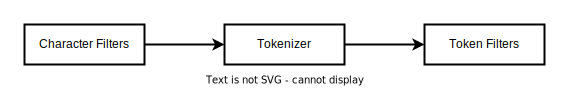

# ES index

ES扩展：
- ES常用到的概念介绍？例如：索引、类型、文档、属性、词条、词典、倒排索引、倒排表、倒排文件等等
- 其他内容介绍（自由发挥）

## 抽象对比

|RDBMS |Elasticsearch|
|------|-------------|
|Table | Index(Type)
|Row   | Document
|Column | Filed
|Schema |Mapping
|SQL    |DSL

传统关系型数据库和Elasticsearch的区别

- Elasticsearch- Schemaless / 相关性/高性能全文检索
- RDMS -事务性/ Join

## 文档(Document)

- Elasticsearch 是面向文档的，文档是所有可搜索数据的最小单位
    - 日志文件中的日志项
    - 一本电影的具体信息/一张唱片的详细信息
    - MP3 播放器里的一首歌/一篇PDF文档中的具体内容
- 文档会 被序列化成JSON格式，保存在Elasticsearch中
    - JSON 对象由字段组成
    - 每个字段都有对应的字段类型(字符串/数值/布尔/日期/二进制/范围类型)
- 每个文档都有一个Unique ID
    - 你可以自己指定ID
    - 或者通过Elasticsearch自动生成

## 文档的元数据

元数据，用于标注文档的相关信息
- _index - 文档所属的索引名
- _type - 文档所属的类型名
- _id  - 文档唯一ID
- _source:文档的原始JSON数据
- _all: 整合所有字段内容到该字段，已被废除
- _version: 文档的版本信息
- _score: 相关性打分

## 索引

- Index - 索引是文档的容器，是一类文档的结合
    - Index 体现了逻辑空间的概念:每个索引都有自己的Mapping定义，用于定义包含的文档的字段名和字段类型
    - Shard 体现了物理空间的概念:索引中的数据分散在Shard上
- 索弓的Mapping与Settings;
    - Mapping定义文档字段的类型
    - Setting定义不同的数据分布

## 索引的不同语义

- 名词: 一个Elasticsearch集群中，可以创建很多个不同的索引.
- 动词: 保存一个文档到Elasticsearch的过程也叫索引(indexing)ES中，创建一个倒排索引的过程
- 名词: 一个B树索引，一个倒排索引

## 倒排索引

|文档id|文档内容|
|-----|-------|
|1    |Mastering Elasticsearch  |
|2    |Elasticsearch Server     |
|3    |Elasticsearch Essentials |

|Term|Count|DocumentId:Position|
|----|-----|-------------------|
|Elasticsearch|3 |1:1,2:0,3:0|
|Mastering    |1 |1:0 |
|Server       |1 |2:1 |
|Essentials   |1 |3:1 |

倒排索引包含两个部分（倒排索引的核心组成）

- 单词词典(Term Dictionary), 记录所有文档的单词，记录单词到倒排列表的关联关系
    - 单词词典一般比较大，可以通过B+树或哈希拉链法实现，以满足高性能的插入与查询。

- 倒排列表(Posting List)-记录了单词对应的文档结合，由倒排索引项组成
    - 倒排索引项(Posting)
        - 文档ID
        - 词频TF - 该单词在文档中出现的次数，用于相关性评分
        - 位置(Position) - 单词在文档中分词的位置。用于语句搜索(phrase query)
        - 偏移(Offset) - 记录单词的开始结束位置，实现高亮显示

Elasticsearch的JSON文档中的每个字段，都有自己的倒排索引，可以指定对某些字段不做索引
- 优点:节省存储空间
- 缺点:字段无法被搜索

## 索引类型

在7.0之前，一个Index 可以设置多个Types。6.0开始，Type 已经被Deprecated。7.0 开始,一个索引只能创建一个Type-`_doc`

## 分词

Analysis与Analyzer
- Analysis一文本分析是把全文本转换一系列单词(term / token) 的过程，也叫分词Analysis是通过Analyzer来实现的
- 可使用Elasticsearch内置的分析器y或者按需定制化分析器
- 除了在数据写入时转换词条，匹配Query语句时候也需要用相同的分析器对查询语句进行分析

Analyzer 

分词器是专门处理分词的组件，Analyzer 由三部分组成。Character Filters (针对原始文本处理，例如去除htm) / Tokenizer (按照规则切分为单词) / Token Filter (将切分的的单词进行加工，小写，删除stopwords,增加同义词)。

Elasticsearch的内置分词器

- Standard Analyzer一默认分词器，按词切分，小写处理
- Simple Analyzer一按照非字母切分(符号 被过滤)，小写处理
- Stop Analyzer -小写处理，停用词过滤(the, a, is)
- Whitespace Analyzer一按照空格切分，不转小写
- Keyword Analyzer一不分词，直接将输入当作输出
- Patter Analyzer一正则表达式，默认\W+ (非字符分隔)
- L_anguage-提供了30多种常见语言的分词器
- Customer Analyzer 自定义分词器

## Dynamic Mapping

 