# Section1.电压信号如何放大——晶体管的引入

- 电压信号如何放大——晶体管的引入
- 压—压受控源(VCVS)和流—压(CCVS)受控源
- 流—流受控源(CCCS)和压—流(VCCS)受控源
- 双极型晶体管分为NPN管和PNP管
- 所谓的N，是英文Negative（负 ）的意思，指N型半导体
- NPN
- PNP
- 每个双极型晶体管都有3个管脚，分别叫基极(b)、集电极(c)和发射极(e)
- 载流子运动
- data  sheet 数据手册
- ON  Semiconductor（中文译为安森美）
- 2N2222
- Renesas（瑞萨）的2SC1213A(K)也是NPN管
- DIODES（达尔）的BC-807
- NXP（恩智浦）的BF723
- 基尔霍夫电流定律
- 双极型晶体管（Bipolar  Junction  Transistor:BJT）

## 晶体管


```txt
在电路图中，如果你看到两个三角形组成的正方形，通常表示一个受控源。这种配置通常用于表示一个受外部控制或受其他电路元件影响的电源。正方形代表一个电源，而内部的两个三角形表示这个电源是可控的，其电流或电压可以由外部因素或其他电路元件来控制或调节。
```

它的符号如图Section1-5左，有三个管脚，称为三个极，基极b，集电极c，发射极e，它可以用右侧的简化模型近似表示。

它与标准CCCS（电流控制电流源）很像，但有以下区别：
- 1）它的b、e之间，是单向导通的，即只有b端电位高于e端电位时，才会有明显的iB存在，这可以用一个二极管近似表示。- 2）且这个电流大小与b、e两端电位差并不是线性关系。
- 3）受控电流源仅在c端电位高于e端电位时，呈现出如下关系：𝑖C=𝛽𝑖B 

不要苛求什么完全一致了，这已经非常棒了。晶体管，被誉为20世纪最伟大的发明，是毫无争议的。在模拟信号领域，它可以被用来做信号放大、功率放大、制作成集成运算放大器；在数字信号领域，它可以构成最基本的数字门电路、  开关电路，以及由数字门衍生出的大规模数字集成电路、微处理器等。可以说，当今世界电子领域几乎全部的电路，都离不开晶体管。

双极型晶体管分为NPN管和PNP管。所谓的N，是英文Negative（负 ）的意思，指N型半导体：在4价的硅材料中掺杂少量5价元素如砷、磷等，形成N型掺杂半导体。所谓的P，是英文Positive（正）的意思，指P型半导体：在4价的硅材料中掺杂少量的3价元素如硼等，形成P型掺杂半导体。



NPN型晶体管，是指组成该晶体管的结构是两个N型半导体的中间是P型半导体，如图Section1-6所示。PNP型晶体管，是指组成该晶体管的结构是两个P型半导体夹着一个N型半导体，如图Section1-6所示。如果NPN是肉夹馍，那么PNP就是馍夹肉。

每个双极型晶体管都有3个管脚，分别叫基极(b)、集电极(c)和发射极(e)。它们的电路符号如图Section1-6所示。其中(a)和(c)图用于解释管脚，在实际电路中一般都简化成(b)和(d)图。基极最好辨认。另外两个极中，带箭头的是发射极，不带箭头的是集电极。

对NPN管，直观看b、e组成了一个PN结，称为发射结，而b、c组成了另一个PN结，称为集电结。但是，晶体管完全不是两个简单PN结的集合，其内部载流子运动非常复杂，本书不阐述。

可以看出，晶体管中箭头方向代表了管子的类型：箭头向外的，是NPN型，箭头朝里的，是PNP型。因此，一个箭头起到了两个作用：
- 第一，标注了哪个管脚是发射极，
- 第二，指明该晶体管是NPN还是PNP。

## 晶体管的基本电流关系

图Section1-7 晶体管的电流、电压定义


- 1）电流的定义非常简单，它依从于发射极电流的方向。对NPN管，发射极电流𝑖𝐸是流出的，那么基极电流𝑖B和集电极电流𝑖C都定义为流入的。而对于PNP管，发射极电流𝑖E是流入的，那么基极电流𝑖B和集电极电流𝑖C都定义为流出的。

- 2）对NPN管，基极是P型半导体，定义基极电位𝑢B减去发射极电位𝑢E为发射结电压，写作𝑢BE，此值为正值才能让发射结的PN结处于正向导通状态。对PNP管则相反，基极是N型半导体，则定义发射极电位𝑢E减去基极电位𝑢𝑩为发射结电压，写作𝑢EB，此值为正值才能让发射结处于正向导通状态。

完成这些最为基本的定义后，晶体管表现出的简单规律如下：

- 1）晶体管的三个管脚电流，永远满足`基尔霍夫电流定律`：`𝑖B+𝑖C=𝑖E`
- 2）在晶体管处于放大状态下，它的集电极电流𝑖C唯一受控于基极电流𝑖B，而与c、e两端电压𝑢CE无关：`𝑖C=𝛽𝑖B`

受控电流源——由一个较小的电流𝑖B控制产生一个较大的电流𝑖C，而𝛽称为电流放大倍数，不同的晶体管具有不同的值，但对一个确定的晶体管，它基本上是恒定的，在几十到几百之间。

- 3）根据式(Section1-1)和(Section1-2)，可以推演出：𝑖E=(1 +𝛽)𝑖B=1 +𝛽𝛽𝑖C

我们不给这个公式定义号码了，因为它太简单了。

