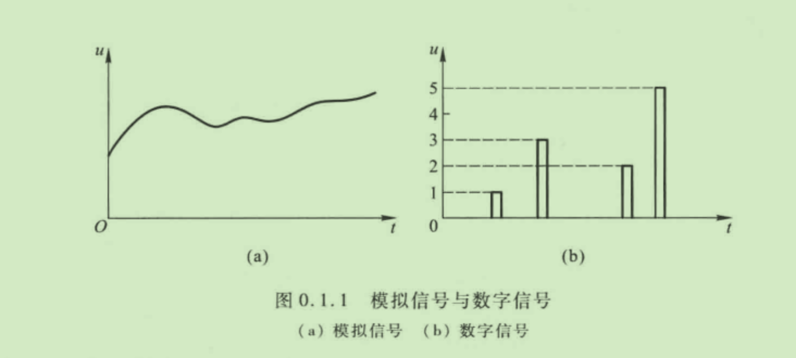
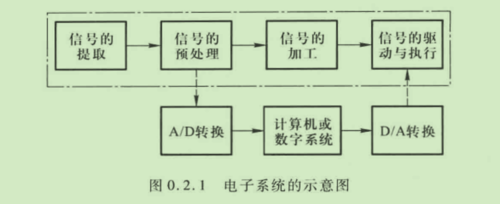

# 第0章 绪论

- 什么是信号
- 模拟信号
- 数字信号
- 常见的模拟电路
- EDA
- 

## 电信号

信号是反映消息的物理量,例如工业控制中的温度、压力、流量、自然界的声音信号等,因而信号是消息的表现形式。人们所说的信息,是指存在于消息之中的新内容,例如人们从各种媒体上获得原来未知的消息,就是获得了信息。可见,信息需要借助于某些物理量(如声、光、电)的变化来表示和传递,广播和电视利用电磁波来传送声音和图像就是最好的例证。

由于电信号较容易传送、处理和控制,人们就将非电的物理量通过各种传感器转换成电信号,以达到信息的提取、传送、交换、存储等目的。

电信号是指随时间而变化的电压 u或电流 i,因此在数学描述上可将它表示为时间的函数,即 u=f(t) 或i=f(t),并可画出其波形。电子电路中的信号均为电信号.以下简称为信号。

## 模拟信号和数字信号

模拟信号在时间和数值上均具有连续性,即对应于任意时间值:均有确定的函数值“或 i并且“或的幅值是连续取值的。例如,正弦波信号是典型的模拟信号,图 0.1.1(a)所示也是典型的模拟信号。

与模拟信号不同,数字信号在时间和数值上均具有离散性， u或i的变化在时间上不连续总是发生在离散的瞬间,
且它们的数值是一个最小量值的整倍数,并以此倍数作为数字信号的数值,如图0.1.1(b)所示。当实际信号的值在 N与N+1(N 为整数)之间时,
则需通过设定的闻值将其确定为1或N+1,即认为 N与N+1之间的数值没有意义。

应当指出,大多数物理量所转换成的电信号均为模拟信号。在信号处理时,模拟信号和数字信号可以相互转化。例如.用计算机处理信号时,由于计算机只能识别数字信号,故需将模拟信号转换为数字信号,称为模 -数转换:由于负载常需模拟信号驱动,故需将计算机输出的数字信号转换为模拟信号,称为数-模转换。

## 模拟电子系统的组成

图 0.2.1 所示点画线框内为模拟电子系统的示意图。系统首先采集信号,即进行信号的提取。通常,这些信号来源于转换各种物理量为电信号的传感器、接收器,或者来源于用于测试的信号发生器。对于实际系统,传感器或接收器所提供的信号的幅值往往很小,噪声很大,且易受干扰,有时甚至分不清什么是有用信号,什么是干扰或噪声;因此,在加工信号之前需将其进行预处理。预处理时需根据实际情况利用隔离、滤波、阻抗变换等各种手段将信号分离出来并进行放大。当信号足够大时,再进行信号的运算、转换、比较、采样保持等不同的加工。最后,通常要经过功率放大以驱动执行机构(负载)。

若系统不经过计算机处理,则图 0.2.1 中的信号的预处理和信号的加工可合而为一,统称为信号的处理,为模拟系统。若要进行数字化处理,则将模拟信号预处理后经 A/D 转换器送人计算机或专门的数字系统进行处理,然后再经 D/A 转换器返回功率放大以驱动执行机构,如图0.2.1 点画线框外所示。

## 电子信息系统中的模拟电路

在电子系统中,常用的模拟电路及其功能如下:
(1) 放大电路:用于信号的电压、电流或功率放大。
(2) 滤波电路:用于信号的提取、变换或抗干扰。
(3) 运算电路:完成一个信号或多个信号的加、减、乘、除、积分、微分、对数、指数·.....运算。
(4) 信号转换电路:用于将电流信号转换成电压信号或将电压信号转换成电流信号、将直流信号转换为交流信号或将交流信号转换为直流信号、将直流电压转换成与之成正比的频率·.....
(5) 信号发生电路:用于产生正弦波、矩形波、三角波、锯齿波等。
(6) 直流电源:将 220 V、50 Hz 交流电转换成不同输出电压和电流的直流电,作为各种电子电路的供电电源

应当指出,放大是对模拟信号最基本的处理,在上述电路中均含有放大电路,因此放大电路是构成各种功能模拟电路的基本电路。

## 如何学习模拟电子技术基础课

一、重点掌握“基本概念、基本电路、基本分析方法

1.基本概念的含义是不变的,但应用是灵活的。对于任何一-个基本概念,至少应了解引人这一概念的必要性及其物理意义,如果是一个物理参数,则还应了解其求解方法及求解过程中的注意事项。

2.基本电路的组成原则是不变的,电路是千变万化的,实际上不可能也没必要记住所有电路。每一章都有其基本电路,掌握这些电路是学好该课程的关键。某种基本电路常不是特指某一个电路,而是指具有同样功能和结构特征的所有电路。掌握它们至少应了解其产生背景(即为满足什么需求)、结构特点和性能特点,以及在电子系统中的作用。

3.在掌握基本概念、基本电路的基础上还应掌握基本分析方法。不同类型的电路具有不同的功能,需用不同的参数和不同的方法描述,而不同的参数有不同的求解方法。基本分析方法包括电路的识别方法、性能指标的估算方法和描述方法、电路形式及电路参数的选择方法等

二、学会全面、辩证地分析模拟电子电路中的问题
应当指出,对于实际需求,从适用的角度出发,没有最好的电路,只有最合适的电路,或者说在某一应用场合中最合适的电路才是最好的电路，“最合适"是由各种约束条件得出的,比如环境、现有元器件、甚至造价,等等。而且,当你为改善电路某方面性能而采取某种措施时,必须自问,这种措施还改变了什么?怎么变的?能容忍这种变化吗?因为一个电子电路是一个整体.各方面性能是相互联系的.通常“有一利将有一弊”.不能“顾此失彼”

三、注意电路的基本定理、定律在模拟电子电路分析中的应用
如前所述,当模拟电子电路中的半导体器件用其等效电路取代后.则与一般电路一样了。因此,电路的基本定理、定律均可用于模拟电子电路的分析计算,如基尔霍夫定理、戴维宁定理、诺顿定理等。