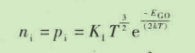

#  第一节 常用的半导体器件

## 本章讨论的问题

- 为什么采用半导体材料制作电子器件?
- 空穴是一种载流子吗?空穴导电时电子运动吗?
- 什么是N型半导体?什么是P型半导体?当两种半导体制作在一起时会产生什么现象?
- PN结上所加端电压与电流符合欧姆定律吗? 它为什么具有单向导电性?在PN结加反向电压时果真没有电流吗?
- 晶体管是通过什么方式来控制集电极电流的?场效应管是通过什么方式来控制漏极电流的?为什么它们都可以用于放大?
- 为什么半导体器件的参数会受温度的影响呢?
- 纯净的具有晶体结构的半导体称为本征半导体

## 摘要

- 纯净的具有晶体结构的半导体称为本征半导体
- 低价元素
- 高价元素
- 将纯净的半导体经过一定的工艺过程制成单晶体,即为本征半导体
- 共价键结构
- 晶体中的共价键具有很强的结合力
- 空穴
- 电子电流
- 空穴电流
- 运载电荷的粒子称为载流子
- 半导体在热激发下产生自由电子和空穴对的现象称为本征激发
- 复合
- 玻尔兹曼常数
- 禁带宽度
- 在常温下,即 T=300 K
- 杂质半导体
- N 型半导体
- P型半导体
- N 为 Negative(负)的字头,由于电子带负电,故得此名
- P 为 Positive(正)的字头,由于空穴带正电,故得此名
- PN 结
- 扩散运动
- 空间电荷区（耗尽层）
- 电场
- 耗尽层
- 高电阻性
- 非导电性
- 漂移运动
- 电位差
- PN 结的单向导电性
- PN 结的电流方程
- 伏安特性
- 势垒电容和扩散电容
- 反向击穿
- 齐纳击穿
- 雪崩击穿
- 变容二极管

## 载流子

运载电荷的粒子称为载流子。导体导电只有一种载流子,即自由电子导电;而本征半导体有两种载流子.即自由电子和空穴均参与导电,这是半导体导电的特殊性质。

## N 型半导体

在纯净的硅晶体中掺入五价元素(如磷),使之取代晶格中硅原子的位置,就形成了 N 型半导体·。由于杂质原子的最外层有五个价电子,所以除了与其周围硅原子形成共价键外,还多出一个电子。多出的电子不受共价键的束缚,只需获得很少的能量,就成为自由电子。

在常温下,由于热激发,就可使它们成为自由电子。而杂质原子因在晶格上,且又缺少电子,故变为不能移动的正离子。N 型半导体中,自由电子的浓度大于空穴的浓度,故称自由电子为多数载流子,空穴为少数载流子;简称前者为多子,后者为少子,由于杂质原子可以提供电子故称之为施主原子。N 型半导体主要靠自由电子导电,掺入的杂质越多,多子(自由电子)的浓度就越高,导电性能也就越强。

## P型半导体

在纯净的硅晶体中掺人三价元素(如硼),使之取代晶格中硅原子的位置,就形成 P 型半导体2。由于杂质原子的最外层有 3 个价电子,所以当它们与周围的硅原子形成共价键时,就产生了一个“空位”(空位为电中性),当硅原子的外层电子填补此空位时,其共价键中便产生一个空穴,如图 1.1.4 所示,而杂质原子成为不可移动的负离子。因而P型半导体中,空穴为多子,自由电子为少子,主要靠空穴导电。与 N 型半导体相同,掺人的杂质越多,空穴的浓度就越高,使得导电性能越强。因杂质原子中的空位吸收电子.故称之为受主原子。

## PN 结

采用不同的掺杂工艺,将卫型半导体与 N 型半导体制作在同一块硅片上,在它们的交界面就形成 PN 结。PN 结具有单向导电性。

## PN 结的单向导电性

1.PN 结外加正向电压时处于导通状态

当电源的正极(或正极串联电阻后)接到 PN 结的P端,且电源的负极(或负极串联电阻后)接到 PN 结的 N端时,称 PN 结外加`正向压`,也称正向接法或正向偏置。
此时外电场将多数载流子推向空间电荷区,使其变窄,削弱了内电场,破坏了原来的平衡,使扩散运动加剧.漂移运动减弱。由于电源的作用.扩散运动将源源不断地进行,从而形成正向电流.PN 结导通。
