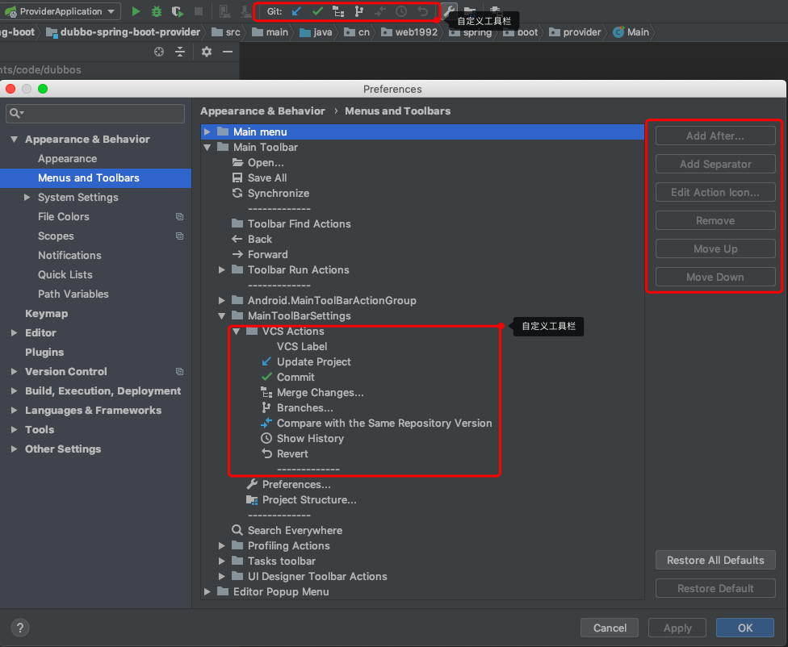
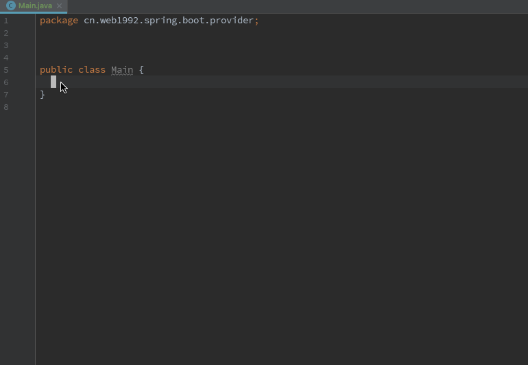
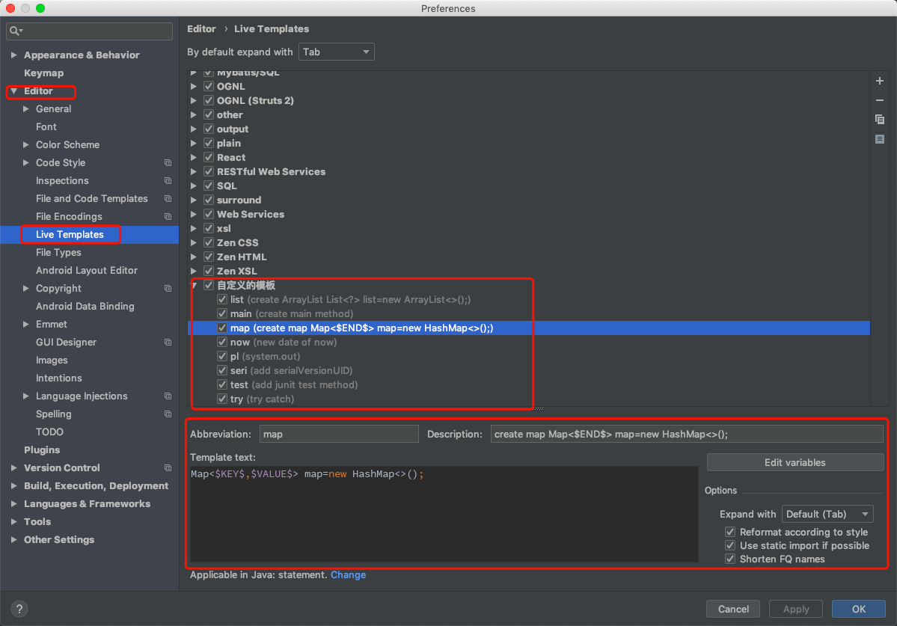
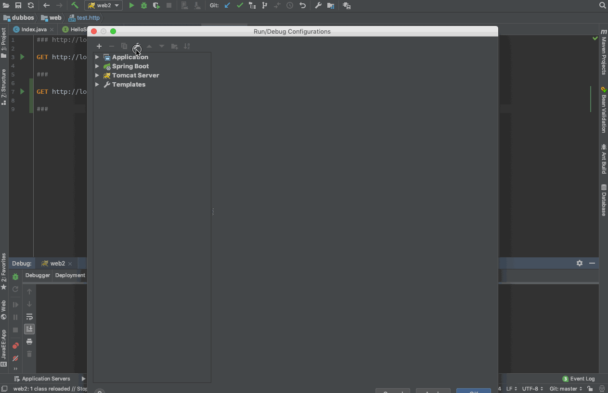
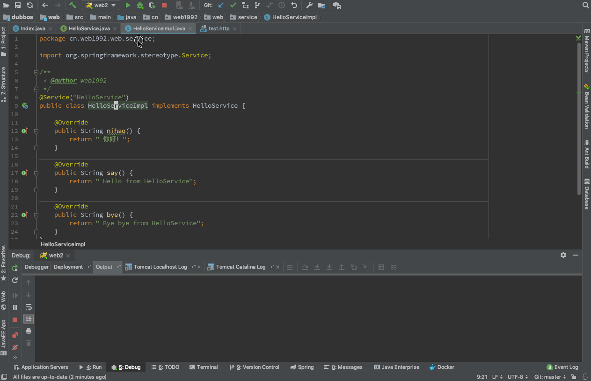
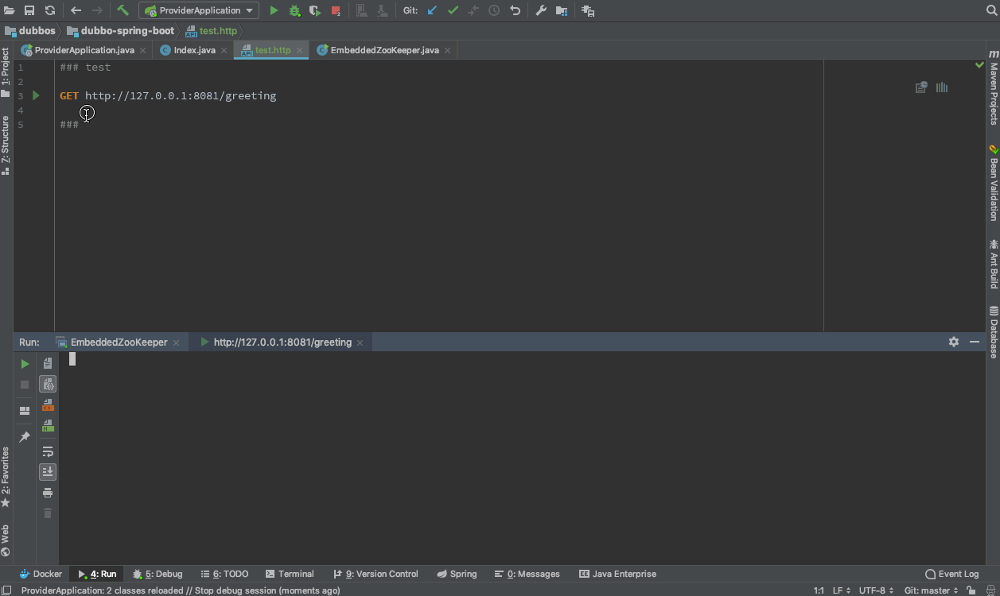
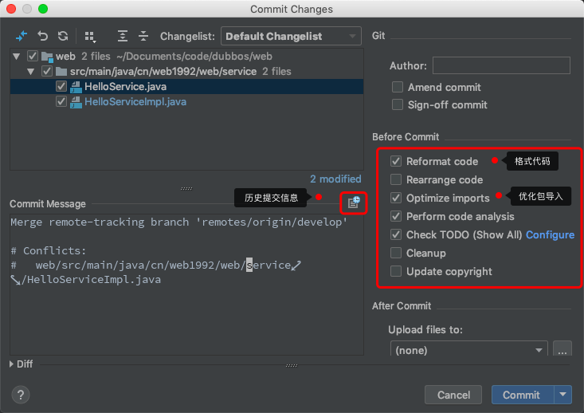
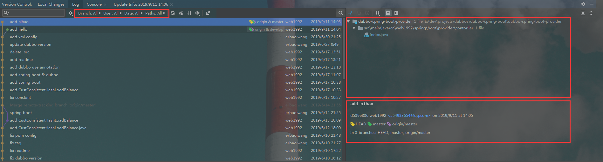
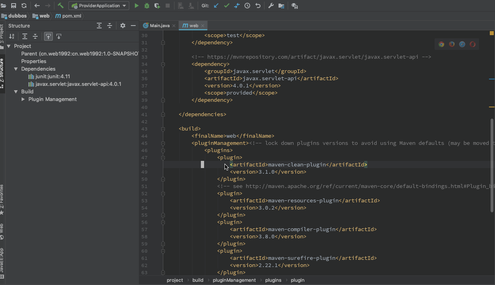

# idea

> idea 提高效率的方法

- [idea](#idea)
  - [Keyboard shortcuts](#keyboard-shortcuts)
  - [Custom Tool bar](#custom-tool-bar)
  - [Live template](#live-template)
  - [Hot reload](#hot-reload)
    - [Tomcat Hot reload](#tomcat-hot-reload)
      - [config](#config)
      - [Demo](#demo)
    - [Java Application Hot reload](#java-application-hot-reload)
  - [Git Version Control](#git-version-control)
    - [Git commit](#git-commit)
    - [Git merge](#git-merge)
    - [Git Change List](#git-change-list)
    - [Git Log](#git-log)
    - [Git Console](#git-console)
  - [Plugin](#plugin)

## Keyboard shortcuts

> 快捷键

| Keyboard shortcuts | desc                                             |
| ------------------ | ------------------------------------------------ |
| Ctrl + F           | 文本内容搜索 (在文件内搜索)                      |
| Ctrl + Shift + F   | 文本内容搜索 (在工程内搜索) Find in Path         |
| Ctrl + R           | 文本内容替换                                     |
| Ctrl + E           | 最近的文件                                       |
| Ctrl + Shift + E   | 最近修改的文件                                   |
| Ctrl + N           | 文件（类）搜索                                   |
| Ctrl + O           | 重写父类的方法 如 `toStirng`,`equals`            |
| Ctrl + I           | 实现没有实现的方法，适合在接口新增方法的时候使用 |
| Ctrl + B           | 查找地定义可以在，`变量`，`方法`，`类`，`接口`上使用     |
| Ctrl + Alt + B     | 查找接口的实现类                                 |
| Ctrl + G           | 在文件内跳转到指定的行                           |
| Alt + F7           | 查询方法引用，可以使用 Ctrl + B                  |
| Shift + F6         | 重命名                                           |
| Ctrl + Q           | 查询类，方法上面的文档注释                       |

## Custom Tool bar

> 自定义工具栏,把常用的功能放在工具类顶部



## Live template

> 可以快速的生成`代码块`，如生成`main`函数，`System.out.println();` 语句



> 配置



> 此外还可以通过 `File > Export Settings > Live templates` 把自己的代码块进行`备份`和`共享`

## Hot reload

> 在不重启应用的情况下，实现代码的修改立即生效

### Tomcat Hot reload

> Tomcat 热加载

#### config



#### Demo



### Java Application Hot reload

> main 方法启动程序的热加载



> 注意 这种方式功能比较简单，只支持`语句`，不支持方法的新增和删除(当新增或者删除方法的时候，依然需要重启)

## Git Version Control

### Git commit



### Git merge

> 在 `idea` 中快速的合并冲突的代码


### Git Change List

> 文件修改的记录的列表，可以方便的进行分组，防止代码误提交

### Git Log

> 方便的查看工程的提交记录，文件的提交记录，





### Git Console

> git 命令的输入，学习 git 命令的好地方

```log
git -c core.quotepath=false -c log.showSignature=false reset --soft 452ad5264bb5402aeaea6809d27b01f24c3b43b6
```

## Plugin

> 插件推荐

- MyBatis Log Plugin
- Free Mybatis plugin
- Lombok
- Alibaba Java Coding Guidelines
- Key promoter
- JRebel
