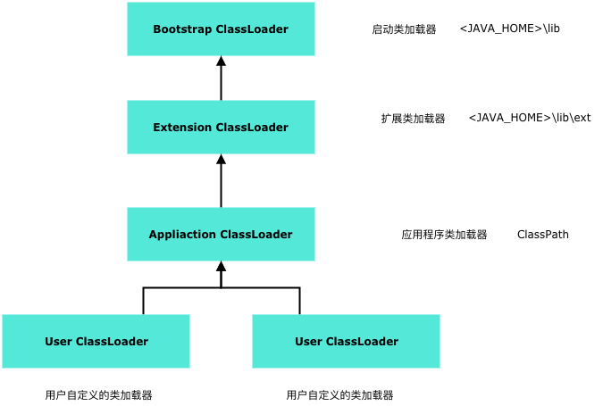

# classLoader

- [https://liujiacai.net/blog/2014/07/12/order-of-initialization-in-java/](https://liujiacai.net/blog/2014/07/12/order-of-initialization-in-java/)
- [Understanding the Java ClassLoader](https://www.ibm.com/developerworks/java/tutorials/j-classloader/j-classloader.html)
- [https://blog.csdn.net/briblue/article/details/54973413](https://blog.csdn.net/briblue/article/details/54973413)

## 打印类加载信息

TraceClassLoading 参数可以显示JVM 从进程开始到运行结束的时候，所有ClassLoad 的相关信息。在JDK8 上，用`-XX:+TraceClassLoading`就可以显示，在JDK11 上的话，要加上`-Xlog:class+load=info`。