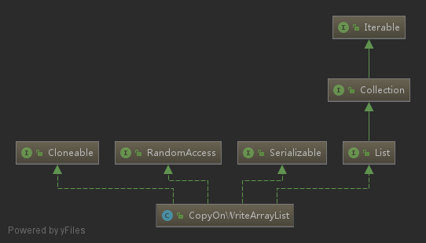

# copy-on-write

## uml

## link

- [wiki](https://en.wikipedia.org/wiki/Copy-on-write)
- [CopyOnWriteArrayList](https://www.javamex.com/tutorials/synchronization_concurrency_8_copy_on_write.shtml)
