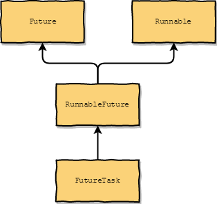

# Future

- [Executor](executor.md)
- [Future(from oracle docs)](https://docs.oracle.com/javase/8/docs/api/java/util/concurrent/Future.html)

A Future represents the result of an asynchronous computation



## 作用

- 表示一个异步计算
- 可以取消这个异步计算
- 可以查询这个异步计算的状态，已经完成或者已经取消

## demo

```java
{
        final ExecutorService executor = Executors.newFixedThreadPool(1);
        try {
            // Callable
            Callable<String> callable = () -> {
                TimeUnit.SECONDS.sleep(2L);
                return "ok";
            };
            Future<String> future = executor.submit(callable);

            System.out.println("isCancelled = " + future.isCancelled());
            System.out.println("isDone = " + future.isDone());
            String result = null;
            try {
                result = future.get(1L, TimeUnit.SECONDS);
            } catch (InterruptedException e) {
                e.printStackTrace();
            } catch (ExecutionException e) {
                e.printStackTrace();
            } catch (TimeoutException e) {
                e.printStackTrace();
            }
            System.out.println(result);
            System.out.println("isCancelled = " + future.isCancelled());
            System.out.println("isDone = " + future.isDone());

            // Runnable
            Runnable runnable =()->{
              System.out.println("runnable run");
            };

            executor.submit(runnable);
        } finally {
            executor.shutdown();
        }
    }
```

## FutureTask