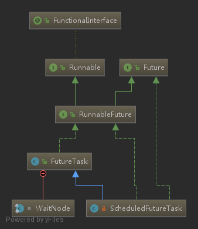

# Future

- [Future](#future)
  - [简介](#%E7%AE%80%E4%BB%8B)
  - [uml](#uml)
  - [作用](#%E4%BD%9C%E7%94%A8)
  - [demo](#demo)
  - [FutureTask methods list](#futuretask-methods-list)
    - [run](#run)
    - [get](#get)
    - [cancel](#cancel)
  - [hook method](#hook-method)
  - [one more thing](#one-more-thing)
  - [link](#link)

## 简介

A Future represents the result of an asynchronous computation

代表一个异步的计算结果

## uml



## 作用

- 表示一个异步计算
- 可以取消这个异步计算
- 可以查询这个异步计算的状态，已经完成或者已经取消
- 内部维护了简单的等待队列

## demo

```java
final ExecutorService executor = Executors.newFixedThreadPool(1);
try {
    // Callable
    Callable<String> callable = () -> {
        TimeUnit.SECONDS.sleep(2L);
        return "ok";
    };
    Future<String> future = executor.submit(callable);
    System.out.println("isCancelled = " + future.isCancelled());
    System.out.println("isDone = " + future.isDone());
    String result = null;
    try {
        result = future.get(1L, TimeUnit.SECONDS);
    } catch (InterruptedException e) {
        e.printStackTrace();
    } catch (ExecutionException e) {
        e.printStackTrace();
    } catch (TimeoutException e) {
        e.printStackTrace();
    }
    System.out.println(result);
    System.out.println("isCancelled = " + future.isCancelled());
    System.out.println("isDone = " + future.isDone());
    // Runnable
    Runnable runnable =()->{
      System.out.println("runnable run");
    };
    executor.submit(runnable);
} finally {
    executor.shutdown();
}
```

## FutureTask methods list

从上面的类图中可以看到 `FutureTask` 本质上是一个 `Runnable`, `FutureTask` 重 写了 run 方法，而这个 `run` 方法的执行者是线程池中的线程，当线程池中的线程执行这个 `run`之后，会
更新 `Object outcome` 这个字段值，方便在后续执行 get 的时候，获取异步执行结果.

下面看 `run` 方法的实现

### run

```java
// 这个run 方法的执行者，其实是 ThreadPoolExecutor 线程池中的线程
public void run() {
    if (state != NEW ||
        !UNSAFE.compareAndSwapObject(this, runnerOffset,
                                     null, Thread.currentThread()))
        return;
    try {
        Callable<V> c = callable;
        if (c != null && state == NEW) {
            V result;
            boolean ran;
            try {
                result = c.call();// 执行任务，返回结果
                ran = true;
            } catch (Throwable ex) {
                result = null;
                ran = false;
                setException(ex);
            }
            if (ran)
                set(result);// 更新结果（outcome）
        }
    } finally {
        // runner must be non-null until state is settled to
        // prevent concurrent calls to run()
        runner = null;
        // state must be re-read after nulling runner to prevent
        // leaked interrupts
        int s = state;
        if (s >= INTERRUPTING)
            handlePossibleCancellationInterrupt(s);
    }
}
```

### get

```java
// 如果一个任务已经取消了那么执行 get 时
// 抛出 java.util.concurrent.CancellationException 异常
public V get() throws InterruptedException, ExecutionException {
    int s = state;// 判断任务的状态，如果没有完成，就等待
    if (s <= COMPLETING)
        s = awaitDone(false, 0L);
    return report(s);// 登台结束后，会执行这个，返回执行结果
}

// 如果在指定的时间内没有获取到结果
// 会抛出 java.util.concurrent.TimeoutException
public V get(long timeout, TimeUnit unit)
    throws InterruptedException, ExecutionException, TimeoutException {
    if (unit == null)
        throw new NullPointerException();
    int s = state;
    if (s <= COMPLETING &&
        (s = awaitDone(true, unit.toNanos(timeout))) <= COMPLETING)
        throw new TimeoutException();
    return report(s);
}
```

### cancel

```java
// 取消任务
// 如果一个任务已经完成了，那么返回 false
// 取消成功，返回 true
public boolean cancel(boolean mayInterruptIfRunning) {
    if (!(state == NEW &&
          UNSAFE.compareAndSwapInt(this, stateOffset, NEW,
              mayInterruptIfRunning ? INTERRUPTING : CANCELLED)))
        return false;
    try {    // in case call to interrupt throws exception
        if (mayInterruptIfRunning) {
            try {
                Thread t = runner;
                if (t != null)
                    t.interrupt();
            } finally { // final state
                UNSAFE.putOrderedInt(this, stateOffset, INTERRUPTED);
            }
        }
    } finally {
        finishCompletion();
    }
    return true;
}
```

## hook method

- done 在任务完成之后，执行一些操作

```java
// 这个方法在任务，完成，取消，任务异常的时候，都会触发
// 其实是在 finishCompletion 方法中被调用的
protected void done() { }
```

## one more thing

`FutureTask` 的设计，其实简单，可以通过下面的简化版本，进行理解

```java
class FutureTask {
    private Object outcome;
    private volatile int state;
    // main 线程执行这个方法
    public V get() {
        // 检查 state
        // (等待结果)返回 outcome
        return (V)outcome;
    }

    // 线程池中的线程执行这个方法
    public void run() {
      // 执行任务
      // 更新 state 和 outcome
    }
}
```

## link

- [Executor](executor.md)
- [Future(from oracle docs)](https://docs.oracle.com/javase/8/docs/api/java/util/concurrent/Future.html)