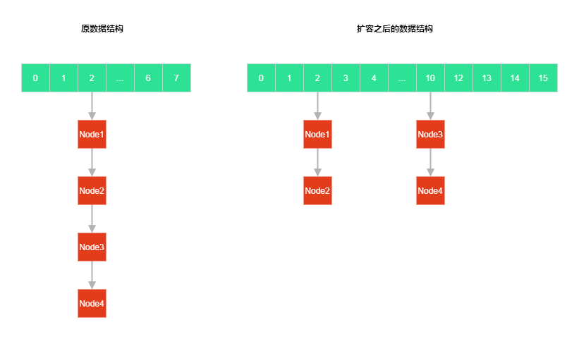
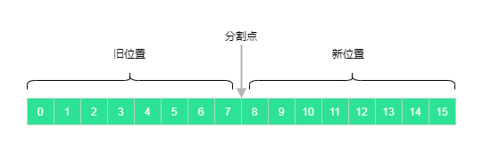
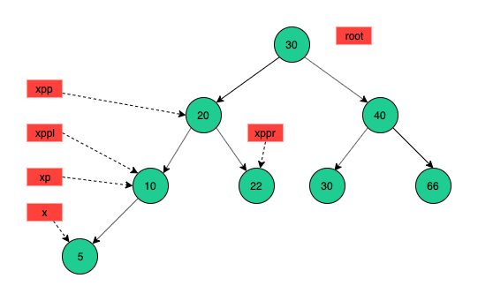

# HashMap

jdk 1.8 `HashMap` 分析

预先了解的知识

| 知道是什么      | 知道怎么解决                        |
| --------------- | ----------------------------------- |
| hash 算法       | 使用hash 映射元素                   |
| hash 算法的问题 | hash 冲突                           |
| 数据结构-树     | 使用树提高查询效率                  |
| 数据结构-链表   | 使用链表解决hash 冲突               |
| 二进制          | 二进制的 & 操作的特点和经典应用场景 |

- [HashMap](#hashmap)
  - [Get](#get)
  - [Init and resize](#init-and-resize)
  - [Move element](#move-element)
    - [e.hash & oldCap](#ehash--oldcap)
    - [j + oldCap](#j--oldcap)
  - [Put](#put)
  - [TreeifyBin](#treeifybin)
  - [TreeNode](#treenode)
    - [balanceInsertion](#balanceinsertion)
    - [balanceDeletion](#balancedeletion)
    - [putTreeVal](#puttreeval)
  - [Links](#links)

## Get

先从 get 方法入手

```java
// get
public V get(Object key) {
    Node<K,V> e;
    return (e = getNode(hash(key), key)) == null ? null : e.value;
}
// hash
// 计算 hash
static final int hash(Object key) {
    int h;
    return (key == null) ? 0 : (h = key.hashCode()) ^ (h >>> 16);
}
// getNode
final Node<K,V> getNode(int hash, Object key) {
    Node<K,V>[] tab; Node<K,V> first, e; int n; K k;
    // 检查为空和长度
    // HashMap 底层是使用数组来存放元素的
    if ((tab = table) != null && (n = tab.length) > 0 &&
        // tab[(n - 1) & hash]
        // 这里简单的说下这个 & 操作
        // 前提 n 是 2的N次幂，如 2的3次方=8，2的4次方=16 (扩容的时候也会保证这个)
        // 这些数的特点是 转化成二进制之后 最高位都是1 ，其他位都是0
        // 如 8 =1000，16 = 10000 (高位为0省略)
        // 而 减去1之后 8-1=7 = 111（二进制）  16-1=15 =1111（二进制）
        // 它们的二进制有效都是1，其他位都是0
        // 而&操作的特点就是 二进制位都是1结果才是1
        // 从而限制了 & 之后的数值永远不大于 (n-1) 的这个值
        // 这样也就保证了数组不会越界,而数组是从0开始的，n-1 也就是数组的最大下标
        // 这样的设计，简称完美！
        (first = tab[(n - 1) & hash]) != null) {// 不为空，说明数组的这个下表位置已经有数据了
        if (first.hash == hash && // always check first node 检查 key 是不是相等
            ((k = first.key) == key || (key != null && key.equals(k))))
            return first;
        if ((e = first.next) != null) {// 找到下一个
            if (first instanceof TreeNode)
                return ((TreeNode<K,V>)first).getTreeNode(hash, key);// 如果是 树，使用树进行查找
            do {// 这里进行链表的遍历,一直到链表的尾部
                if (e.hash == hash &&
                    ((k = e.key) == key || (key != null && key.equals(k))))
                    return e;
            } while ((e = e.next) != null);
        }
    }
    return null;
}
```

## Init and resize

`HashMap` 是延迟初始化的，在 `put` 之后进行初始化操作的

```java
// put -> resize
final Node<K,V>[] resize() {
    Node<K,V>[] oldTab = table;
    // hashmap 无参数初始化的时候 oldCap 和 oldThr 都是0
    // 使用有参数初始化 hashmap 那么 threshold 不为0
    int oldCap = (oldTab == null) ? 0 : oldTab.length;
    // threshold -> The next size value at which to resize (capacity * load factor).
    int oldThr = threshold;// 默认的数组大小，默认是0
    int newCap, newThr = 0;
    if (oldCap > 0) {// 扩容走这里
        if (oldCap >= MAXIMUM_CAPACITY) {
            // 超过最大容量，调整 threshold 结束
            threshold = Integer.MAX_VALUE;
            return oldTab;
        }
        else if ((newCap = oldCap << 1) < MAXIMUM_CAPACITY &&// newCap 加倍
                 oldCap >= DEFAULT_INITIAL_CAPACITY)// 如果旧的容量小于16，newThr 加倍
            newThr = oldThr << 1; // double threshold
    }
    else if (oldThr > 0) // initial capacity was placed in threshold 扩容走这里/指定初始容量也走这里
        newCap = oldThr;
    else {               // zero initial threshold signifies using defaults
        // 初始化走这里
        newCap = DEFAULT_INITIAL_CAPACITY;// 默认数组大小是16
        newThr = (int)(DEFAULT_LOAD_FACTOR * DEFAULT_INITIAL_CAPACITY);//  0.75*16=12.0
    }
    if (newThr == 0) {
        float ft = (float)newCap * loadFactor;
        newThr = (newCap < MAXIMUM_CAPACITY && ft < (float)MAXIMUM_CAPACITY ?
                  (int)ft : Integer.MAX_VALUE);
    }
    threshold = newThr;
    @SuppressWarnings({"rawtypes","unchecked"})
    Node<K,V>[] newTab = (Node<K,V>[])new Node[newCap];// 创建新数组
    table = newTab;
    if (oldTab != null) {// 扩容，需要重新计算hash
        // 在扩容完成之后，在这个for循环里面开始进行元素的移动
        for (int j = 0; j < oldCap; ++j) {// 遍历旧数组大小
            Node<K,V> e;
            if ((e = oldTab[j]) != null) {// 找到那些不为 null 的数组中的元素
                oldTab[j] = null;
                if (e.next == null)// 如果这个位置上的元素上只有一个元素(没有hash冲突)
                    newTab[e.hash & (newCap - 1)] = e;// 直接把这个元素重新进行hash,放到新数组的位置上即可
                else if (e instanceof TreeNode)
                    ((TreeNode<K,V>)e).split(this, newTab, j, oldCap);// 如果是树数据结构
                else { // preserve order 保证顺序
                    // 代码执行到这里，说明 e 这个 Node 已经是链表了
                    // 那么需要把这个链表进行拆分和元素移动
                    // 具体的细节和做法，在后面 Move element 部分详细解释
                    Node<K,V> loHead = null, loTail = null;
                    Node<K,V> hiHead = null, hiTail = null;
                    Node<K,V> next;
                    do {
                        next = e.next;
                        if ((e.hash & oldCap) == 0) {
                            if (loTail == null)
                                loHead = e;
                            else
                                loTail.next = e;
                            loTail = e;
                        }
                        else {
                            if (hiTail == null)
                                hiHead = e;
                            else
                                hiTail.next = e;
                            hiTail = e;
                        }
                    } while ((e = next) != null);
                    if (loTail != null) {
                        loTail.next = null;
                        newTab[j] = loHead;
                    }
                    if (hiTail != null) {
                        hiTail.next = null;
                        newTab[j + oldCap] = hiHead;
                    }
                }
            }
        }
    }
    return newTab;
}
```

## Move element

> 元素移动

先看下数据扩容之后一种可能的元素位置的变化,如下图



如上图所示，移动前后元素位置和链表的对比(这里是数据扩容之后，链表拆分&元素移动之后的结果)

一部分元素依然在索引为2的位置，另一部分则移动到了索引为10的位置上

> 下面再看问题&解决方案

或者你认为，数组在扩容之后，元素依然在旧的位置，这样也可以啊，为甚需要移动呢？

这里需要考虑二个问题:

1. 在数组扩容之后，数组的长度变了，那么在进行 `e.hash & (newCap - 1)` 新hash操作的时候，旧的那些元素旧不一定在放在索引为2位置上面了，如果不移动元素，那么在 `get`(扩容之后)的时候，执行 `tab[(n - 1) & hash` 肯定是那查询不到当前元素的

2. 如何快速的把扩容之前在索引为2为元素，但是扩容之后索引不在2的元素进行筛选和移动(重新计算索引)

下面通过举例来说明：

> 问题1

假如: 旧数组长度为 8（索引0-7），扩容之后的新数组的长度是 16 （索引0-15）,假如一个Node 的 hash = 10,

那么：根据公式 `e.hash & (newCap - 1)` 这个元素在数组扩容之前的位置是 `10 & 7= 2`,扩容之后的位置是 `10 & 15=10`

可见：在数据扩容之后，Node 元素在新数组中的索引位置发生了变化(从2变成了10)

> 问题2

对应上面的例子就是`如何`把就数组中在索引为`2`的元素（进行筛选）移动到新数组中索引为`10`的位置上面

而下面的这段代码逻辑就是处理上面的二个问题

```java
// 代码执行到这里，说明 e 这个 Node 已经是链表了
// 那么需要把这个链表进行 拆分
// 这里先新建二个链表，用来存储Node
Node<K,V> loHead = null, loTail = null;// 新链表1
Node<K,V> hiHead = null, hiTail = null;// 新链表2
Node<K,V> next;
do {
    next = e.next;
    if ((e.hash & oldCap) == 0) {// 进行筛选
        // 旧位置
        if (loTail == null)
            loHead = e;
        else
            loTail.next = e;
        loTail = e;
    }
    else {
        // 新位置
        if (hiTail == null)
            hiHead = e;
        else
            hiTail.next = e;
        hiTail = e;
    }
} while ((e = next) != null);
if (loTail != null) {// 不为空
    loTail.next = null;
    newTab[j] = loHead;// 旧位置
}
if (hiTail != null) {// 不为空
    hiTail.next = null;
    newTab[j + oldCap] = hiHead; // 新位置
}
```

### e.hash & oldCap

上面的代码重点是 `(e.hash & oldCap) == 0` 和 `j + oldCap` 理解了这个就掌握了作者的思想

还是来举例:

假如有二个Node, `Node1.hash=2` ,`Node2.hash=10`，旧数组的长度为8，新数组长度为16

那么：`2&7=2` `10&7=2`, `2&15=2` `10&15=10` (扩容之前这二个元素的位置都是2，扩容之后一个是2，另一个变成了10)

我们这里把新的数组分成两部分，`旧位置`和`新位置`（只是为了方便理解），如下图:



那么 `Node1.hash=2` 应该放在`旧数组`的位置， `Node2.hash=10` 应该放在`新数组`的位置（这样才能保证get在新数组中执行Hash计算的位置是正确的）

hashmap 中数组的长度都是2的n次方,如： $2^3=8$ ,而2的n次方的结果，这个的数字的二进制有一个特点，就是有效位高位是1，低位都是0，如`8`的二进制是`1000`,`16`的二进制`10000`

如果 hash<8,hash与8进行&计算，结果肯定是0(hash<8,意味着hash的二进制的最高位肯定是0,不是1),比如 `100 & 1000`, `10 & 1000`, `1 &1000`

而 `(e.hash & oldCap) == 0` 的最终目的就是根据&结果是否为零,来确定这个元素到底是放在`旧位置`还是`新位置`

### j + oldCap

- 旧位置： `newTab[j] = loHead`
- 新位置： `newTab[j + oldCap] = hiHead`

下面说明下为什么通过 `j + oldCap` 来计算新位置

如果： `hash=10` `oldCap =8` `newCap=16`

旧index： `1010 & 01000`

新index： `1010 & 10000`

| 二进制                                              | 十进制           |
| --------------------------------------------------- | ---------------- |
| 而 (1010 & 10000) - (1010 & 01000) = 01000 = oldCap | 新 - 旧 =oldCap  |
| 所以 (1010 & 10000) =   (1010 & 01000)  +oldCap     | 新 = 旧  +oldCap |
| 即 (1010 & 10000) = j + oldCap                      | 新 = j+oldCap    |

[如果这里没看懂，可以看文章末尾的连接](#links)

## Put

```java
// put
public V put(K key, V value) {
    return putVal(hash(key), key, value, false, true);
}
// putVal
final V putVal(int hash, K key, V value, boolean onlyIfAbsent,
               boolean evict) {
    Node<K,V>[] tab; Node<K,V> p; int n, i;
    if ((tab = table) == null || (n = tab.length) == 0)
        n = (tab = resize()).length;// 进行初始化
    if ((p = tab[i = (n - 1) & hash]) == null)// 为空，说明i位置上并没存储其他数据
        tab[i] = newNode(hash, key, value, null);// 把key，value 包装成Node，放在i的位置上
    else {
        Node<K,V> e; K k;
        if (p.hash == hash &&
            ((k = p.key) == key || (key != null && key.equals(k))))
            e = p;// 如果hash相等&Key相等，e=p,下面的 e!=null 会进行处理
        else if (p instanceof TreeNode)// treeNode 的处理
            e = ((TreeNode<K,V>)p).putTreeVal(this, tab, hash, key, value);
        else {// 链表的处理
            for (int binCount = 0; ; ++binCount) {
                if ((e = p.next) == null) {// 等于null说明是链表的最后一个元素了
                    p.next = newNode(hash, key, value, null);// 把新的数据包装成Node放在链表的最后
                    // TREEIFY_THRESHOLD=8
                    // 如果链表的长度大于等于8了，那么把链表转换成 TreeNode
                    if (binCount >= TREEIFY_THRESHOLD - 1) // -1 for 1st
                        treeifyBin(tab, hash);
                    break;// 结束循环
                }
                // 如果存在相等的Key, 结束 e!=null 会处理value的赋值
                if (e.hash == hash &&
                    ((k = e.key) == key || (key != null && key.equals(k))))
                    break;
                p = e;// break 执行了,p=e 就不会执行了
            }
        }
        if (e != null) { // existing mapping for key
            V oldValue = e.value;// 拿到旧值
            if (!onlyIfAbsent || oldValue == null)
                e.value = value;// 覆盖旧值
            afterNodeAccess(e);// hook Method 这个方法在HashMap 中没作用，在LinkedHashMap 中有使用
            return oldValue;
        }
    }
    // modCount 用来进行并发修改检测的
    // 如果你在遍历元素的时候，其他线程对 hashmap 进行了插入/删除数据
    // 那么此时再继续遍历就不是安全的，抛出 ConcurrentModificationException 异常,而不是一直的错下去
    ++modCount;
    if (++size > threshold)// 数组的长度超过了 threshold 就进行扩容
        resize();// 扩容的目的就是重新计算hash，打散数据，提高查询效率
        // 因为hashmap 的数据越多，产生hash 冲突也就多,get 查询元素的时间复杂度就会从 O(1) 变成 O(n) 了
    afterNodeInsertion(evict);// Hook Method
    return null;
}
```

## TreeifyBin

```java
/**
 * Replaces all linked nodes in bin at index for given hash unless
 * table is too small, in which case resizes instead.
 */
final void treeifyBin(Node<K,V>[] tab, int hash) {
    int n, index; Node<K,V> e;
    // MIN_TREEIFY_CAPACITY =64 小于64仅仅是扩容
    // 数组的大于64才开始把链表变成树
    if (tab == null || (n = tab.length) < MIN_TREEIFY_CAPACITY)
        resize();
    else if ((e = tab[index = (n - 1) & hash]) != null) {// 元素所在的位置有值
        // 这个hash是你put元素的hash,因此这里仅仅是把这个hash
        // 所在数组的链表转化成树
        TreeNode<K,V> hd = null, tl = null;
        do {// 开始转化
            TreeNode<K,V> p = replacementTreeNode(e, null);// Node -> TreeNode
            if (tl == null)
                hd = p;// hd 是第一个被转化的元素
            else {
                p.prev = tl;// 改当前一个元素的prev
                tl.next = p;// 改变前一个元素的next
                // 上面的两个操作创建了双向链表
            }
            tl = p;// 每次循环都会更新 tl
        } while ((e = e.next) != null);
        if ((tab[index] = hd) != null)// 把上面创建的链放在index位置
            hd.treeify(tab);// 这里才是链表变成树的重点
    }
}
```

## TreeNode

```java
// TreeNode#treeify
/**
 * Forms tree of the nodes linked from this node.
 */
// hd.treeify(tab)
// 上面说过在treeifyBin 中已经创建了 TreeNode 链表
// 而hd 是第一个元素，下面的循环就是从第一个元素开始
final void treeify(Node<K,V>[] tab) {
    TreeNode<K,V> root = null;
    for (TreeNode<K,V> x = this, next; x != null; x = next) {
        next = (TreeNode<K,V>)x.next;
        x.left = x.right = null;
        if (root == null) {
            x.parent = null;
            x.red = false;
            root = x;
        }
        else {
            K k = x.key;
            int h = x.hash;
            Class<?> kc = null;
            for (TreeNode<K,V> p = root;;) {
                int dir, ph;
                K pk = p.key;
                if ((ph = p.hash) > h)
                    dir = -1;
                else if (ph < h)
                    dir = 1;
                else if ((kc == null &&
                          (kc = comparableClassFor(k)) == null) ||
                         (dir = compareComparables(kc, k, pk)) == 0)
                    dir = tieBreakOrder(k, pk);
                TreeNode<K,V> xp = p;
                if ((p = (dir <= 0) ? p.left : p.right) == null) {
                    x.parent = xp;
                    if (dir <= 0)
                        xp.left = x;
                    else
                        xp.right = x;
                    root = balanceInsertion(root, x);// 插入成功，进行重新树的平衡
                    break;// 结束循环
                }
            }
        }
    }
    moveRootToFront(tab, root);
}
```

### balanceInsertion

> 插入操作

```java
// HashMap.TreeNode#balanceInsertion
// 在 treeify 可以，此时 x 已经插入到树种了
// 下面的操作就是进行重新平衡
static <K,V> TreeNode<K,V> balanceInsertion(TreeNode<K,V> root,
                                            TreeNode<K,V> x) {
    x.red = true;
    for (TreeNode<K,V> xp, xpp, xppl, xppr;;) {
        if ((xp = x.parent) == null) {
            x.red = false;
            return x;
        }
        else if (!xp.red || (xpp = xp.parent) == null)
            return root;
        if (xp == (xppl = xpp.left)) {
            if ((xppr = xpp.right) != null && xppr.red) {
                xppr.red = false;
                xp.red = false;
                xpp.red = true;
                x = xpp;
            }
            else {
                if (x == xp.right) {
                    root = rotateLeft(root, x = xp);
                    xpp = (xp = x.parent) == null ? null : xp.parent;
                }
                if (xp != null) {
                    xp.red = false;
                    if (xpp != null) {
                        xpp.red = true;
                        root = rotateRight(root, xpp);
                    }
                }
            }
        }
        else {
            if (xppl != null && xppl.red) {
                xppl.red = false;
                xp.red = false;
                xpp.red = true;
                x = xpp;
            }
            else {
                if (x == xp.left) {
                    root = rotateRight(root, x = xp);
                    xpp = (xp = x.parent) == null ? null : xp.parent;
                }
                if (xp != null) {
                    xp.red = false;
                    if (xpp != null) {
                        xpp.red = true;
                        root = rotateLeft(root, xpp);
                    }
                }
            }
        }
    }
}
```



### balanceDeletion

```java
// HashMap.TreeNode#balanceDeletion
static <K,V> TreeNode<K,V> balanceDeletion(TreeNode<K,V> root,
                                           TreeNode<K,V> x) {
    for (TreeNode<K,V> xp, xpl, xpr;;) {
        if (x == null || x == root)
            return root;
        else if ((xp = x.parent) == null) {
            x.red = false;
            return x;
        }
        else if (x.red) {
            x.red = false;
            return root;
        }
        else if ((xpl = xp.left) == x) {
            if ((xpr = xp.right) != null && xpr.red) {
                xpr.red = false;
                xp.red = true;
                root = rotateLeft(root, xp);
                xpr = (xp = x.parent) == null ? null : xp.right;
            }
            if (xpr == null)
                x = xp;
            else {
                TreeNode<K,V> sl = xpr.left, sr = xpr.right;
                if ((sr == null || !sr.red) &&
                    (sl == null || !sl.red)) {
                    xpr.red = true;
                    x = xp;
                }
                else {
                    if (sr == null || !sr.red) {
                        if (sl != null)
                            sl.red = false;
                        xpr.red = true;
                        root = rotateRight(root, xpr);
                        xpr = (xp = x.parent) == null ?
                            null : xp.right;
                    }
                    if (xpr != null) {
                        xpr.red = (xp == null) ? false : xp.red;
                        if ((sr = xpr.right) != null)
                            sr.red = false;
                    }
                    if (xp != null) {
                        xp.red = false;
                        root = rotateLeft(root, xp);
                    }
                    x = root;
                }
            }
        }
        else { // symmetric
            if (xpl != null && xpl.red) {
                xpl.red = false;
                xp.red = true;
                root = rotateRight(root, xp);
                xpl = (xp = x.parent) == null ? null : xp.left;
            }
            if (xpl == null)
                x = xp;
            else {
                TreeNode<K,V> sl = xpl.left, sr = xpl.right;
                if ((sl == null || !sl.red) &&
                    (sr == null || !sr.red)) {
                    xpl.red = true;
                    x = xp;
                }
                else {
                    if (sl == null || !sl.red) {
                        if (sr != null)
                            sr.red = false;
                        xpl.red = true;
                        root = rotateLeft(root, xpl);
                        xpl = (xp = x.parent) == null ?
                            null : xp.left;
                    }
                    if (xpl != null) {
                        xpl.red = (xp == null) ? false : xp.red;
                        if ((sl = xpl.left) != null)
                            sl.red = false;
                    }
                    if (xp != null) {
                        xp.red = false;
                        root = rotateRight(root, xp);
                    }
                    x = root;
                }
            }
        }
    }
}
```

### putTreeVal

## Links

- [HashMap 扩容](https://segmentfault.com/a/1190000015812438)
- [HashMap 扩容](https://www.jianshu.com/p/ee0de4c99f87)
