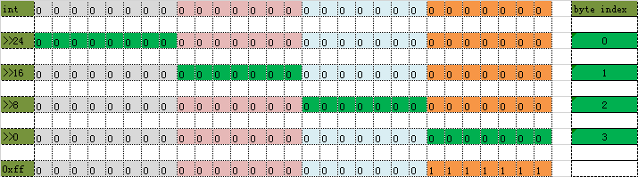

# int to byte and byte to int

## int to byte

[org.apache.dubbo.common.io.Bytes#int2bytes](https://github.com/apache/incubator-dubbo/blob/master/dubbo-common/src/main/java/org/apache/dubbo/common/io/Bytes.java#L126)

```java
// 这里用到了 无符号的右移 >>>
public static void int2bytes(int v, byte[] b, int off) {
    b[off + 3] = (byte) v;
    b[off + 2] = (byte) (v >>> 8);
    b[off + 1] = (byte) (v >>> 16);
    b[off + 0] = (byte) (v >>> 24);
    // b[off + 0] = (byte) ((v >> 24) & 0xFF);
}
```



## byte to int

[org.apache.dubbo.common.io.Bytes#bytes2int](https://github.com/apache/incubator-dubbo/blob/master/dubbo-common/src/main/java/org/apache/dubbo/common/io/Bytes.java#L290)

```java
public static int bytes2int(byte[] b, int off) {
    return ((b[off + 3] & 0xFF) << 0) +
            ((b[off + 2] & 0xFF) << 8) +
            ((b[off + 1] & 0xFF) << 16) +
            ((b[off + 0]) << 24);
}
```