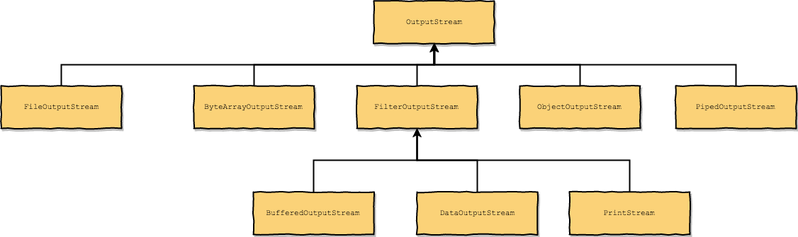
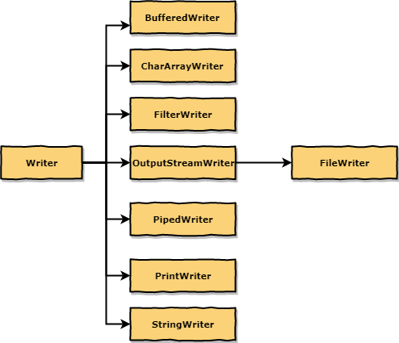
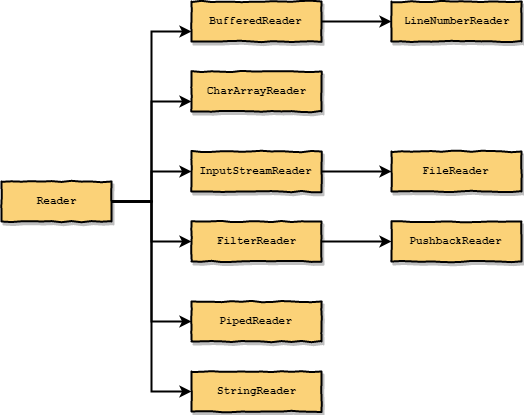

# io

## Stream

The java.io package provides several output stream and input stream
classes that are descendants of its abstract `OutputStream` and `InputStream`
classes.

## Writer Reader

- [draw.io(writer-reader)](draw.io/writer-reader.xml)

JDK 1.0’s I/O capabilities are suitable for streaming bytes, but cannot
properly stream characters because they don’t account for character
encodings. JDK 1.1 overcame this problem by introducing writer/reader
classes that take character encodings into account. For example, the
java.io package includes `FileWriter` and `FileReader` classes for writing
and reading character streams.
Chapter 5 explores various writer

## Writer

## Reader

