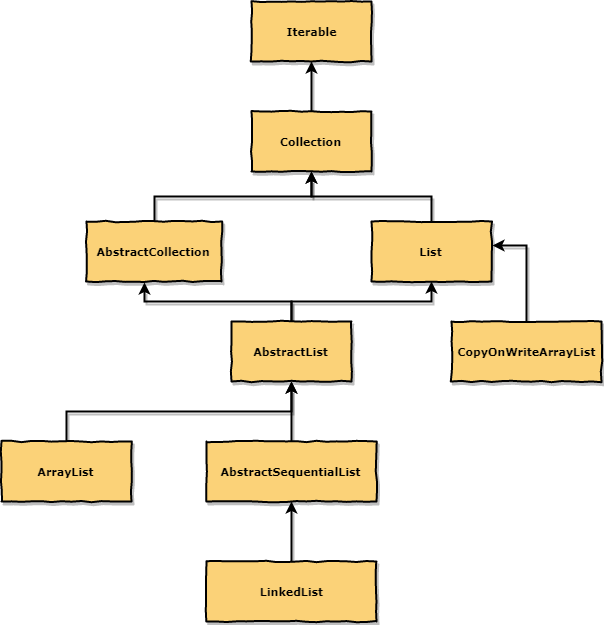

# List

- [List Implementations(oracle docs)](https://docs.oracle.com/javase/tutorial/collections/implementations/list.html)
- [arraylist vs linkedlist](https://dzone.com/articles/arraylist-vs-linkedlist-vs)
- [when-to-use-linkedlist-over-arraylist](https://stackoverflow.com/questions/322715/when-to-use-linkedlist-over-arraylist)

