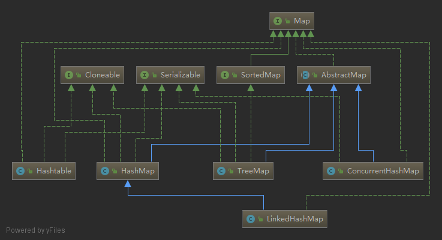
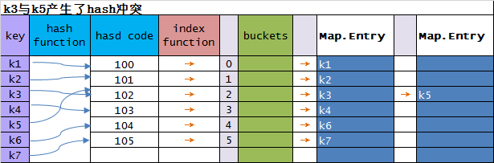
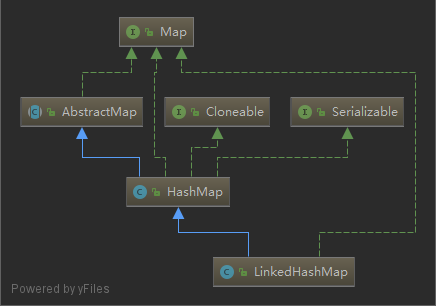

# map

- [map](#map)
  - [map 大家族](#map-%E5%A4%A7%E5%AE%B6%E6%97%8F)
  - [概要](#%E6%A6%82%E8%A6%81)
  - [问题思考](#%E9%97%AE%E9%A2%98%E6%80%9D%E8%80%83)
  - [HashMap](#hashmap)
    - [demo](#demo)
  - [LinkedHashMap](#linkedhashmap)
    - [insertion order](#insertion-order)
    - [access order](#access-order)
    - [removeEldestEntry](#removeeldestentry)
      - [demo removeEldestEntry](#demo-removeeldestentry)
  - [TreeMap](#treemap)
  - [ConcurrentHashMap](#concurrenthashmap)
  - [好文链接](#%E5%A5%BD%E6%96%87%E9%93%BE%E6%8E%A5)

## map 大家族



## 概要

Map 的集合实现可以分三类：

1. 普通的实现 `HashMap`,`TreeMap`,`LinkedHashMap`
2. 特殊实现 `EnumMap`,`WeakHashMap`,`IdentityHashMap`
3. `ConcurrentHashMap` 并发实现

`TreeMap` 可以保证放入`Map`的元素是有序的（key 自然顺序）,`HashMap`不保证顺序，但是性能比`TreeMap`好。

如果你需要好的性能&key 的插入顺序（这是是插入顺序，不是自然顺序），你可以使用 `LinkedHashMap`.此外，LinkedHashMap 还可以实现 key 的访问顺序。

## 问题思考

- 1 为什么 `HashMap` 无法保证顺序（插入顺序和遍历顺序不一致）？
- 2 `TreeMap` 是如何实现 key 的自然顺序的？
- 3 `LinkedHashMap` 的插入顺序和访问顺序是如果实现的？

## HashMap

[hash表的解释](https://liujiacai.net/blog/2015/09/03/java-hashmap/#哈希表（hash-table）)

> 下面看下为什么 `HashMap` 无法保证顺序（插入顺序和遍历顺序不一致）

这里通过图表解释

自己动手画了一个hash冲突产生的图（假设k3与k5产生了hash冲突）
如果产生了hash冲突，那么`HashMap`中的元素按照链表的方式存储



```java
key --hash function--> hashcode ----index function--> 索引 ----> 放入bucketsz中(放入buckets是一个Map.Entry 数组)
```

而 `HashMap`的源码遍历实现:

```java
// source version jdk 1.8
@Override
public void forEach(BiConsumer<? super K, ? super V> action) {
    Node<K,V>[] tab;
    if (action == null)
        throw new NullPointerException();
    if (size > 0 && (tab = table) != null) {
        int mc = modCount;
        // 通过Node<K,V>[] table的长度顺序遍历
        // 通过Node实现了Map.Entry接口
        for (int i = 0; i < tab.length; ++i) {
            // 如果产生了hash冲突图，继续循环遍历
            for (Node<K,V> e = tab[i]; e != null; e = e.next)
                action.accept(e.key, e.value);
        }
        if (modCount != mc)
            throw new ConcurrentModificationException();
    }
}
```

因此遍历输出的顺序是:

```java
    k1
    k2
    k3
    k5
    k4
    k6
    k7
```

而插入的顺序是 k1 -> k7
所以`HashMap`是无序的:插入顺序和遍历顺序不一致

### demo

> 这里通过 demo 验证

```java
public static void main(String[] args) {
    Map<Book, Book> hashMap = new HashMap<>();
    Map<Book, Book> linkedHashMap = new LinkedHashMap<>();
    // 添加三本书
    addBooks(hashMap);
    // 打印顺序
    System.out.println("hashMap " + hashMap);
    // 添加三本书
    addBooks(linkedHashMap);
    // 打印顺序
    System.out.println("linkedHashMap " + linkedHashMap);
    // 打印结果:
    // hashMap       {book 1=book 1, book 2=book 2, book 3=book 3}
    // linkedHashMap {book 1=book 1, book 3=book 3, book 2=book 2}
    // 从打印的顺序看出
    // 当 hashMap 中放入了id =1 的 两个对象之后
    // 放入的顺序是 1->3->2
    // 打印的顺序是 1->2->3
    // 原因是 hashMap 底层是通过 hashcode 方法计算元素在 hashMap 中的位置
    // book1 和 book2 的产生了 hash 冲突 (重写了 Book 的 hashCode 方法)
    // 导致 hashMap 形成链表,从而导致遍历顺序与插入顺序不一致
    // 而 linkedHashMap 实现了有序的功能
    // 可保证插入顺序和打印顺序是一致的
}
private static void addBooks(Map<Book, Book> mapBooks) {
    Book book = new Book(1, "book 1");
    mapBooks.put(book, book);
    Book book3 = new Book(3, "book 3");
    mapBooks.put(book3, book3);
    Book book2 = new Book(1, "book 2");
    mapBooks.put(book2, book2);
}
static class Book {
    private int id;
    private String name;
    Book(int id, String name) {
        this.id = id;
        this.name = name;
    }
    public int getId() {
        return id;
    }
    /**
     * 重写了 hashCode 使用 id 当做 hashcode
     */
    @Override
    public int hashCode() {
        return id;
    }
    @Override
    public String toString() {
        return name;
    }
}
```

## LinkedHashMap

`LinkedHashMap` 继承了 `HashMap`



### insertion order

> demo

```java
Map<String, String> map = new LinkedHashMap<>(10, 0.75f);
    map.put("a", "a1");
    map.put("b", "b1");
    map.put("c", "c1");
    System.out.println(map);
    System.out.println(map.get("a"));
    System.out.println(map);
}
```

> 输出

```java
{a=a1, b=b1, c=c1}
a1
{a=a1, b=b1, c=c1}
```

`insertion order` 插入顺序, `LinkedHashMap` 内部是基于链表实现的

[LinkedHashMap 算法实现(环型双向链表)](https://liujiacai.net/blog/2015/09/12/java-linkedhashmap/#双向链表)

`LinkedHashMap` 没有重写 `HashMap` 的 put 方法，而是重写了 `newTreeNode` 方法

```java
TreeNode<K,V> newTreeNode(int hash, K key, V value, Node<K,V> next) {
    TreeNode<K,V> p = new TreeNode<K,V>(hash, key, value, next);
    // 多了这个方法
    linkNodeLast(p);
    return p;
}

 // link at the end of list
private void linkNodeLast(LinkedHashMap.Entry<K,V> p) {
    LinkedHashMap.Entry<K,V> last = tail;
    tail = p;
    if (last == null)
        head = p;
    else {
        // 把新的节点放在链表的最末端
        p.before = last;
        last.after = p;
    }
}
```

遍历的实现：

```java
public void forEach(BiConsumer<? super K, ? super V> action) {
    if (action == null)
        throw new NullPointerException();
    int mc = modCount;
    // 从链表的头开始找，一直到空
    for (LinkedHashMap.Entry<K,V> e = head; e != null; e = e.after)
        action.accept(e.key, e.value);
    if (modCount != mc)
        throw new ConcurrentModificationException();
}
```

`LinkedHashMap`中所有的`Entry`都是链接在一起的，遍历的时候，从链表的头一直遍历到链表的结束，从而保证其插入顺序的有序。

### access order

`access order` 访问顺序

看下 demo

```java
public static void main(String[] args) {
    Map<String, String> map = new LinkedHashMap<>(10, 0.75f, true);
    map.put("a", "a1");
    map.put("b", "b1");
    map.put("c", "c1");
    System.out.println(map);
    System.out.println(map.get("a"));// 访问之后，a 会再最后
    System.out.println(map);
}
```

> 输出：

```out
{a=a1, b=b1, c=c1}
a1
{b=b1, c=c1, a=a1}
```

> 实现分析：

```java
// 构造一个 LinkedHashMap,实现访问顺序
// jdk 的默认实现是在每次访问一个元素之后，这个元素，会被移动到最后
// 你也可以重写 afterNodeAccess 方法实现自定义的规则
Map<String, String> map = new LinkedHashMap<>(2,0.75f,true);

// LinkedHashMap 实现了HashMap 的 afterNodeAccess 方法
// 如果 accessOrder = true,在每次访问元素的时候，都会调用此方法
// 把这个元素放在 Entry 链接的最后
// jdk 1.8 源码
void afterNodeAccess(Node<K,V> e) { // move node to last
    LinkedHashMap.Entry<K,V> last;
    // 如果 accessOrder = true & tail!=e(存在二个以上的元素)
    if (accessOrder && (last = tail) != e) {
        // p = e
        // b = e 之前的元素
        // a = e 之后的元素
        LinkedHashMap.Entry<K,V> p =
            (LinkedHashMap.Entry<K,V>)e, b = p.before, a = p.after;
        // 把当前元素的后续元素指向 null
        p.after = null;
        // 如果 e 之前的元素不存在，那把 a 当做 head,(因为 e 要变成 tail)
        if (b == null)
            head = a;
        else
            b.after = a;// 否则 a 就向前移动，成为 e 之前元素 b 的 tail
        if (a != null)// 如果 e 的尾巴 a 不为空，让 a 的前一个元素指向 b
            a.before = b;
        else
            last = b;// last 指向b(但是这里b可能为空，因此后续会进行判断)
        if (last == null)// 如果b(last)为空，那么e就是head
            head = p;
        else {
            p.before = last;// 如果tail不为空，e(p)要移动到最后(在last之后)
            last.after = p;// 把p放在链表最后
        }
        tail = p;// 更新tail
        ++modCount;
    }
}
```

### removeEldestEntry

> 删除最年长的数据

```java
// removeEldestEntry 是一个被 protected 修饰的方法
// 因此可以被子类重写实现额外的功能
protected boolean removeEldestEntry(Map.Entry<K,V> eldest) {
    return false;
}
```

#### demo removeEldestEntry

`MaxSizeMap` 是一个只能存储 11 个元素的map，如果超过了11 ，多余的数据就会被删除

```java
public static void main(String[] args) {
    Map<String, String> myMap = new MaxSizeMap<>();
    add(myMap, "a");
    // 如果执行了 get("a1") 那么a1 最近被使用过，就不会被删除
    // myMap.get("a1");
    add(myMap, "b");
    System.out.println(myMap);
    // {a9=9, b0=0, b1=1, b2=2, b3=3, b4=4, b5=5, b6=6, b7=7, b8=8, b9=9}
    // a1 - a8 是最先放进 map，因此超过 11 条的时候，就被删除了
}
private static void add(Map<String, String> mapBooks, String id) {
    IntStream.range(0, 10).forEach(i -> {
        mapBooks.put(id + i, "" + i);
    });
}
/**
 * MaxSizeMap 重写了  removeEldestEntry 方法
 * 当 Map 中的数据超过 11 个的时候，就删掉最早的数据
 * <p>
 * 可以和 access order 配合使用，从而实现删除最不常用的数据
 * 如果数据被访问过了，那么数据就会放在最后，而删除的时候是从
 * 链表的头部开始删除的
 *
 * @param <K>
 * @param <V>
 */
static class MaxSizeMap<K, V> extends LinkedHashMap<K, V> {
    private static final long serialVersionUID = -782643560495986549L;
    private static final int MAX_ENTRIES = 11;
    public MaxSizeMap() {
        this(10, 0.75f, true);
    }
    public MaxSizeMap(int initialCapacity, float loadFactor, boolean accessOrder) {
        super(initialCapacity, loadFactor, accessOrder);
    }
    @Override
    protected boolean removeEldestEntry(Map.Entry eldest) {
        return size() > MAX_ENTRIES;
    }
}
```

## TreeMap

1. 可以实现 `Comparator` 接口，当成参数传给 `TreeMap`,`TreeMap` 会使用`Comparator` 的 `compare` 方法进行比较，实现排序
2. 如果没有使用 `Comparator`,`TreeMap` 会使用 `key` 的对应的 `Comparable` 的`compareTo` 方法进行比较(此时key不能为null)
3. `TreeMap` 重写了 `Map` 的 `put` 方法,使用`红黑二叉树(From CLR)`算法保证顺序（每次put元素之后，都会遍历整个树，保证顺序）

具体的算法实现可以参考 [TreeMap的算法实现](https://liujiacai.net/blog/2015/09/04/java-treemap/)

## ConcurrentHashMap

[ConcurrentHashMap from IBM doc](https://www.ibm.com/developerworks/cn/java/java-lo-concurrenthashmap/index.html)

## 好文链接

- [讲述了hashcode方法的优点，缺点](https://ericlippert.com/2011/02/28/guidelines-and-rules-for-gethashcode/)
- [hashmap](https://liujiacai.net/blog/2015/09/03/java-hashmap/)
- [hashset vs hashmap](http://www.cnblogs.com/ywl925/p/3865269.html)
- [map (oracle doc)](https://docs.oracle.com/javase/tutorial/collections/implementations/map.html)