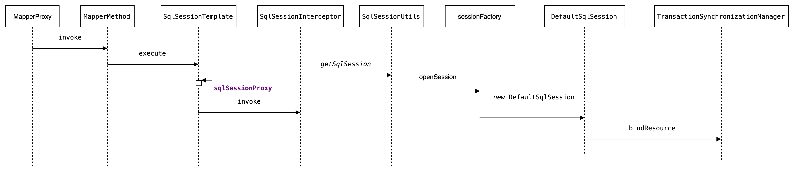

# SqlSession

看下 `SqlSession` 的时序图



需要了解的内容：

- `SqlSession` 由 `SqlSessionFactory` 创建
- `SqlSession` 的默认实现是 `DefaultSqlSession`
- 在 mybatis-spring 中 使用 `SqlSessionTemplate` 进行 `DefaultSqlSession` 代理(包装)，缓存 `SqlSession` 到 `TransactionSynchronizationManager` 中
- `SqlSessionTemplate` 是单例，线程安全的(因为实现了代理，会使用 `SqlSessionFactory` 创建新的 `SqlSession`)
- `SqlSessionUtils` 缓存 `SqlSession` 的工具类

## SqlSessionFactoryBean

Spring with mybatis `org.mybatis.spring.SqlSessionFactoryBean`

`SqlSessionFactoryBean` 用来创建 `SqlSession` 对象

## interface SqlSession

`SqlSession` 的接口定义

```java
public interface SqlSession {
  <T> T selectOne(String statement);
  <T> T selectOne(String statement, Object parameter);
  <E> List<E> selectList(String statement);
  <E> List<E> selectList(String statement, Object parameter);
  <E> List<E> selectList(String statement, Object parameter, RowBounds rowBounds);
  <K, V> Map<K, V> selectMap(String statement, String mapKey);
  <K, V> Map<K, V> selectMap(String statement, Object parameter, String mapKey);
  <K, V> Map<K, V> selectMap(String statement, Object parameter, String mapKey, RowBounds rowBounds);
  void select(String statement, Object parameter, ResultHandler handler);
  void select(String statement, ResultHandler handler);
  void select(String statement, Object parameter, RowBounds rowBounds, ResultHandler handler);
  int insert(String statement);
  int insert(String statement, Object parameter);
  int update(String statement);
  int update(String statement, Object parameter);
  int delete(String statement);
  int delete(String statement, Object parameter);
  void commit();
  void commit(boolean force);
  void rollback();
  void rollback(boolean force);
  public List<BatchResult> flushStatements();
  void close();
  void clearCache();
  Configuration getConfiguration();
  <T> T getMapper(Class<T> type);
  Connection getConnection();
}
```

## Reference

- [SqlSessionTemplate](./mybatis-sql-session-template.md)
